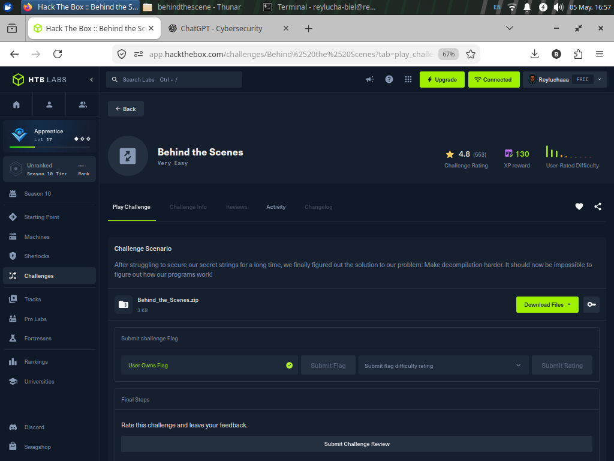
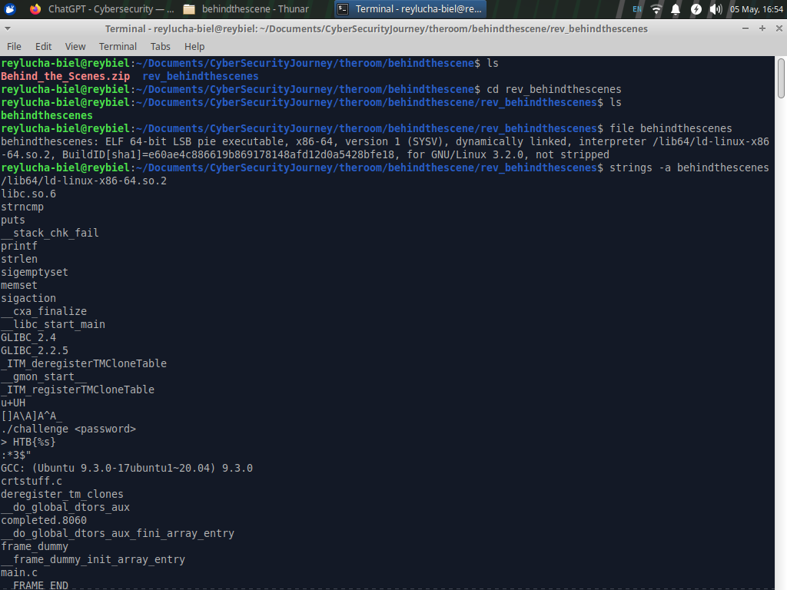
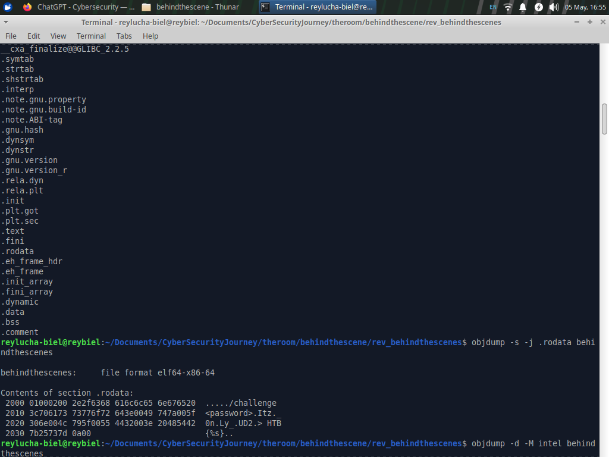
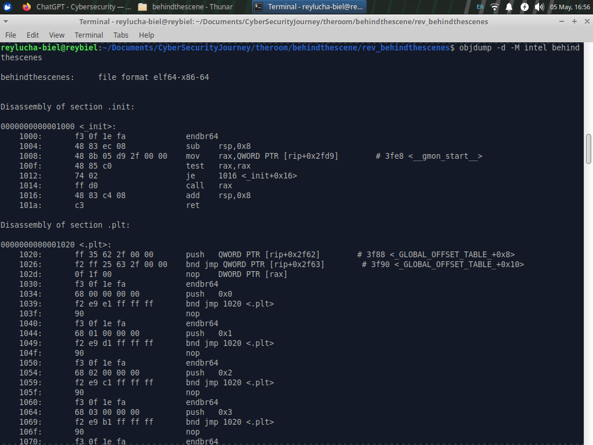
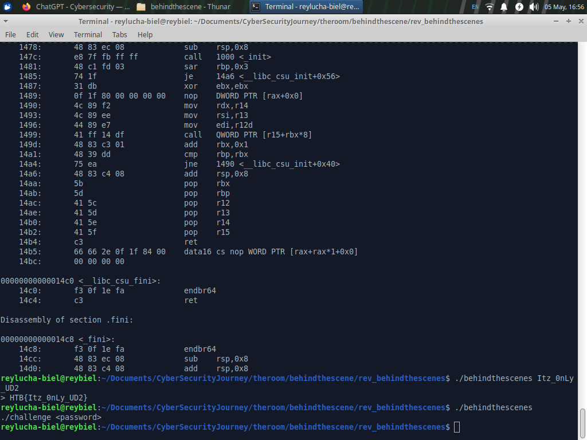

# Hack The Box - Behind the Scenes Writeup

**Category:** Reverse Engineering  
**Difficulty:** Very Easy  
**Platform:** Hack The Box  
**Author perspective:** Cybersecurity / CTF Reverse Engineering  
**Final Flag:** `HTB{Itz_0nLy_UD2}`

> This writeup is written for an isolated CTF lab challenge. The goal is to explain the reverse engineering thought process clearly, safely, and professionally. No drama, no black magic - just a tiny illegal instruction doing comedy backstage.

---

## Reference Screenshots

### Challenge page



### Initial recon and strings output



### `.rodata` inspection



### Disassembly view



### Runtime validation



---

## TL;DR

The binary tries to make decompilation annoying by inserting `UD2`, an invalid x86 instruction. Normally, executing `UD2` raises `SIGILL` and crashes the program. However, this binary installs a `SIGILL` handler with `sigaction()`. The handler skips over each `UD2` instruction by advancing the instruction pointer by 2 bytes.

Once we ignore the anti-decompiler trick, the actual password validation is simple:

```text
Input length must be 12.
Input is checked in four chunks:

0..2   = Itz
3..5   = _0n
6..8   = Ly_
9..11  = UD2
```

So the valid password is:

```text
Itz_0nLy_UD2
```

The program prints it inside the HTB flag format:

```text
HTB{Itz_0nLy_UD2}
```

---

## 1. Extracting the Challenge Archive

The challenge was provided as a ZIP archive with the password:

```text
hackthebox
```

Extraction command:

```bash
unzip -P hackthebox Behind_the_Scenes.zip
cd rev_behindthescenes
```

After extraction, the target file is:

```text
behindthescenes
```

### Why this step matters

Before reversing anything, we need to know what artifact we are dealing with. CTF files may be Linux binaries, Windows PE files, APKs, .NET assemblies, Python bytecode, firmware blobs, or packed archives. The first job is not to solve the challenge - it is to identify the battlefield.

---

## 2. File Identification

Command:

```bash
file behindthescenes
```

Observed result:

```text
behindthescenes: ELF 64-bit LSB pie executable, x86-64, dynamically linked, interpreter /lib64/ld-linux-x86-64.so.2, not stripped
```

Important takeaways:

| Property | Meaning | Why we care |
|---|---|---|
| ELF | Linux executable | Use Linux reversing tools such as `objdump`, `readelf`, `gdb`, `strings` |
| 64-bit x86-64 | AMD64 architecture | Registers are `rax`, `rdi`, `rsi`, `rip`, etc. |
| PIE | Position Independent Executable | Runtime addresses may shift because of ASLR |
| Dynamically linked | Uses libc functions | Calls like `strlen`, `strncmp`, `printf`, `sigaction` may appear |
| Not stripped | Symbols remain | Function names such as `main` and handler names are easier to find |

### Why this step matters

This tells us which reversing strategy to use. A non-stripped ELF is friendly because symbol names often survive. That is like walking into a maze where someone kindly left labels on the doors.

---

## 3. String Triage

Command:

```bash
strings -a behindthescenes
```

Interesting strings:

```text
/lib64/ld-linux-x86-64.so.2
libc.so.6
strncmp
puts
printf
strlen
sigemptyset
memset
sigaction
./challenge <password>
> HTB{%s}
:*3$"
main.c
```

The most important clues are:

```text
./challenge <password>
> HTB{%s}
strncmp
strlen
sigaction
```

### What these clues suggest

`./challenge <password>` suggests the binary expects a command-line argument.

`strlen` suggests the program checks the input length.

`strncmp` suggests the program compares the input, probably chunk by chunk.

`> HTB{%s}` suggests the final flag is printed by inserting a string into the flag format.

`sigaction` suggests signal handling, which is often used for anti-debugging, anti-decompilation, or unusual control flow.

### Why this step matters

`strings` is a cheap first pass. It does not prove the solution, but it gives strong leads. In reverse engineering, strings are like footprints. They do not tell the whole story, but they tell us where to start looking.

---

## 4. Inspecting `.rodata`

Command:

```bash
objdump -s -j .rodata behindthescenes
```

Relevant output:

```text
Contents of section .rodata:
 2000 01000200 2e2f6368 616c6c65 6e676520  ...../challenge 
 2010 3c706173 73776f72 643e0049 747a005f  <password>.Itz._
 2020 306e004c 795f0055 4432003e 20485442  0n.Ly_.UD2.> HTB
 2030 7b25737d 0a00                        {%s}..
```

When decoded as readable strings, this gives:

```text
./challenge <password>
Itz
_0n
Ly_
UD2
> HTB{%s}
```

This looks like the password may be split into four 3-byte chunks:

```text
Itz + _0n + Ly_ + UD2 = Itz_0nLy_UD2
```

### Why we do not stop here

At this point we have a strong candidate, but not proof. CTF binaries sometimes contain fake strings to mislead players. A professional reverser verifies whether these strings are actually referenced by the validation logic.

So the next step is disassembly.

---

## 5. Disassembling the Binary

Command:

```bash
objdump -d -M intel behindthescenes
```

The `-d` option disassembles executable sections.  
The `-M intel` option makes the assembly use Intel syntax, which many CTF players find easier to read.

### Why this step matters

A decompiler can lie when obfuscation exists. Assembly is closer to the truth. If the decompiler gets confused, assembly is where we regain control.

---

## 6. Understanding the Program Flow

The high-level flow of the binary is:

```text
main()
 |
 |-- install SIGILL handler
 |
 |-- check argc == 2
 |
 |-- check strlen(argv[1]) == 12
 |
 |-- compare argv[1] + 0 with "Itz"
 |-- compare argv[1] + 3 with "_0n"
 |-- compare argv[1] + 6 with "Ly_"
 |-- compare argv[1] + 9 with "UD2"
 |
 |-- if all checks pass, print HTB{%s}
```

In C-like pseudocode:

```c
int main(int argc, char **argv) {
    setup_sigill_handler();

    if (argc != 2) {
        puts("./challenge <password>");
        return 1;
    }

    char *password = argv[1];

    if (strlen(password) != 12) {
        return 1;
    }

    if (strncmp(password,     "Itz", 3) != 0) return 1;
    if (strncmp(password + 3, "_0n", 3) != 0) return 1;
    if (strncmp(password + 6, "Ly_", 3) != 0) return 1;
    if (strncmp(password + 9, "UD2", 3) != 0) return 1;

    printf("> HTB{%s}\n", password);
    return 0;
}
```

### The password reconstruction

The chunks are checked at offsets 0, 3, 6, and 9:

```text
Offset 0: Itz
Offset 3: _0n
Offset 6: Ly_
Offset 9: UD2
```

Put them together:

```text
Itz_0nLy_UD2
```

Length check:

```text
I t z _ 0 n L y _ U D 2
1 2 3 4 5 6 7 8 9 10 11 12
```

The candidate has exactly 12 characters, matching the `strlen(password) == 12` check.

---

## 7. The Trick: `UD2` and `SIGILL`

The challenge scenario says:

> Make decompilation harder.

That hint points directly to an anti-decompiler trick.

The binary contains repeated `UD2` instructions:

```asm
0f 0b    ud2
```

`UD2` is an official x86 instruction whose purpose is to generate an invalid opcode exception. In normal execution, this causes a `SIGILL` signal on Linux.

So why does the program not crash?

Because it installs a signal handler using `sigaction()`.

The handler catches `SIGILL` and modifies the saved CPU context so execution resumes after the invalid instruction. Since `UD2` is 2 bytes long, the handler advances the instruction pointer by 2 bytes.

Conceptually:

```c
void sigill_handler(int sig, siginfo_t *info, void *ucontext) {
    context->RIP += 2;
}
```

### Flow of the anti-decompiler trick

```text
CPU reaches UD2
 |
 v
CPU raises invalid instruction exception
 |
 v
Linux sends SIGILL to the process
 |
 v
Custom SIGILL handler runs
 |
 v
Handler increments RIP by 2
 |
 v
Execution resumes after UD2
```

### Why this hurts decompilers

A decompiler tries to convert machine code into readable C-like logic. When it sees invalid instructions in the middle of code, it may assume the control flow ends or becomes corrupted.

Runtime behavior is different:

```text
Decompiler: "This code is broken. I do not like this."
Program:    "Relax, I catch SIGILL and keep walking."
```

This is the fun part of the challenge. The binary looks spooky, but the monster under the bed is just a two-byte `UD2` wearing sunglasses.

---

## 8. Validating the Flag

Run the binary with the reconstructed password:

```bash
./behindthescenes Itz_0nLy_UD2
```

Output:

```text
> HTB{Itz_0nLy_UD2}
```

Final flag:

```text
HTB{Itz_0nLy_UD2}
```

---

## 9. Expert Notes: How to Think Like a Reverser

This challenge is easy mechanically, but it teaches a very useful professional habit: do not trust only one source of truth.

### Good reverse engineering questions used here

| Question | Answer in this challenge |
|---|---|
| What type of file is this? | Linux ELF x86-64 |
| Where does input come from? | `argv[1]` command-line argument |
| Is there a length check? | Yes, length must be 12 |
| Are there comparison functions? | Yes, `strncmp` |
| Are strings visible? | Yes, chunks are in `.rodata` |
| Is there anti-analysis behavior? | Yes, `UD2` plus `SIGILL` handler |
| Is the input part of the final flag? | Yes, printed via `HTB{%s}` |

### The key mindset

Reverse engineering is not guessing passwords. It is answering:

```text
What exact conditions must be true for the program to choose the success path?
```

Here, the success conditions are:

```text
argc == 2
strlen(argv[1]) == 12
argv[1][0:3]  == "Itz"
argv[1][3:6]  == "_0n"
argv[1][6:9]  == "Ly_"
argv[1][9:12] == "UD2"
```

Once those are known, the flag becomes inevitable.

---

## 10. Cybersecurity Insight

This challenge demonstrates why hiding secrets inside client-side binaries is not a strong security boundary.

The program attempts to protect its secret by making decompilation harder. That may slow down automated tools, but it does not remove the secret. A reverser can still inspect strings, trace comparisons, analyze memory, or debug execution.

### Security lesson

Obfuscation can increase analysis cost, but it should not be treated as real secret protection.

Better approaches for real-world systems include:

- Do not store long-term secrets in distributed client binaries.
- Keep sensitive validation server-side when possible.
- Use short-lived tokens instead of hardcoded secrets.
- Assume motivated analysts can inspect code, memory, and runtime behavior.
- Use obfuscation only as a delay mechanism, not as the only defense.

### Defensive detection idea

A binary that repeatedly executes invalid opcodes and catches `SIGILL` may be using unusual control flow. In malware analysis or EDR contexts, patterns such as the following can be suspicious:

```text
sigaction(SIGILL, handler, ...)
handler modifies saved RIP/EIP
code section contains repeated UD2 instructions
```

That does not automatically mean malware. As this challenge shows, it may also be a CTF trick. Context matters.

---

## 11. Final Answer

```text
HTB{Itz_0nLy_UD2}
```

The challenge name is accurate: the real action happens "behind the scenes" in the signal handler. But once we notice the `UD2` trick, the validation logic is clean, short, and very solvable.

No wizard robe required. Just `strings`, `.rodata`, assembly, and curiosity.
