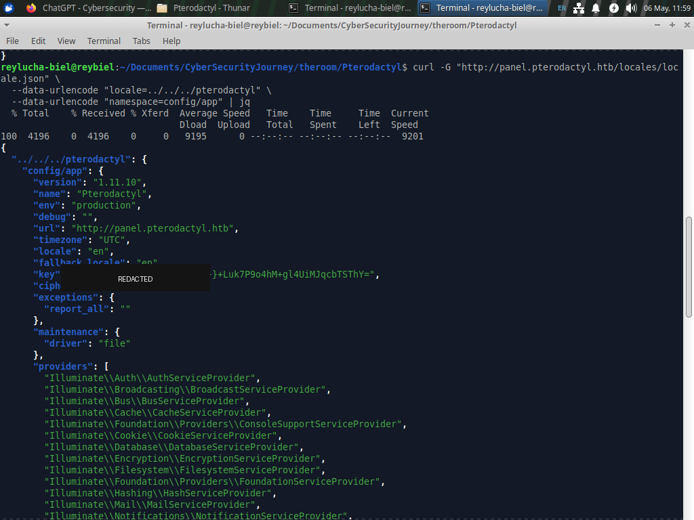
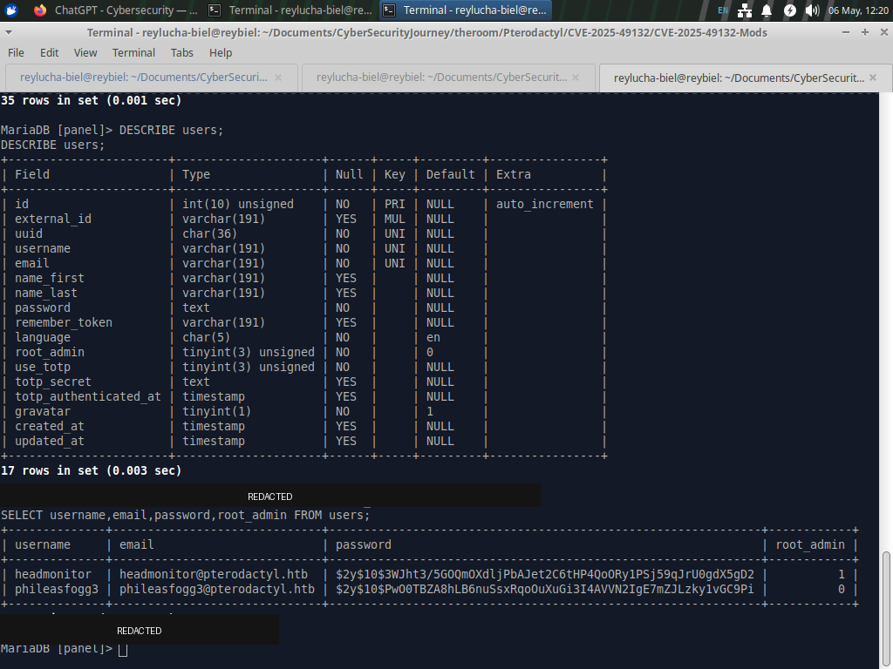
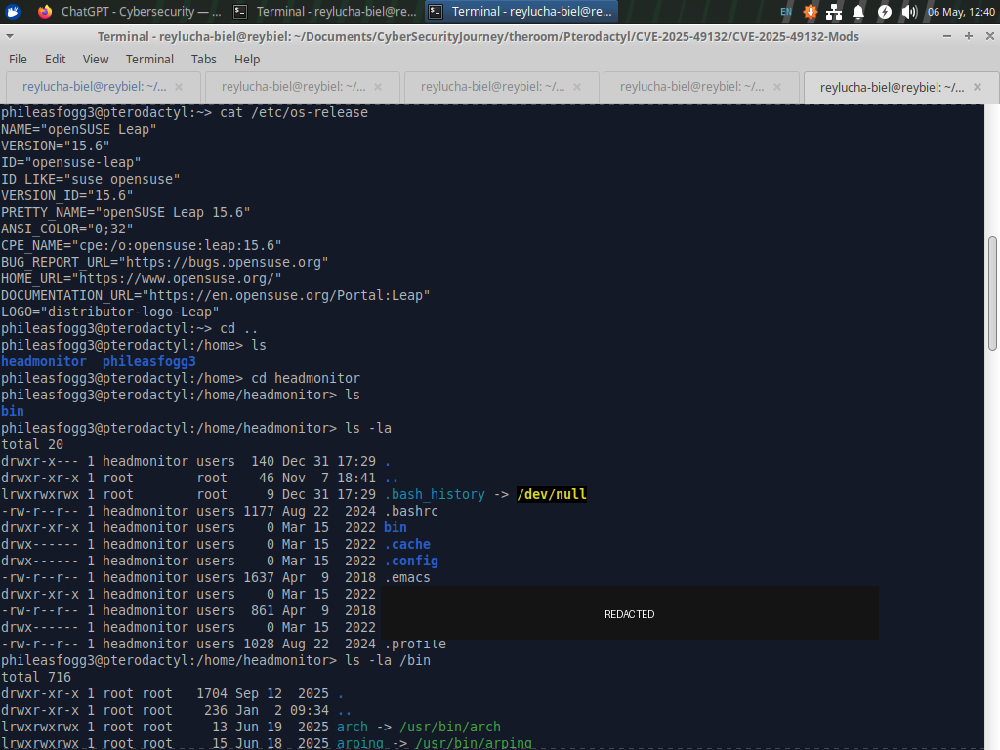
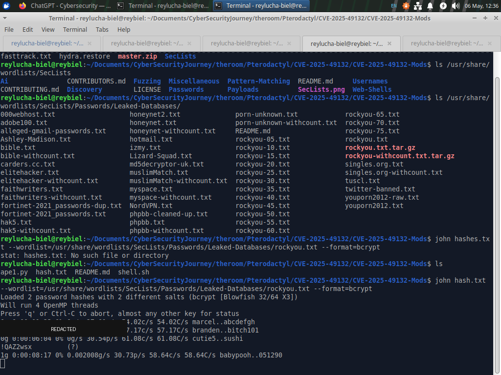
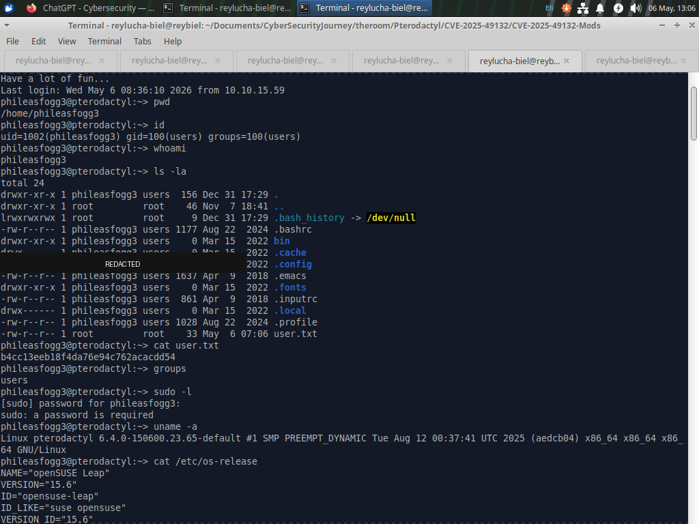
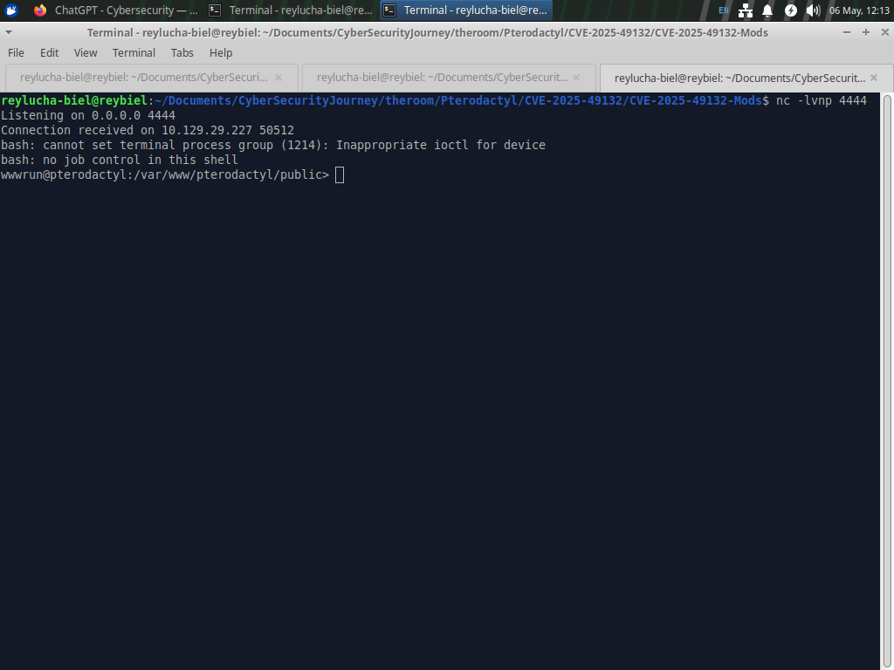
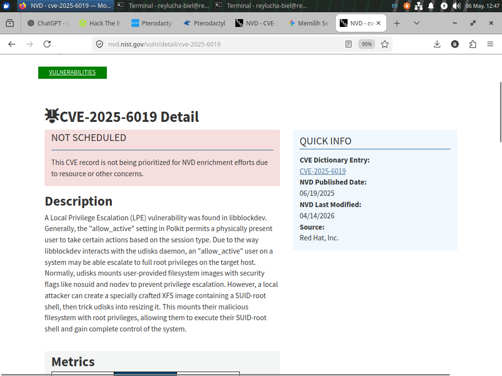
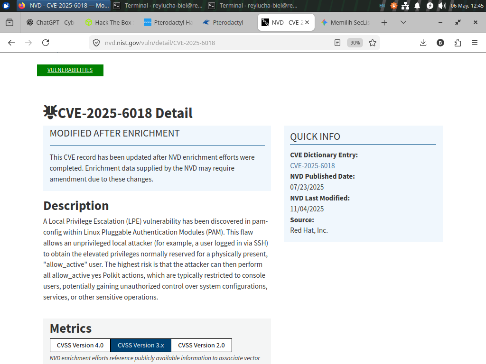
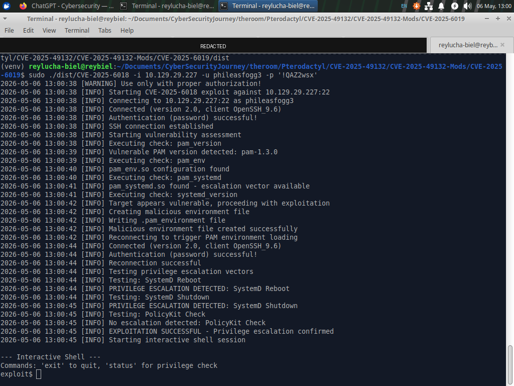
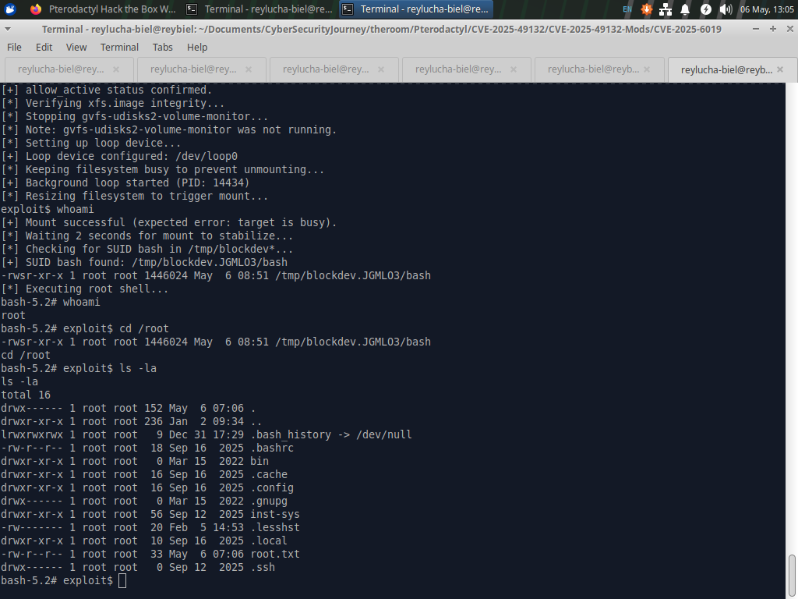

# Hack The Box — Pterodactyl Writeup

> **Purpose and scope**  
> This writeup is written for educational use inside the legal Hack The Box lab environment. It does not target any real organization or public system. Sensitive values such as flags, tokens, application keys, database passwords, session cookies, and full password hashes have been redacted from the screenshots and from the notes.

## Machine Summary

| Item | Value |
|---|---|
| Platform | Hack The Box |
| Machine | Pterodactyl |
| Difficulty | Medium |
| OS | Linux |
| Main themes | Web enumeration, virtual hosts, configuration exposure, credential analysis, password reuse, local privilege escalation |


This machine is a good example of a realistic CTF chain. It starts like a normal website investigation, then slowly turns into a deeper system review. A simple analogy is inspecting a building: first we look at the front doors, then we find different nameplates on the same building, then we discover a back office, and finally we review internal notes that point to a maintenance issue.

## High-Level Attack Path

```text
Network recon
  -> Web service discovered
  -> Virtual host routing identified
  -> Pterodactyl Panel discovered
  -> Locale endpoint reviewed
  -> Application configuration exposure validated
  -> Lab access obtained for deeper enumeration
  -> Database reviewed for account risk
  -> Password reuse identified
  -> SSH user access obtained
  -> Local mail clue points to udisksd
  -> Privilege escalation path validated in the lab
  -> Root-level proof collected with flags redacted
```

The most important lesson is that the machine was not solved by one single trick. It was solved by connecting small pieces of evidence.

---

# 1. Initial Reconnaissance

The first step was to understand what services were exposed by the target. The scan showed a very small external attack surface: mainly SSH and HTTP.


From a practitioner mindset, this result tells us two things:

1. SSH is usually useful later, after valid credentials are found.
2. HTTP should be investigated first because web applications often reveal names, routes, redirects, technologies, or user-facing clues.

Think of this like arriving at a building and seeing only two visible doors: a public reception door and a locked staff entrance. Since we do not have staff credentials yet, we start with reception.

---

# 2. Web Application Review

Opening the web service revealed a Minecraft-themed landing page called MonitorLand.


This page was useful because it confirmed that the machine was related to game server hosting. That context matters. In CTFs, names and themes are often intentional hints. Here, the theme pointed toward Pterodactyl, a game server management panel.

A separate login page was later identified for the Pterodactyl Panel.


At this stage, the correct mindset is not to brute force the login page. A professional approach is to understand what software is running, how it is exposed, and whether there are public advisories that match the observed behavior.

---

# 3. Virtual Host Discovery

The application used virtual host routing. This means the same IP address can serve different websites depending on the hostname in the request.

A daily-life analogy: imagine one office building with several companies inside. The street address is the same, but the receptionist sends you to different rooms depending on the company name you ask for.

Virtual host fuzzing identified an additional host: the panel interface.


This was a key checkpoint because administrative interfaces are often separated from public-facing pages. The discovery of the panel gave the investigation a focused direction.

---

# 4. Endpoint Validation

The next step was to review a locale-related endpoint exposed by the Pterodactyl Panel.


The response confirmed that the endpoint was reachable and handled by the application. Cookies and tokens were visible in the original response, but they are redacted in this report.

The important learning point is not the token value. The important point is the behavior:

- the endpoint was available without logging in;
- it returned application-controlled content;
- it matched the area described in public vulnerability information.

This is how a responsible CTF practitioner validates a lead: match the machine behavior with the vulnerability description before relying on any proof-of-concept.

---

# 5. Public Vulnerability Research

The Pterodactyl Panel behavior matched CVE-2025-49132. Public vulnerability descriptions indicated that affected versions could expose sensitive application information through the locale mechanism.


The key concept is **configuration exposure**. Configuration files are like the instruction manual for an application. If that manual accidentally becomes readable, it may reveal where the database is, which credentials are used, and how the application signs or encrypts sensitive data.

---

# 6. Configuration Exposure Validation

The application configuration was reviewed in the lab. Sensitive values such as the application key are redacted below.


The database configuration was also exposed. The password and other sensitive parts are redacted.



This is the first major turning point of the machine.

The lesson is simple: when an application leaks configuration, it may leak the keys to other internal doors. The database itself was not exposed directly to the internet, but the leaked configuration became useful after gaining access inside the lab system.

---

# 7. Initial Lab Access for Deeper Enumeration

After validating the issue, lab access was obtained for deeper enumeration. The screenshot below shows an interactive shell context as the web service user.


At this stage, the goal is not to rush. A web service shell is usually limited. The best practice is to enumerate carefully:

- current user;
- current directory;
- application files;
- local configuration;
- available services;
- possible user accounts;
- logs or local messages.

In simple terms, we moved from standing outside the building to being inside a restricted office. Now the job is to read signs, drawers, and internal notes carefully without assuming anything.

---

# 8. Application Directory Review

Inside the application directory, the environment file confirmed the same type of sensitive configuration exposure. Values are redacted in this report.



This confirmed the root cause: sensitive secrets were accessible from the application context. From a defensive perspective, this is serious because application secrets often enable follow-on access.

Important security lessons:

- secrets should not be exposed through application endpoints;
- application keys and database passwords should be rotated after exposure;
- web service users should have the minimum required file access;
- secrets should be monitored and protected like production credentials.

---

# 9. Database Enumeration

With the application context understood, the local database was reviewed. The table overview showed several areas of interest, including user accounts, sessions, API-related data, and recovery data.


The users table showed accounts and password hashes. Full hashes are redacted.



This step teaches an important real-world risk: even if passwords are hashed, account data exposure is still dangerous. Hashes can sometimes be tested offline, especially if users choose weak or reused passwords.

Think of a password hash as a locked box. It is not the password itself, but if the lock is weak and the attacker has enough time, they may be able to identify what password produced it.

---

# 10. Credential Analysis and SSH Access

One recovered password was found to be reused for SSH access to a lab user. The recovered value is not shown here.



This is another major lesson from the machine: **password reuse turns one exposure into another access path**.

After SSH access was obtained, the user-level proof was collected. The flag is redacted.



Professional takeaway:

- never reuse application passwords for system accounts;
- enforce password hygiene;
- monitor exposed hashes as a serious incident;
- rotate credentials after a configuration leak.

---

# 11. Local Enumeration and the Mail Clue

After user access, local enumeration revealed an internal mail message referencing unusual `udisksd` activity.



This was not random. In CTFs, local mail, notes, scripts, and unusual file names often act as clues. The message pointed toward a local privilege escalation path involving udisks/libblockdev behavior.

A good practitioner does not blindly run tools after seeing a clue. The better approach is:

1. identify the clue;
2. form a hypothesis;
3. research the related component;
4. validate whether the system matches the vulnerability conditions;
5. proceed only inside the authorized lab scope.

---

# 12. Privilege Escalation Research

The clue aligned with public information about CVE-2025-6018 and CVE-2025-6019.



CVE-2025-6018 relates to session and policy behavior. In simple terms, it can affect whether the system treats a user as having a kind of locally active session.



CVE-2025-6019 relates to udisks/libblockdev behavior. In simple terms, the storage-management component can be influenced in a way that leads to elevated privileges under the right conditions.

The chain matters: one issue helps create the right session/policy condition, and the other issue uses that condition to reach a stronger privilege level.

A simple analogy: one weakness makes the badge reader believe the user is standing at the front desk, while the second weakness allows that badge state to access a maintenance elevator.

---

# 13. Privilege Escalation Validation

The privilege escalation path was validated inside the HTB lab. Sensitive command-line values are redacted in the screenshot.



Successful validation resulted in root-level access in the lab environment.



The root flag value is not shown. The purpose of the screenshot is only to document that the lab objective was completed.

---

# 14. Defensive Lessons Learned

This machine is valuable because every offensive step maps to a defensive lesson.

| Finding | Defensive Lesson |
|---|---|
| Virtual hosts exposed multiple applications | Inventory all hostnames and review hidden admin surfaces |
| Locale endpoint exposed sensitive data | Patch vulnerable software and validate input paths carefully |
| Application config leaked secrets | Rotate application keys, database passwords, and related tokens |
| Database contained user hashes | Protect database access and monitor credential exposure |
| Password reuse enabled SSH access | Enforce unique credentials and stronger authentication controls |
| Local mail revealed operational clue | Avoid leaving sensitive operational hints accessible to normal users |
| udisks/libblockdev path allowed privilege escalation | Apply timely system patches and restrict risky local authorization behavior |

---

# 15. Final Reflection

Pterodactyl is not just a machine about running a public proof-of-concept. It is a machine about building a chain from evidence.

The professional workflow was:

1. enumerate what is exposed;
2. understand the application context;
3. validate the vulnerability behavior;
4. review exposed configuration carefully;
5. analyze credentials ethically inside the lab;
6. pivot only when evidence supports it;
7. use local clues to guide privilege escalation research;
8. document findings with sensitive data redacted.

The biggest takeaway is that cybersecurity is not about blindly using tools. It is about asking the right questions, validating assumptions, and documenting the risk in a way that helps others learn and defend systems better.

---

## Ethical Note

This writeup is for CTF learning only. The same techniques must never be used against systems without explicit permission. A high-morality cybersecurity practitioner uses these skills to understand risk, improve defenses, report responsibly, and protect people.

## Big Respect
To https://nvd.nist.gov/ for giving the information about the CVE
To https://www.ibrahimisiaqbolaji.com/ who guided me if I get stuck in this room
To str1keboo he give us PoC about CVE-2025-49132
To guinea-offensive-security he give us PoC about CVE-2025-6019
To ibrahmsql he give us PoC about CVE-2025-6018
