# Hack The Box — Pterodactyl Writeup

> **Purpose and scope**  
> This writeup is written for educational use inside the legal Hack The Box lab environment. It does not target any real organization or public system. Sensitive values such as flags, tokens, application keys, database passwords, session cookies, and full password hashes have been redacted from the screenshots and from the notes.

## Machine Summary

| Item | Value |
|---|---|
| Platform | Hack The Box |
| Machine | Pterodactyl |
| Difficulty | Medium |
| OS | Linux |
| Main themes | Web enumeration, virtual hosts, configuration exposure, credential analysis, password reuse, local privilege escalation |

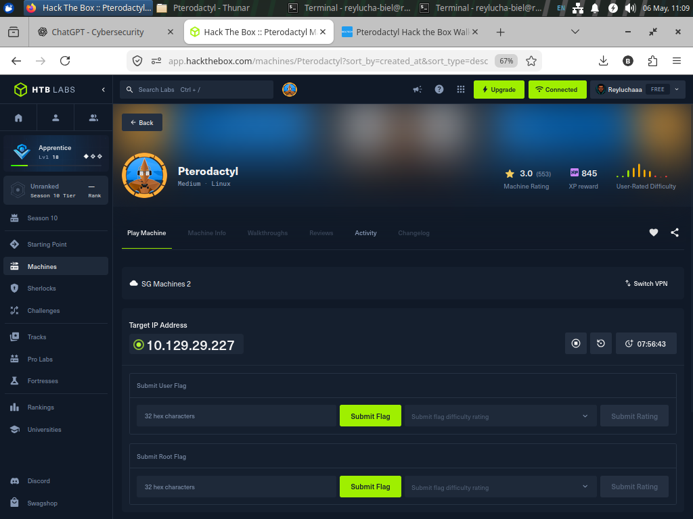

This machine is a good example of a realistic CTF chain. It starts like a normal website investigation, then slowly turns into a deeper system review. A simple analogy is inspecting a building: first we look at the front doors, then we find different nameplates on the same building, then we discover a back office, and finally we review internal notes that point to a maintenance issue.

## High-Level Attack Path

```text
  -> Network recon
  -> Web service discovered
  -> Virtual Host Fuzzing
  -> Pterodactyl Panel discovered
  -> Locale endpoint reviewed
  -> Application configuration exposure validated
  -> Lab access obtained for deeper enumeration
  -> Database reviewed for account risk
  -> Password reuse identified
  -> SSH user access obtained
  -> Local mail clue points to udisksd
  -> Privilege escalation path validated in the lab
  -> Root-level proof collected with flags redacted
```

The most important lesson is that the machine was not solved by one single trick. It was solved by connecting small pieces of evidence.

---

## 🐾 Phase 1: Reconnaissance & Enumeration
This phase is about mapping the "attack surface" before touching the target.

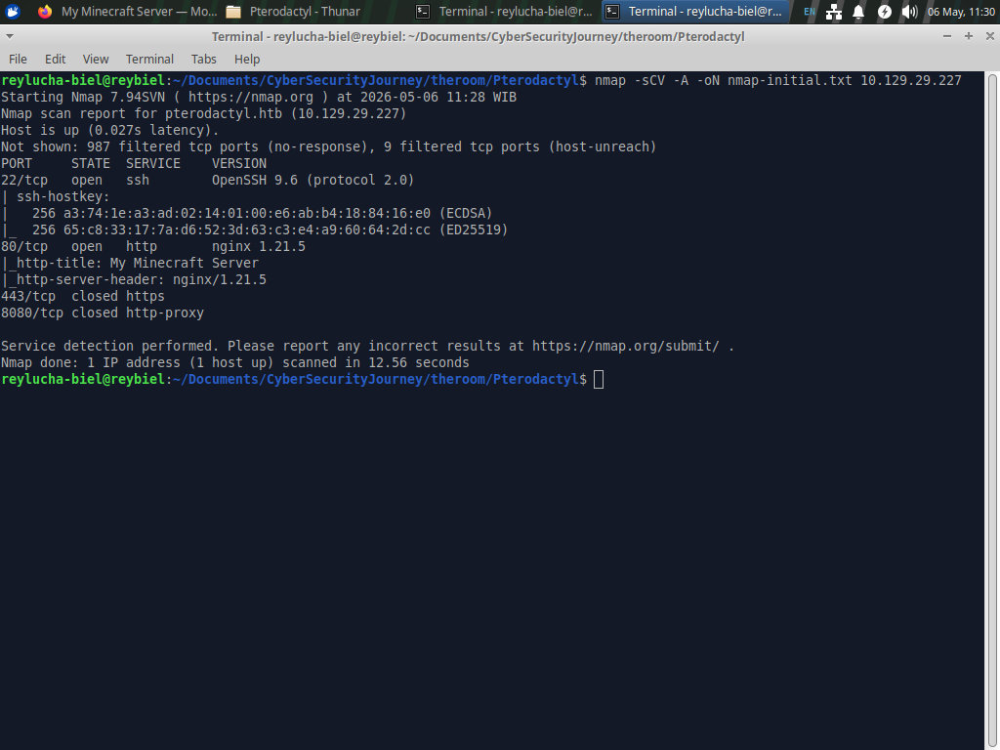
* **Initial Port Scanning:** The scan showed a very small external surface: SSH (22) and HTTP (80). As practitioners, we know SSH is usually for later once we have credentials, so we focus on HTTP first.

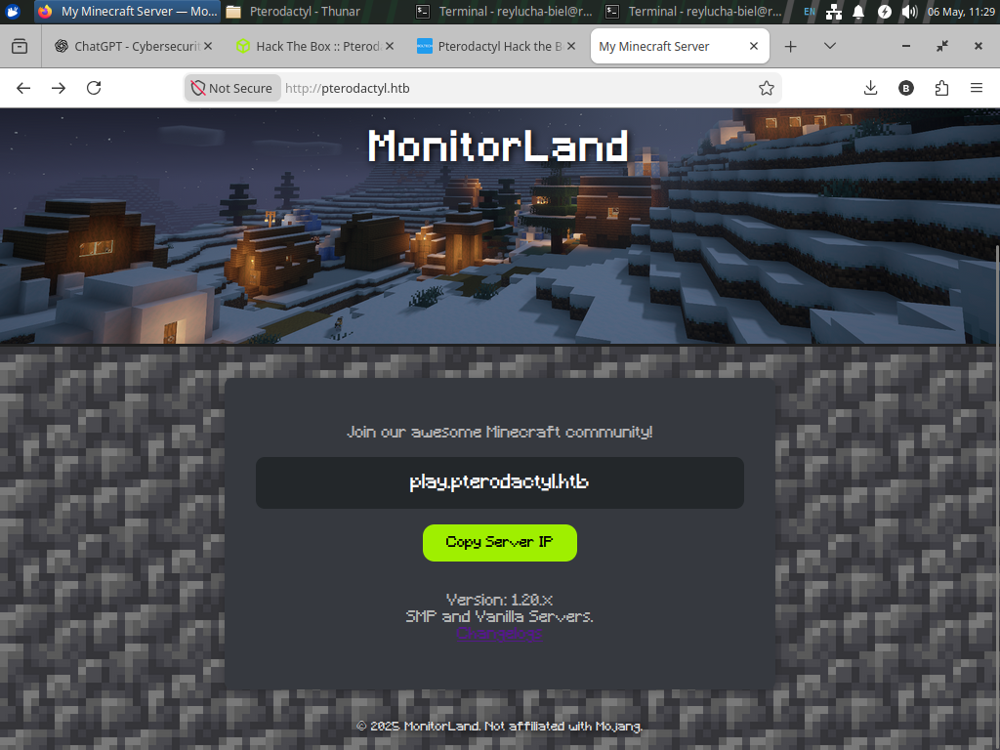
* **Web Investigation:** The web service reveals a Minecraft-themed landing page called "MonitorLand". In CTFs, themes are hints; this points toward

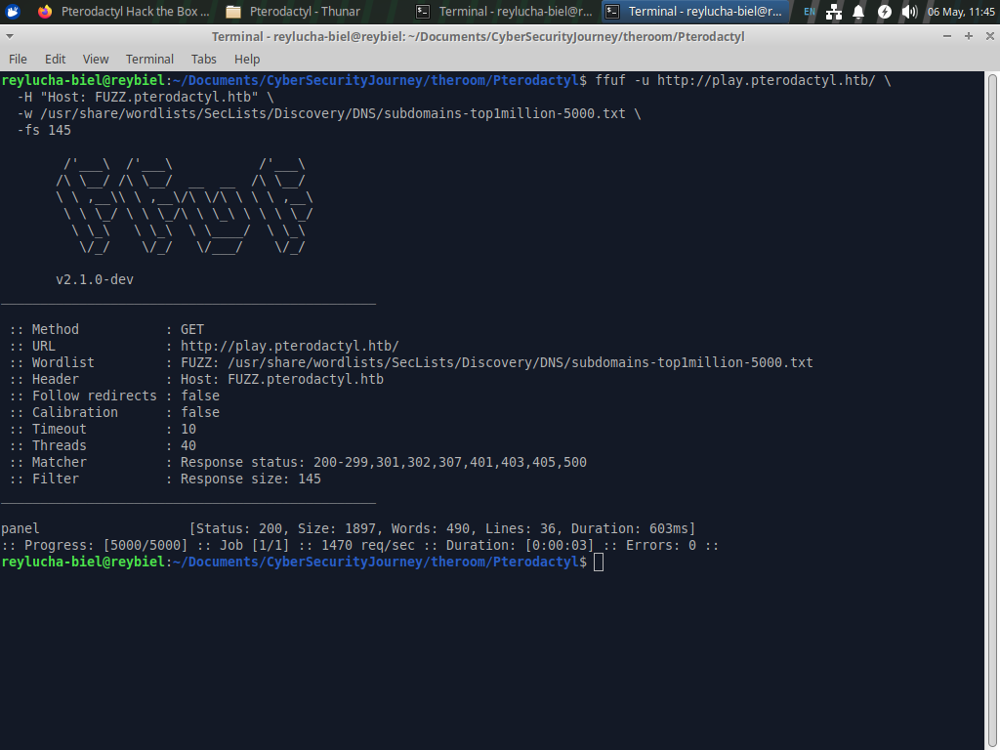
* **Virtual Host Discovery:** The application uses virtual host routing, meaning one IP serves different sites based on the requested hostname.
* **Analogy:** Imagine one office building. The address is the same, but the receptionist sends you to different rooms depending on the company name you ask for.

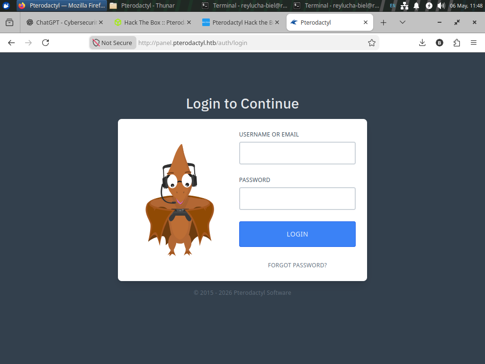
* **Pterodactyl**, a game server management panel.
* By "fuzzing" hostnames, we discovered the administrative panel interface.


---

## 🔓 Phase 2: Gaining Initial Access
Here, we turn information into a way inside the system.

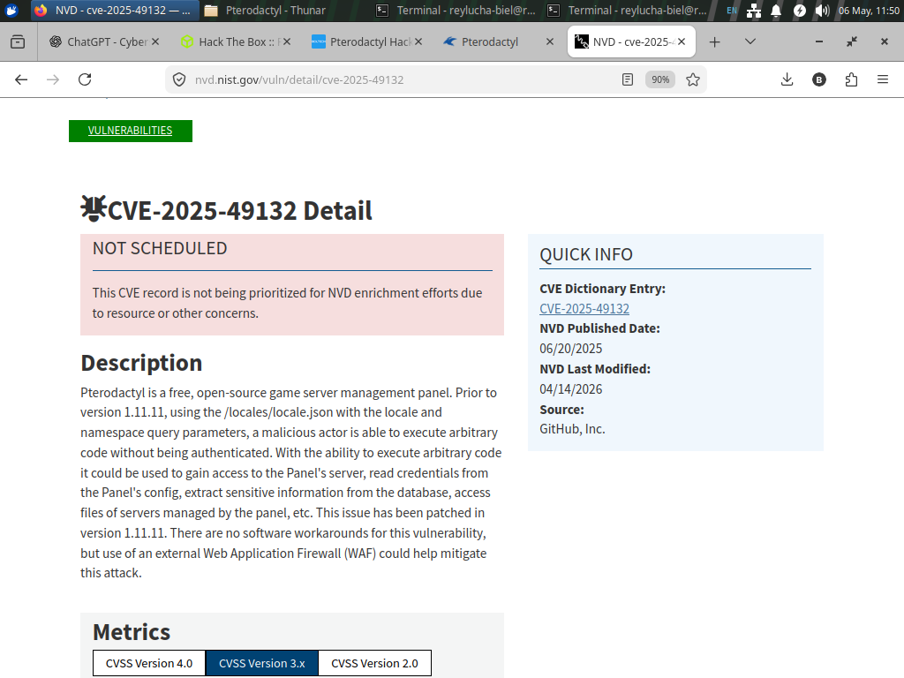
* **CVE-2025-49132 Exploitation:** The behavior matched a known vulnerability where affected versions expose sensitive information through the locale mechanism.

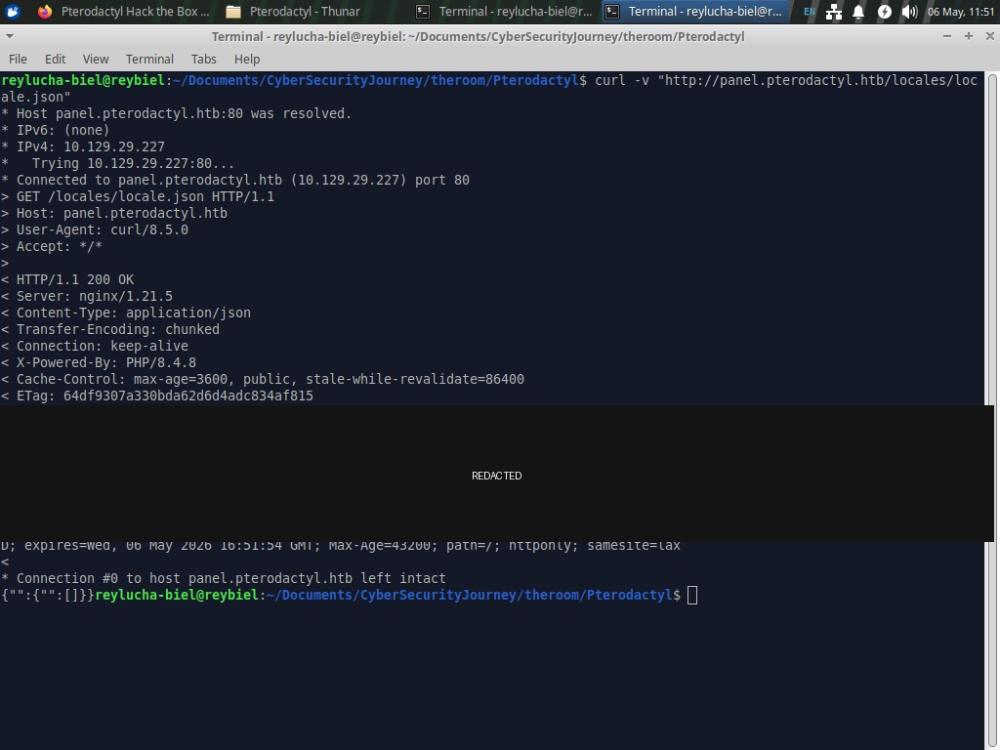
* **Endpoint Validation:** A "locale" (language) endpoint was found that could be reached without logging in.

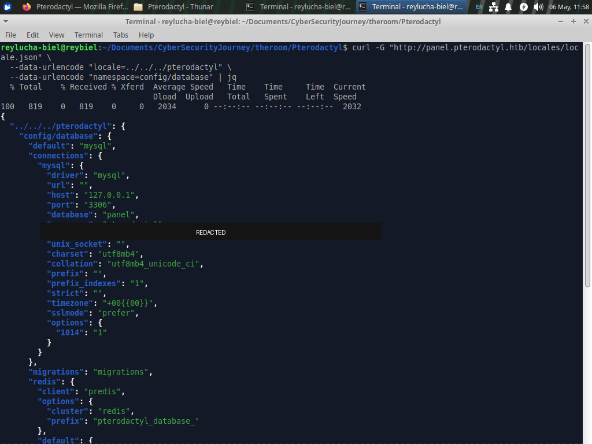
* **Configuration Exposure:** Configuration files are like an "instruction manual" for an application. Through this leak, we obtained the **Application Key** and **Database Credentials**.

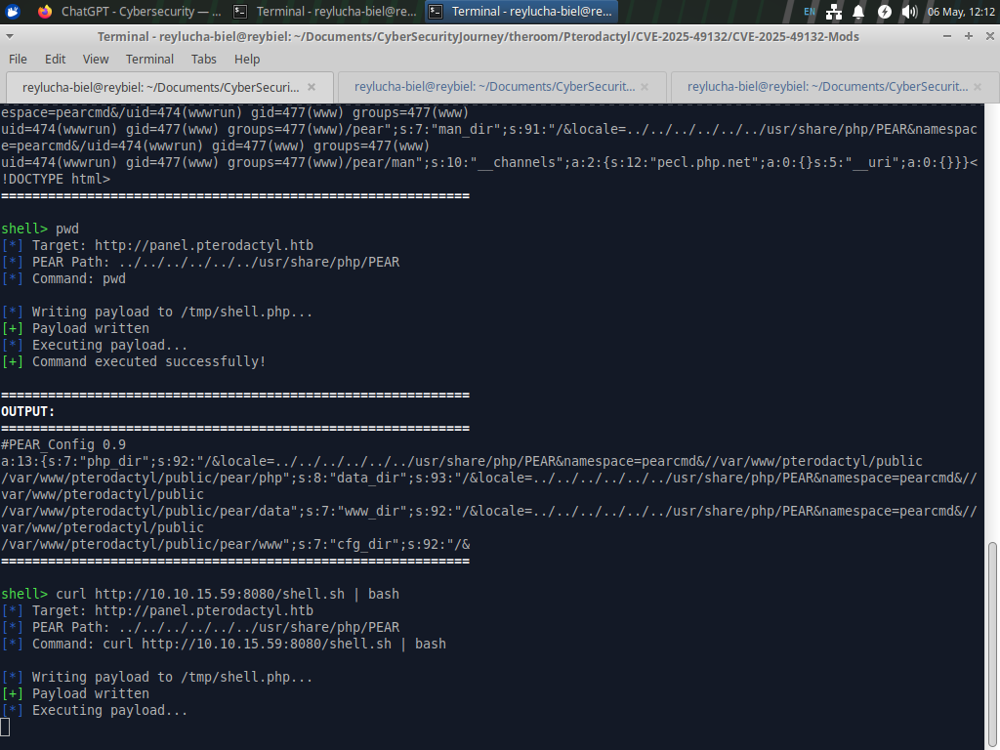
* **Initial Lab Access:** Using these secrets, we obtained an interactive shell as the web service user. We are now inside the building in a restricted staff area.

---

## 🕵️ Phase 3: Lateral Movement & User Escalation
Web access is usually limited. Our goal now is to become a full system user.

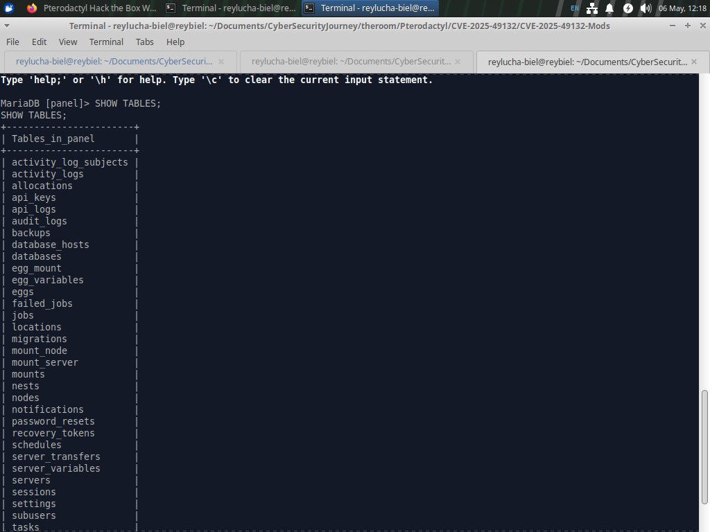
* **Database Enumeration:** With the database password from Phase 2, we reviewed the local tables, specifically the `users` table containing password hashes.

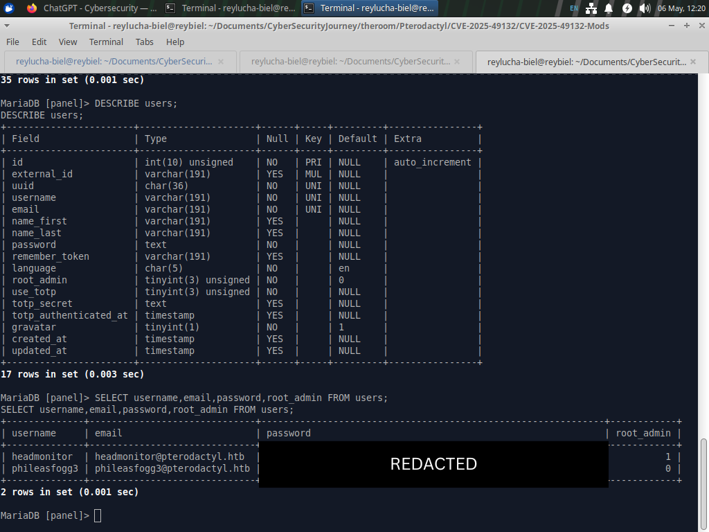
* **Credential Analysis and The Hash Concept:** A password hash is like a locked box. It isn't the password, but if the lock is weak, we can "crack" it to see what's inside.


* **Password Reuse:** One recovered password was reused for SSH access by a local lab user. 
* **Lesson:** Password reuse turns one small leak into a total system breach.
* **Result:** SSH access obtained; User Flag collected.

---

## 👑 Phase 4: Privilege Escalation (Root)
The final step: Taking total control of the Linux machine.


* **The Mail Clue:** Local enumeration revealed an internal email mentioning unusual activity with `udisksd`. In CTFs, internal notes are rarely accidental; they are breadcrumbs.


* **Vulnerability Research:** The clue pointed to two specific vulnerabilities:
    1.  **CVE-2025-6018:** Affects how the system treats a user's active session.
    2.  **CVE-2025-6019:** Affects `udisks/libblockdev`, allowing a user to gain elevated privileges.
    * **Analogy:** The first weakness tricks the badge reader into thinking you're at the front desk. The second weakness lets that "active" status open the maintenance elevator to the roof.
 

* **Root Execution:** By chaining these, we successfully gained **Root** access and completed the lab.

---

## 🛡️ Phase 5: Defensive Lessons (Blue Team Mindset)
Every offensive step provides a lesson for a defender.

| Finding | Defensive Recommendation |
| :--- | :--- |
| Virtual hosts exposed | Inventory all hostnames and hide admin interfaces. |
| Locale endpoint leak | Patch software immediately and validate input paths. |
| Config leak (Secrets) | Rotate application keys and DB passwords after any exposure. |
| Password reuse | Enforce unique credentials and Multi-Factor Authentication (MFA). |
| Local mail hints | Do not leave sensitive operational clues in plain text. |
| `udisks` Privilege Escalation | Apply system patches and restrict risky local permissions. |

# Phase 6: Defensive Lessons Learned

This machine is valuable because every offensive step maps to a defensive lesson.

| Finding | Defensive Lesson |
|---|---|
| Virtual hosts exposed multiple applications | Inventory all hostnames and review hidden admin surfaces |
| Locale endpoint exposed sensitive data | Patch vulnerable software and validate input paths carefully |
| Application config leaked secrets | Rotate application keys, database passwords, and related tokens |
| Database contained user hashes | Protect database access and monitor credential exposure |
| Password reuse enabled SSH access | Enforce unique credentials and stronger authentication controls |
| Local mail revealed operational clue | Avoid leaving sensitive operational hints accessible to normal users |
| udisks/libblockdev path allowed privilege escalation | Apply timely system patches and restrict risky local authorization behavior |

---

# Phase 7: Final Reflection

Pterodactyl is not just a machine about running a public proof-of-concept. It is a machine about building a chain from evidence.

The professional workflow was:

1. enumerate what is exposed;
2. understand the application context;
3. validate the vulnerability behavior;
4. review exposed configuration carefully;
5. analyze credentials ethically inside the lab;
6. pivot only when evidence supports it;
7. use local clues to guide privilege escalation research;
8. document findings with sensitive data redacted.

The biggest takeaway is that cybersecurity is not about blindly using tools. It is about asking the right questions, validating assumptions, and documenting the risk in a way that helps others learn and defend systems better.

---

## Ethical Note

This writeup is for CTF learning only. The same techniques must never be used against systems without explicit permission. A high-morality cybersecurity practitioner uses these skills to understand risk, improve defenses, report responsibly, and protect people.

## Big Respect
1. To https://nvd.nist.gov/ for giving the information about the CVE
2. To https://www.ibrahimisiaqbolaji.com/ who guided me if I get stuck in this room
3. To str1keboo he give us PoC about CVE-2025-49132
4. To guinea-offensive-security he give us PoC about CVE-2025-6019
5. To ibrahmsql he give us PoC about CVE-2025-6018
