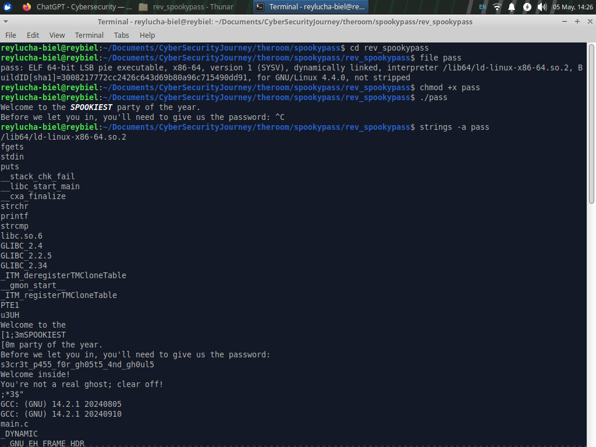
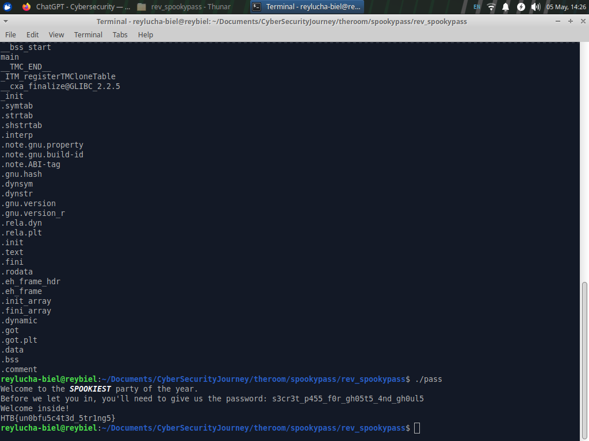

# Hack The Box — SpookyPass Writeup

> **Category:** Reverse Engineering  
> **Difficulty:** Very Easy  
> **Platform:** Hack The Box Labs  
> **Target file:** `SpookyPass.zip`  
> **ZIP password:** `hackthebox`  
> **Flag:** `HTB{un0bfu5c4t3d_5tr1ng5}`

---

## 1. Challenge Overview


The scenario says:

> All the coolest ghosts in town are going to a Haunted Houseparty — can you prove you deserve to get in?

Our mission is simple: reverse the given binary, figure out the correct password, and get invited to the spooky party. No panic. No dark magic. Just static analysis, binary triage, and a tiny bit of ghost hunting.

Because this is a CTF private lab challenge, all analysis was performed locally against the provided challenge binary.

---

## 2. Initial Extraction

The downloaded file is a password-protected ZIP archive. Hack The Box gives us the archive password:

```bash
unzip -P hackthebox SpookyPass.zip
```

After extraction, the challenge directory contains a binary named `pass`:

```bash
cd rev_spookypass
ls -la
```

---

## 3. Binary Triage

The first thing I do in almost every reverse engineering challenge is basic triage. Before opening Ghidra, IDA, Binary Ninja, or going full wizard mode, I want to know what kind of creature I am dealing with.

```bash
file pass
```

Output:

```text
pass: ELF 64-bit LSB pie executable, x86-64, version 1 (SYSV), dynamically linked,
interpreter /lib64/ld-linux-x86-64.so.2, BuildID[sha1]=3008217772cc2426c643d69b80a96c715490dd91,
for GNU/Linux 4.4.0, not stripped
```

Important observations:

- It is a **Linux ELF 64-bit** executable.
- It is **PIE**, so addresses are position-independent at runtime.
- It is **dynamically linked**, so libc functions like `puts`, `fgets`, and `strcmp` are likely imported.
- It is **not stripped**, which is great for us because useful symbol names may still exist.

The `not stripped` part is basically the binary saying, “I brought a name tag to the haunted party.” Very polite.

---

## 4. Running the Program

Next, I made the binary executable and ran it:

```bash
chmod +x pass
./pass
```

The program prints:

```text
Welcome to the SPOOKIEST party of the year.
Before we let you in, you'll need to give us the password:
```

So the program expects a password. If the password is wrong, it rejects us:

```text
You're not a real ghost; clear off!
```

This behavior strongly suggests a simple password comparison, likely something like:

```c
if (strcmp(user_input, correct_password) == 0) {
    print_flag();
} else {
    reject_user();
}
```

At this point, the best next move is to search for embedded strings.

---

## 5. Static Analysis with `strings`

For beginner and very easy reverse engineering challenges, `strings` is often the fastest way to find hardcoded secrets.

```bash
strings -a pass
```

Relevant output:

```text
fgets
stdin
puts
strchr
printf
strcmp
Welcome to the 
[1;3mSPOOKIEST
[0m party of the year.
Before we let you in, you'll need to give us the password: 
s3cr3t_p455_f0r_gh05t5_4nd_gh0ul5
Welcome inside!
You're not a real ghost; clear off!
main.c
parts
main
```



The interesting string is:

```text
s3cr3t_p455_f0r_gh05t5_4nd_gh0ul5
```

That looks exactly like the password. It is not subtle. It is wearing a ghost costume with a flashing neon sign.

The imported symbol `strcmp` also supports the hypothesis that the binary compares our input against this hardcoded password.

---

## 6. Confirming the Password

I ran the program again and entered the recovered password:

```bash
./pass
```

Input:

```text
s3cr3t_p455_f0r_gh05t5_4nd_gh0ul5
```

Output:

```text
Welcome inside!
HTB{un0bfu5c4t3d_5tr1ng5}
```



And we are in. The ghosts have accepted us. The haunted houseparty bouncer has been defeated by `strings`.

---

## 7. Deeper Reverse Engineering Explanation

Although the flag can be solved quickly with `strings`, it is worth understanding what the binary actually does internally.

Disassembling `main` shows the following flow:

```bash
objdump -d -Mintel pass | sed -n '/<main>:/,/^$/p'
```

Key instructions:

```asm
call   fgets@plt
call   strchr@plt
call   strcmp@plt
test   eax,eax
jne    wrong_password
```

This tells us the program:

1. Reads user input with `fgets`.
2. Searches for the newline character using `strchr`.
3. Replaces the newline with a null byte if found.
4. Compares the cleaned input with the hardcoded password using `strcmp`.
5. Prints the flag only if `strcmp` returns `0`.

In C-like pseudocode, the logic looks like this:

```c
char input[128];

puts("Welcome to the SPOOKIEST party of the year.");
printf("Before we let you in, you'll need to give us the password: ");

fgets(input, 128, stdin);

char *newline = strchr(input, '\n');
if (newline != NULL) {
    *newline = '\0';
}

if (strcmp(input, "s3cr3t_p455_f0r_gh05t5_4nd_gh0ul5") == 0) {
    puts("Welcome inside!");
    print_flag_from_parts_array();
} else {
    puts("You're not a real ghost; clear off!");
}
```

The password is stored plainly in the binary's read-only data area, which is why `strings` found it immediately.

---

## 8. Where the Flag Comes From

Interestingly, the flag itself is not shown as a clean normal string in the `strings` output. Instead, the binary has a symbol named `parts`, and the flag bytes are stored as 32-bit integers in the `.data` section.

Dumping the `.data` section shows it clearly:

```bash
objdump -s -j .data pass
```

Relevant bytes:

```text
4060 48000000 54000000 42000000 7b000000  H...T...B...{...
4070 75000000 6e000000 30000000 62000000  u...n...0...b...
4080 66000000 75000000 35000000 63000000  f...u...5...c...
4090 34000000 74000000 33000000 64000000  4...t...3...d...
40a0 5f000000 35000000 74000000 72000000  _...5...t...r...
40b0 31000000 6e000000 67000000 35000000  1...n...g...5...
40c0 7d000000 00000000                    }.......
```

Reading the low byte of each 32-bit value gives:

```text
HTB{un0bfu5c4t3d_5tr1ng5}
```

So the program does not store the flag as one normal contiguous C string. It stores each character as an integer, then reconstructs the flag after the password check. This is a tiny obfuscation trick, but the challenge title and flag make the lesson clear: the sensitive password was still unobfuscated.

---

## 9. Final Flag

```text
HTB{un0bfu5c4t3d_5tr1ng5}
```

---

## 10. Key Takeaways

- Always start reverse engineering with basic triage: `file`, `checksec`, running the binary, and `strings`.
- The presence of `strcmp` is a strong sign of simple password validation.
- `not stripped` binaries are friendlier because symbol names can remain available.
- Hardcoded secrets in plaintext are easy to recover.
- A flag can be lightly hidden while the password remains completely exposed — spooky, but not secure.

---

## 11. Commands Summary

```bash
unzip -P hackthebox SpookyPass.zip
cd rev_spookypass
file pass
chmod +x pass
./pass
strings -a pass
./pass
objdump -d -Mintel pass | sed -n '/<main>:/,/^$/p'
objdump -s -j .data pass
```

---

## 12. Professional Notes

From a secure software development perspective, this binary demonstrates why secrets should not be embedded directly in client-side executables. Any value required to unlock privileged behavior, such as a password or license key, can be extracted through static analysis if it is present locally.

In real-world software, stronger approaches include server-side validation, challenge-response protocols, cryptographic verification, and minimizing secret material shipped to the client. In CTF land, though, this is a perfect warm-up challenge: quick, clean, and just spooky enough to make `strings` feel like a ghost detector.
