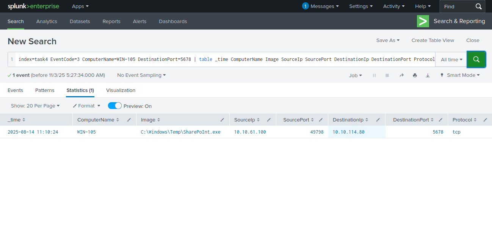
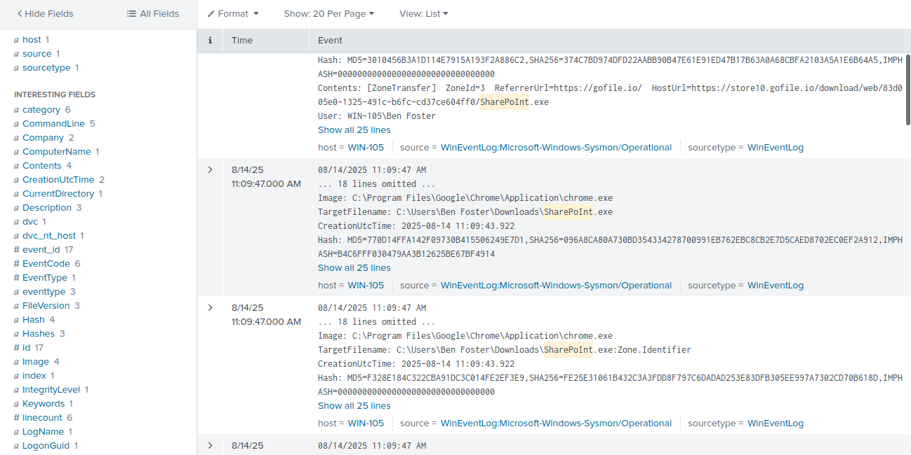
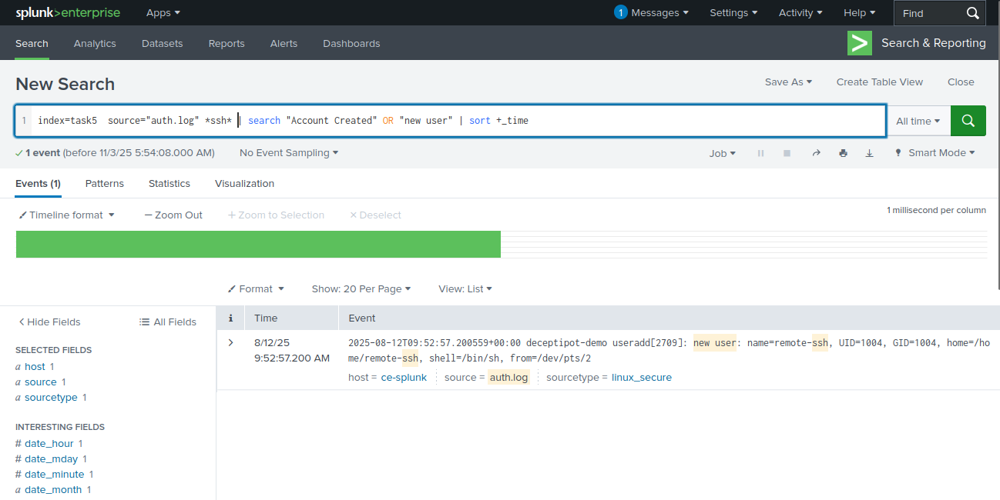
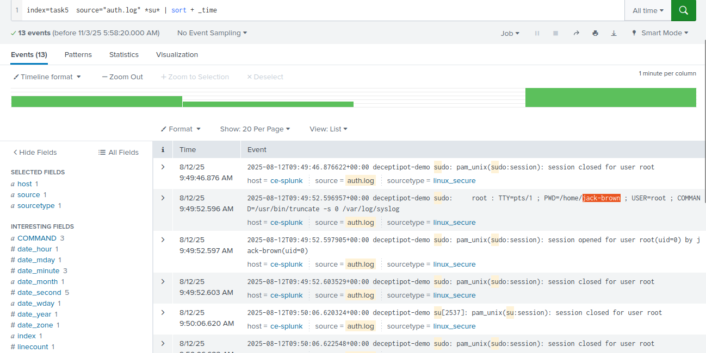
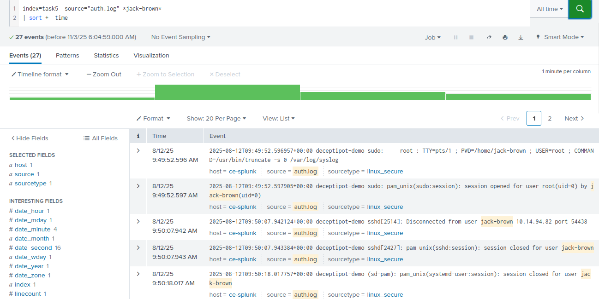
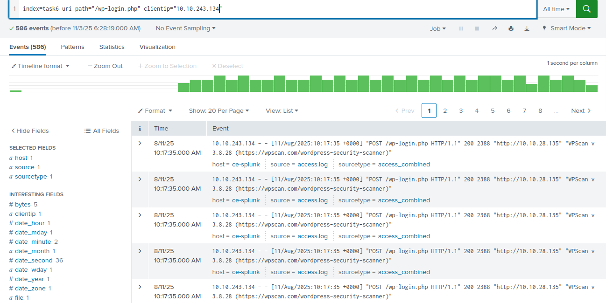

This is how to Analysts with Splunk SIEM, using TryHackMe platform studycase or challenge

Log Analysis with SIEM
Learn how SIEM solutions can be used to detect and analyse malicious behaviour.

Task 1 - Introduction

Any modern SOC analyst must be able to effectively use a SIEM to analyse and correlate logs while quickly identifying malicious activity and compromised assets. Equally important is understanding the different data sources behind the logs and how each one helps you see the full picture.
Learning Objectives

    Discover various data sources that are ingested into a SIEM.
    Understand the importance of data correlation.
    Learn the value of Windows, Linux, Web, and Network logs during an investigation.
    Practice analysing malicious behaviour.

Room Prerequisites

It is suggested to complete the following rooms first before proceeding:

    Introduction to SIEM
    Windows Logging Capabilities
    Cyber Kill Chain
    Sysmon

Lab Access

Before proceeding, start the lab by clicking the Start Machine button below. You will then have access to the Splunk Web Interface. 
To access Splunk, please follow this link: https://LAB_WEB_URL.p.thmlabs.com. Please wait 4-5 minutes for the Splunk instance to launch. Use Splunk’s All Time range to search. The indexes where logs are stored for each practical exercise are present in each task.

Let's go!
First step is connected to THM server with VPN OVPN download the file and activate the with OVPN
Click Start Machine, wait a moment until the link is change or appear 
Use the link for access Splunk SIEM

Task 2 - Benefits of SIEM for Analysts

🧩 1. Centralization

Imagine you're a detective, but all the evidence is scattered in various places — in a closet at home, in a car, in a cafe, even on your friend's cell phone.
Well, SIEM is like a large closet where you can store all the evidence in one place.
So you just open one closet and see everything at once — no need to run around everywhere.
➡️ The result: your work becomes faster and more efficient, and you can immediately see the whole picture of the case 🔎

🧠 2. Correlation

Still playing detective 🕵️‍♂️
Now you've found many pieces of clues—footprints, CCTV photos, and strange messages. Individually, they don't make sense, but...
when you combine all the clues, you can see who the culprit is!
That's correlation in SIEM—collecting pieces of events from various sources, then putting them together to reveal the whole story: who, when, where, and how.
➡️ The result: random data becomes a complete story of the attack 🔥

⏳ 3. Historical Events

This is like the “memories” feature on Instagram 😆
You can scroll back in time to see old posts — “Oh, it turns out he's been uploading photos from that place a lot!”
It's the same with SIEM. You can look at past logs to see if the strange activity has happened before or is new.
➡️ The result: you can tell if it's a new threat or just an old user habit.

🧭 Simple Conclusion:

Centralization: all data is collected in one place (to avoid complications).

Correlation: piecing together the puzzle from numerous logs to understand the actual story.

Historical Events: looking back to recognize attack patterns.

Answer the questions below

What is the process of linking data from multiple sources to identify relationships between individual events called?
Answer: Correlation
Explanation:
This is the process of connecting data from various sources (e.g., IDS logs, Sysmon, Event Log, etc.) to see the relationship between events — like putting together pieces of a puzzle to see the whole picture.
➡️ The goal: to help analysts know who, where, and what happened, so they can distinguish between malicious and normal activity.

What is the process of collecting and storing log data from multiple systems and sources into a single, unified location for easier analysis called?
Answer: Centralization
Explanation:
This is the process of collecting all logs from various systems into one place (for example, to SIEM).
➡️ The goal: so that analysts don't need to open multiple systems — just one platform to analyze all data, making it faster, more efficient, and easier to see the big picture.

Task 3 - Log Sources Overview

🌳 Overview: Log Sources

Imagine an organization as a large tree 🌲

Roots = all log sources (computers, servers, firewalls, websites, cloud, etc.).

Trunk & leaves = SIEM analysis results.
All roots send “nutrients” (log data) to the trunk (SIEM) to keep the tree healthy, aka the system secure 💪

💻 Host-Based Logs

Like CCTV inside a house 🏠
Records all activities on a computer or server — who logged in, what was run, what files were changed.
➡️ Useful for finding out if a malicious script is running or if there is strange activity within the system.

🌐 Network-Based Logs

Like cameras on the highway 🚦
See who is sending data to whom, who is entering and leaving the network.
➡️ Helps analysts understand the flow of communication between devices and detect attacks through suspicious traffic.

🕸️ Web-Based Logs

Imagine this as a guard at an online store door 🛒
Monitoring who enters, fills out forms, or tries to “break in” through web bugs.
➡️ This is very important for detecting attacks through websites or applications.

⏰ Time Pitfalls

It's like you and your friend are in different time zones ⏳
You say “5 p.m.”, but the system shows “1 p.m.”.
➡️ Be careful when reading the time in the log, don't misinterpret the sequence of events!

🔄 Log Normalization

Imagine everyone submitting reports in different languages—some in Indonesian, English, Japanese 🤯
Well, normalization is like Google Translate for logs.
➡️ All logs are converted to a single format to make them easier to read, search, and correlate with each other.

🧭 Simple Conclusion:
| Concept             | Analogy              | Purpose                               |
| ------------------ | -------------------- | ------------------------------------ |
| Host-Based Logs    | CCTV inside the house  | Detection of activity on computers/servers |
| Network-Based Logs | Highway cameras    | Monitoring connections between devices       |
| Web-Based Logs     | Online store guard  | Web attack detection                 |
| Time Pitfalls      | Time zone differences      | Ensure accurate analysis time       |
| Normalisation      | Google Translate log | Standardize log format for easy reading |

Answer the questions below

What is the process of converting logs from different formats into a single format for easier analysis in a SIEM? 
Answer: Normalization
Explanation:
Imagine you receive reports from many people — some use English, some use emojis, and some use alien language 😅
Well, normalization is the process of standardizing the format of all reports into one common language, so that they are easy to read and analyze in SIEM.

Which log source type can be used to detect the execution of a malicious script?
Answer: Host-Based Log Source
Explanation:
Logs from computers or servers (hosts) can reveal activity within the machine — including when malicious scripts are executed 🦠
So, from these host logs, analysts can find out when and how malicious scripts were run.

Task 4 - Windows Logs

🧠 Two Main Log Sources in Windows SIEM

There are two important “spies” for Windows analysis in SIEM:
1️⃣ WinEventLogs
2️⃣ Sysmon (must be installed manually)

When combined, both allow you to see what is happening inside and outside the system. 🔍

⚙️ Sysmon = Secret Detective Inside Your PC

Think of Sysmon as a super-detailed CCTV camera inside your computer.
It records all the little things:

Malicious processes running (e.g., strange PowerShell).

Suspicious network connections.

Registry changes, new files, process injections.

🧩 Example:
Sysmon can show that cmd.exe is running powershell.exe using an encoded command, then making a connection to a suspicious IP on port 9999.

➡️ Purpose: to track what and who is causing suspicious activity.

🪟 WinEventLogs = Windows Logbook

Like an official diary from Windows that records major events in the system:

User logins, new accounts, restarts, log deletions, policy changes.

System service activity (service creation/start).

📘 Example:

Event 4720 / 4722 → a new account has been created (sign of persistence).

Event 7045 / 7036 → a new service has appeared (sign of privilege escalation).

➡️ Purpose: helps you see administrative activity and system changes.

🧭 Simple Conclusion:
| Log Source       | Analogy                | Focus of Analysis                                |
| ---------------- | ---------------------- | --------------------------------------------- |
| **Sysmon**       | Internal computer CCTV | In-depth activities: processes, connections, registry |
| **WinEventLogs** | Windows logbook    | Login, accounts, services, system events            |

Malicious Process Execution
index=winenv EventCode=1 *powershell* AND *EncodedCommand*
| table _time ComputerName ParentUser ParentImage ParentCommandLine Image CommandLine
function: This query helps analysts find malicious PowerShell that may be running hidden (encoded) scripts — an early sign of malware execution or attack scripts.

Suspicious Network Connection
index=winenv EventCode=3 ComputerName=WINHOST05
| table _time ComputerName Image SourceIp SourcePort DestinationIp DestinationPort Protocol
function: Query ini berguna buat melacak aktivitas jaringan dari host tertentu, misalnya buat tahu apakah WINHOST05 nyambung ke IP mencurigakan atau server C2 (Command & Control).

Windows Security Logs
index=winenv EventCode=4720 OR EventCode=4722
| table _time EventCode ComputerName Subject_Account_Name Target_Account_Name New_Account_Account_Name Keywords
function: Query ini membantu SOC Analyst menemukan akun baru atau akun lama yang diaktifkan kembali — langkah penting buat deteksi privilege escalation atau akun backdoor buatan attacker.

Windows System Logs
index=winenv EventCode=7045 OR EventCode=7036 ComputerName=WINHOST05
|  table _time EventCode ComputerName Service_Name Service_Account Service_File_Name Message
function: Query ini membantu SOC Analyst mendeteksi service mencurigakan — misalnya service yang aneh, aktif tiba-tiba, atau pakai akun sistem tinggi.

Practice Scenario
You are an SOC Level 1 Analyst on shift and have received an alert indicating a suspicious network connection using port 5678 on the WIN-105 host. Your task is to conduct an investigation and determine whether this activity is suspicious.

The logs for this task are located in the Splunk index task4. Use the following query: index=task4

Image Documentasion:

Answer the questions below

Which IP address was the connection established with?
As we know in practice scenario we got the information index=task4 , DestinationPort is 5678 and ComputerName WIN-105, let's using the query for search the suspicious network
Query: index=task4 EventCode=3 ComputerName=WIN-105 DestinationPort=5678 | table _time ComputerName Image SourceIp SourcePort DestinationIp DestinationPort Protocol
We can see in the DestinationIp
Answer: 10.10.114.80

Which process initiated this suspicious connection?
In the previous question we can see the process in image column
Answer: SharePoInt.exe

What is the MD5 hash of the malicious process from the previous question?
Hint: This question requires a log correlation process!
After analyse correlation log we can use this query: index=task4 *SharePoInt* | sort +_time
The second record event displaying the message of MD5 hash
Answer: 770D14FFA142F09730B415506249E7D1

What is the name of the scheduled task that was created on the system?
Hint: You need to look at the behavior after executing the malicious executable file!
Use this query to find the Scheduled task: index=task4 *schtasks* | sort +_time
it will display at the top
Answer: Office365 Install

Task 5 - Linux Logs

🔍 Linux Log Analysis in SIEM

There are two main log sources that SOC analysts always look at when analyzing Linux:

🧩 auth.log → stores all login activities and sudo usage.
➜ For detecting failed logins, brute-force attacks, or privilege escalation.
Example query:
index=linux source="auth.log" *ubuntu* process=sshd 
| search "Accepted password" OR "Failed password"
→ Finding successful and failed login attempts to the Ubuntu user → signs of brute-force.

⚙️ syslog → stores general system events such as service restarts, cron jobs, and background processes.
➜ Use it to look for suspicious activity or persistence.
Example query:
index=linux sourcetype=syslog ("CRON" OR "cron") 
| search ("python" OR "perl" OR "ruby" OR ".sh" OR "bash" OR "nc")
→ Found a strange script in /tmp that runs every 5 minutes (indication of persistent malware).

🧠 Conclusion:

auth.log = see who logged in and how.
syslog = see what the system is doing behind the scenes.
Both help you understand when, who, and how the attack occurred.

Practice Scenario
You are an SOC Level 1 Analyst on shift and have received an alert indicating possible persistence through the creation of a new remote-ssh user on an Ubuntu server. 
Your task is to dive into the logs and determine exactly what happened on the system.

The logs for this task are located in the Splunk index task5. Use the following query: index=task5

Image Documentasition:

Answer the questions below

What was the timestamp of the remote-ssh account creation?
Answer Format Example: 2025-01-15 12:30:45
As we know in the scenario we use index=task5 process persistence use ssh on Ubuntu Server, the question mention the account creation
so we can use the query: index=task5  source="auth.log" *ssh* | search "Account Created" OR "new user"
this will show only one event
Answer: 2025-08-12 09:52:57

Which user successfully escalated their privileges to root prior to the action from the first question?
We can use this query to find escalated privilages in linux to access the root CLI use is sudo su and fin the from the oldest
so the query is: index=task5  source="auth.log" *su* | sort + _time
Answer: jack-brown

From which IP address did the user from the previous question successfully log in to the system?
Use this query: index=task5  source="auth.log" *jack-brown* 
| sort + _time
Answer: 10.14.94.82

How many failed login attempts occurred prior to this successful login?
use this query after we receive correlation information: index=task5 source="auth.log" | search "Failed password for jack-brown"
this will show 5 event but that one is not included so
Answer: 4

Which port is the persistence mechanism configured to connect to?
Use this query will show one event and readed the message: index=task5 source=syslog *port*
Answer: 7654

Task 6 - Web Application Logs

🌐 Web Log Sources

Every organization has a web server (such as Apache or Nginx) that stores website activity logs.
These logs are very important for detecting attacks such as:

🔑 Brute force login

🕳️ Web shell

🌊 DDoS attack

⚔️ 1. Brute Force Attack

🔍 Check for multiple requests to the login page (e.g., /wp-login.php) in a short period of time.
The query looks for IPs that send >25 POST requests in 5 minutes.
➡️ If one IP (e.g., 167.172.41.141) spams hundreds of times, it's a sign of a brute force attack.
📎 User-Agent: “Hydra” → hacker tool for brute force.

💀 2. Web Shell

🔍 Look for requests to suspicious files like .php, .asp, .jsp, .exe with POST/GET method and status=200.
➡️ If strange files such as 505.php appear repeatedly, it could be a web shell (hacker backdoor).

🌩️ 3. DDoS Attack

🔍 Look for multiple requests in a short period of time + status 503 (server overload).
➡️ For example, if one IP sends >100,000 requests in 10 minutes → it's most likely a DDoS attack.

🧠 Conclusion:

Web logs = CCTV cameras of the website world 🌐
You can see who is trying to log in, who is sneaking in through malicious files, and who is attacking the server with flood traffic.

Image Documentasition:

Answer the questions below

Which URI path had the highest number of requests?
Use this index=task6 and check the fields menu on the left side and click field uri_path that's show 10 top values the answer is on the top
Answer: /wp-login.php

Which IP address was the source of the activity?
Use this query and do the same things in the previous question click field clientip it will show on the top: index=task6 uri_path="/wp-login.php"
Answer: 10.10.243.134

How can this activity be classified?
Analyse from this query: index=task6 uri_path="/wp-login.php" clientip="10.10.243.134"
The reasons:
⚔️ Conclusion
This attack is a WordPress Login Brute Force using the WPScan tool from IP 10.10.243.134.
The goal: to try username/password combinations repeatedly to gain WordPress admin access.

🧩 Supporting Signs
Repeated POST to /wp-login.php
Status 200 (successfully sent, not an error)
User-Agent: WPScan v3.8.28
Many requests in a very short time

Which tool did the threat actor use?
We can find after use the query in the previous question
WPScan is a specialized tool (scanner) for detecting vulnerabilities on WordPress sites.

It is typically used by pentesters and security researchers, but can also be used by attackers.

Its functions include enumerating (searching for) usernames, plugins, themes, WordPress versions, and checking for vulnerabilities or weak points.

It can also be used for brute-force login attempts (trying combinations of usernames and passwords).

Its implementation often appears as the User-Agent “WPScan...” in web server logs.

In essence: it's a valid tool for security, but if used maliciously, it becomes a source of attack.

Quick mitigation: update core/plugins/themes, use strong passwords + 2FA, limit retries (rate-limit / fail2ban), and block suspicious IPs.
Anwer: WPScan

Task 7 - Conclusion

Great job completing this room! You've now gained a solid understanding of the key log sources commonly found in SIEM platforms and the value they provide during analysis.

    Explored the value of SIEM during log analysis.
    Learned how Splunk queries can be used to detect malicious behaviours.
    Gained an introduction to the processes of log correlation and normalisation.

