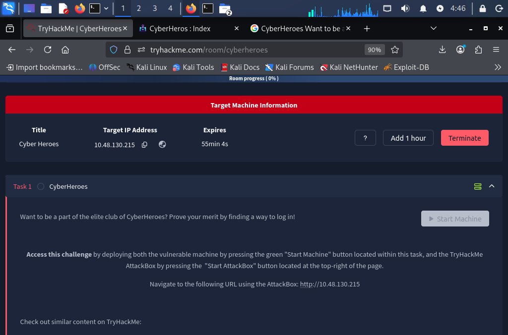
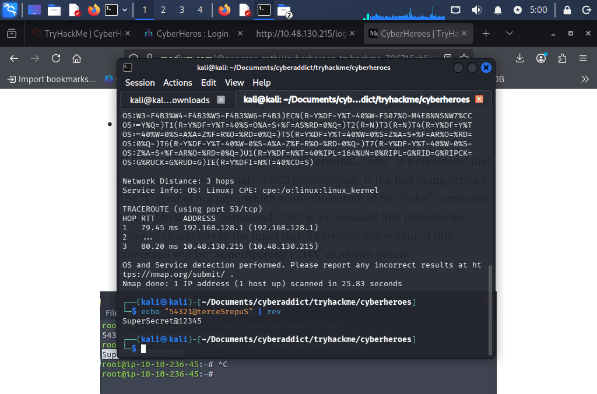
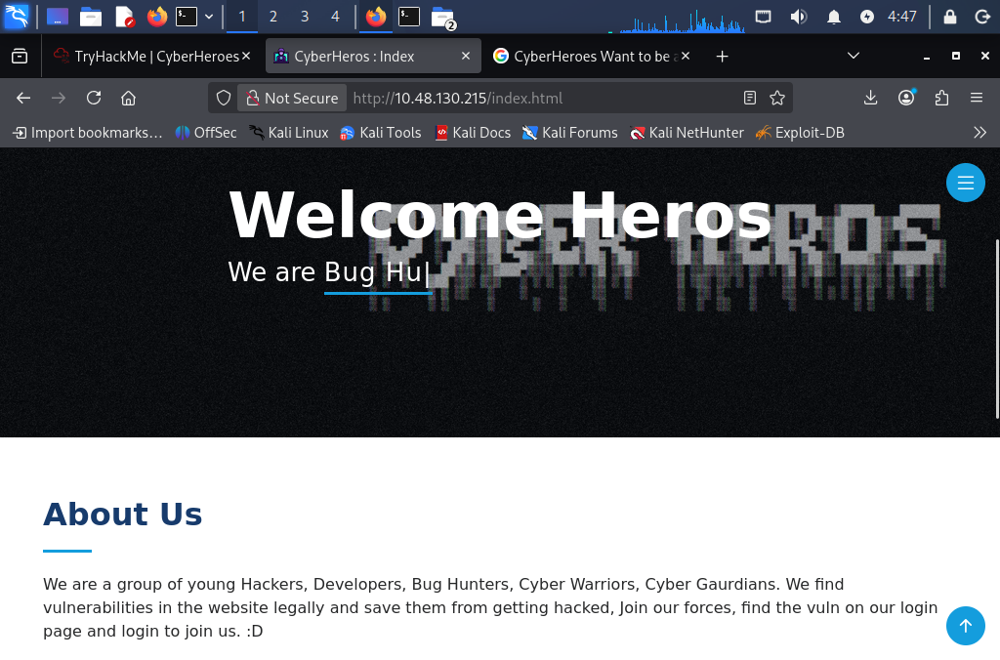
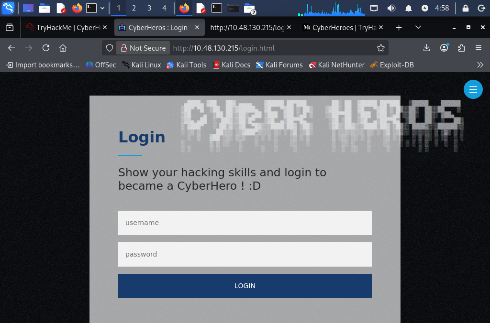
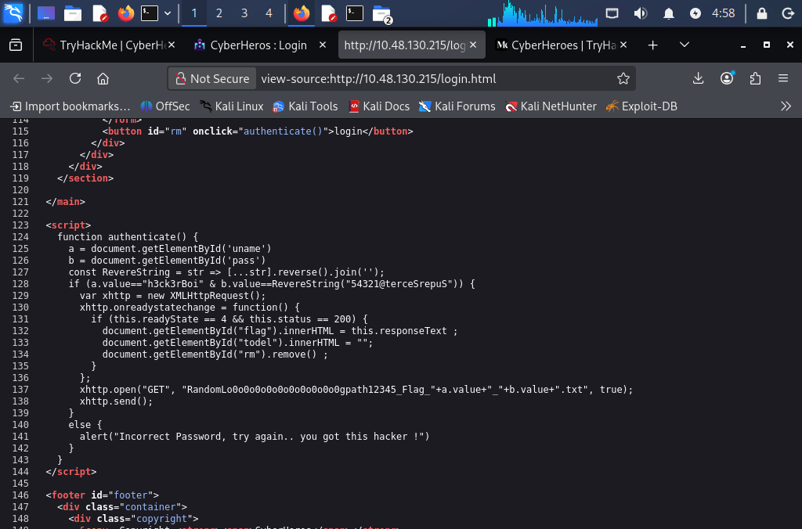
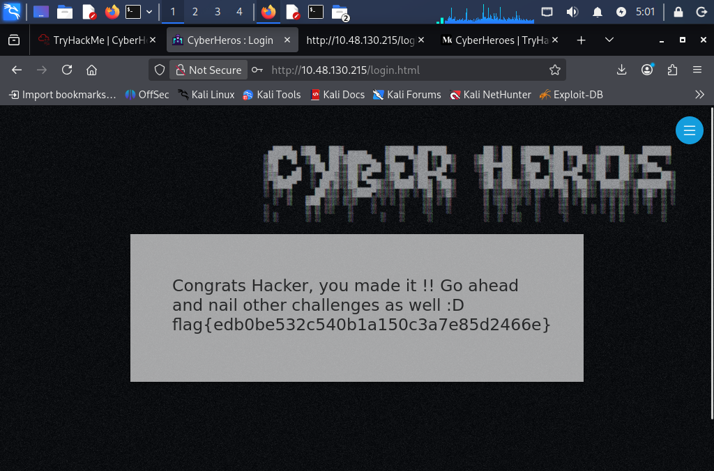

# TryHackMe CyberHeroes - CTF Write-up



> **Platform:** TryHackMe  
> **Room:** CyberHeroes  
> **Category:** Web Security / Client-Side Authentication  
> **Difficulty:** Beginner Friendly  
> **Target IP:** `10.48.130.215`  
> **Status:** Completed  
> **Author:** Biel  

---

## 1. Executive Summary

This report documents the successful completion of the TryHackMe **CyberHeroes** challenge. The objective of the room was to find a way to log in to the target web application and retrieve the flag.

The challenge demonstrates a common web security weakness: **sensitive authentication logic and credentials exposed in client-side JavaScript**. By performing basic reconnaissance, browsing the web application, and reviewing the page source, the login credentials were discovered directly inside the JavaScript code. The password was lightly obfuscated by reversing the string, which was decoded using a simple command-line technique.

This activity was performed inside an authorized Capture The Flag lab environment. The same techniques should only be used on systems where explicit permission has been granted.

---

## 2. Scope and Authorization

This assessment was conducted against a vulnerable machine intentionally provided by TryHackMe for educational purposes.

### In Scope

- Target machine deployed from the TryHackMe CyberHeroes room
- Web application hosted at `http://10.48.130.215`
- Reconnaissance and analysis required to solve the challenge
- Browser-based source code review

### Out of Scope

- Attacking real-world systems
- Attempting persistence
- Denial-of-service activity
- Accessing unrelated services or third-party infrastructure
- Any activity outside the TryHackMe lab environment

---

## 3. Tools Used

| Tool | Purpose |
|---|---|
| `nmap` | Network reconnaissance and service enumeration |
| Web browser | Manual web application analysis |
| View Page Source / Developer Tools | Client-side JavaScript inspection |
| `echo` and `rev` | Reversing the obfuscated password string |

---

## 4. Methodology Overview

The approach followed a simple and ethical web application testing workflow:

1. **Reconnaissance** - Identify open services and available technologies on the target.
2. **Web Enumeration** - Browse the discovered web application and understand its behavior.
3. **Client-Side Analysis** - Inspect the page source and JavaScript logic.
4. **Credential Discovery** - Identify exposed authentication values in the source code.
5. **Password Decoding** - Reverse the obfuscated password string.
6. **Login and Flag Retrieval** - Authenticate to the application and capture the flag.
7. **Security Review** - Explain the vulnerability and how to prevent it.

This methodology is useful for beginner-level CTF rooms because it teaches a structured process instead of relying on random guessing.

---

## 5. Reconnaissance

The first step was to identify what services were available on the target machine. Reconnaissance is important because it helps determine the attack surface before interacting deeply with the application.

The following command was used:

```bash
nmap -sC -sV -A 10.48.130.215
```

### Why this command was used

- `-sC` runs Nmap default scripts to collect useful service information.
- `-sV` attempts to detect service versions.
- `-A` enables aggressive detection, including OS detection, version detection, script scanning, and traceroute.

The scan confirmed that the target hosted a web application accessible through the browser.



---

## 6. Web Application Enumeration

After confirming that a web service was available, the target was opened in the browser:

```text
http://10.48.130.215
```

The landing page introduced the **CyberHeroes** challenge and directed the user toward a login page. The application message suggested that the user needed to prove their merit by finding a way to log in.



At this stage, the goal was not to brute-force the login page. Instead, the better approach was to understand how the page worked and whether the client-side code exposed useful information.



---

## 7. Source Code Review

A common technique in beginner web challenges is to inspect the client-side source code. This is useful because HTML, CSS, and JavaScript sent to the browser are visible to the user.

By opening the page source of the login page, the following JavaScript authentication logic was found:

```javascript
function authenticate() {
  a = document.getElementById('uname')
  b = document.getElementById('pass')
  const RevereString = str => [...str].reverse().join('');
  if (a.value=="ho3ck3rBi" & b.value==RevereString("54321@terceSrepuS")) { 
    var xhttp = new XMLHttpRequest();
    xhttp.onreadystatechange = function() {
      if (this.readyState == 4 && this.status == 200) {
        document.getElementById("flag").innerHTML = this.responseText ;
        document.getElementById("todel").innerHTML = "";
        document.getElementById("rm").remove() ;
      }
    };
    xhttp.open("GET", "RandomLo0o0o0o0o0o0o0o0o0o0gpath12345_Flag_"+a.value+"_"+b.value+".txt", true);
    xhttp.send();
  }
  else {
    alert("Incorrect Password, try again.. you got this hacker !")
  }
}
```



### Findings from the source code

| Field | Value |
|---|---|
| Username | `ho3ck3rBi` |
| Password logic | Reverse the string `54321@terceSrepuS` |
| Sensitive path pattern | `RandomLo0o0o0o0o0o0o0o0o0o0gpath12345_Flag_<username>_<password>.txt` |

The application performed authentication checks directly in the browser. This is insecure because any user can inspect, copy, and understand JavaScript delivered to their browser.

---

## 8. Password Decoding

The password was not securely protected. It was only reversed in the JavaScript code.

To decode it, the following command was used:

```bash
echo "54321@terceSrepuS" | rev
```

Output:

```text
SuperSecret@12345
```

The valid credentials were therefore:

```text
Username: ho3ck3rBi
Password: SuperSecret@12345
```

---

## 9. Exploitation and Flag Retrieval

Using the discovered credentials, the login form was submitted successfully. After authentication, the application returned the flag.

```text
flag{edb0be532c540b1a150c3a7e85d2466e}
```



---

## 10. Root Cause Analysis

The main issue was that the application exposed sensitive authentication logic in client-side JavaScript.

### Vulnerability

**Client-side credential exposure**

The username and password validation were visible in the browser source code. Since every user can inspect JavaScript delivered to their browser, this makes the authentication mechanism ineffective.

### Why this is dangerous

Client-side code should never be trusted to protect secrets. Anything sent to the browser can be read, copied, modified, or replayed by a user.

In a real-world environment, this issue could allow an attacker to:

- Discover hardcoded credentials
- Bypass login functionality
- Access hidden files or endpoints
- Understand internal application logic
- Modify requests to retrieve protected resources

---

## 11. Security Recommendations

To prevent this type of issue in real applications, the following controls should be implemented:

### 1. Move authentication logic to the server side

Login validation must happen on the backend, not in JavaScript running in the browser.

### 2. Never hardcode credentials in source code

Credentials should not be stored in HTML, JavaScript, public repositories, or static files.

### 3. Use secure password storage

Passwords should be hashed using strong password hashing algorithms such as Argon2, bcrypt, or scrypt. Plaintext passwords should never be stored or compared directly.

### 4. Protect sensitive files

Files containing flags, tokens, configuration values, or secrets should not be accessible directly through predictable URLs.

### 5. Apply proper access control

Even if a user knows the URL of a sensitive resource, the server should verify that the user is authenticated and authorized before returning it.

### 6. Avoid weak obfuscation as a security control

Reversing a string, encoding with Base64, or hiding values in JavaScript is not real security. Obfuscation may slow down beginners, but it does not stop attackers.

### 7. Review frontend code before deployment

Developers should review client-side files to ensure no secrets, debug comments, test credentials, or internal endpoints are exposed.

---

## 12. Ethical Considerations

This challenge was completed in a controlled and authorized CTF environment. The techniques used in this report are intended for education, defensive security learning, and authorized testing only.

In real-world scenarios, the ethical approach is:

- Test only systems where permission has been granted.
- Stay within the agreed scope.
- Do not exploit beyond what is necessary to prove the issue.
- Do not access, modify, or delete unrelated data.
- Report vulnerabilities responsibly to the system owner.
- Avoid hack-back or retaliation against attackers, because it can be illegal, unsafe, and harmful to third parties.

A good security professional focuses on evidence, responsible reporting, and prevention rather than revenge or unauthorized access.

---

## 13. Lessons Learned

This room reinforced several important beginner web security lessons:

- Reconnaissance should be performed before exploitation.
- Login pages should be analyzed carefully before attempting brute force.
- Browser source code can reveal sensitive logic when developers make mistakes.
- Client-side authentication is not secure.
- Simple obfuscation is not equivalent to encryption or proper access control.
- Ethical boundaries are as important as technical skills in cybersecurity.

---

## 14. Final Result

The TryHackMe CyberHeroes room was successfully completed by identifying exposed credentials in client-side JavaScript, decoding the reversed password string, logging in to the application, and retrieving the flag.

**Flag:**

```text
flag{edb0be532c540b1a150c3a7e85d2466e}
```

---

## 15. Portfolio Summary

This challenge demonstrates beginner-friendly web application testing skills, including network reconnaissance, web enumeration, JavaScript source code review, basic command-line string manipulation, ethical exploitation, and security-focused reporting.

**Key skill demonstrated:** Identifying insecure client-side authentication logic and explaining how to remediate it from a defensive security perspective.
